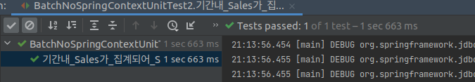
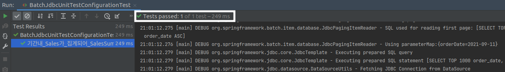
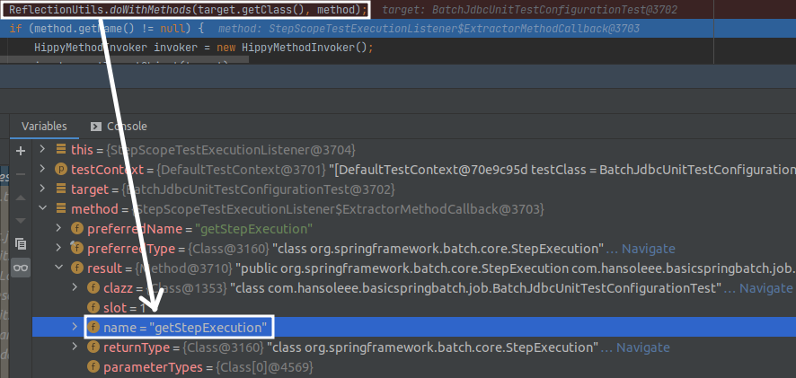
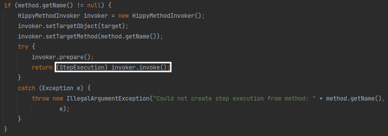
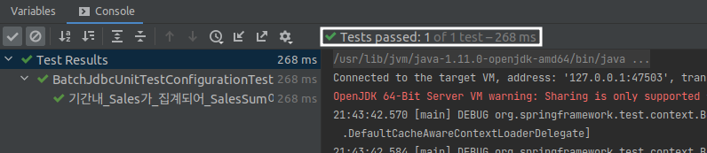

## 단위 테스트 코드 - Reader 편

웹 애플리케이션을 개발하다보면 통합 테스트보다, **단위 테스트가 훨씬 더 많이 작성**됩니다.  
단위 테스트로 많은 코드를 검증 후, 통합 테스트 코드를 통해 각 단위가 합쳐졋을 때 잘 작동되는지 검증하곤 합니다.

스프링 배치를 이용한 **배치 애플리케이션**에서는 많은 분들이 **통합 테스트만** 작성할 때가 많습니다.

그래서 이번 챕터에서는 다음의 질문들에 대해 이야기하려 합니다.
- Reader의 쿼리가 잘 작동되었는지 어떻게 확인하지?
- StepScope를 통한 JobParameter가 잘 할당된다는 것은 어떻게 확신하지?

부분 부분을 잘게 쪼개서 테스트할 수 있는 방법들을 소개해 드리겠습니다.

Reader의 단위 테스트는 다음을 보고 싶을 때가 많이 있습니다.
- 내가 작성한 Reader의 Query가 잘 작동하는지

그래서 Reader의 단위 테스트 방법은 이 부분에 초점을 맞춰서 진행할 예정입니다.

테스트 방법은 총 2단계로 진행됩니다.  
StepScope & JobScope가 없는 테스트와  
StepScope & JobScope가 필요한 테스트.

차근차근 진행해 보겠습니다.

> 참고로 아래 모든 단위 테스트들에는 H2 의존성이 필수입니다.  
> `compile('com.h2database:h2)`

### StepScope가 필요없는 단위 테스트
JDBC를 사용하는 배치를 만든다고 가정해 보겠습니다.

전체 스프링 배치 코드를 작성하기까지 시간이 필요해 그전에 빠르게 **JdbcItemReader의 쿼리**만 검증하는 테스트 코드를 작성하고 싶을 때가 많습니다.

전체 코드를 모두 작성하고 테스트를 시작하기에는 많이 부담스럽기 때문입니다.

그래서 **최소한의 내용만 구현된** Reader 테스트 코드를 만들어 보겠습니다.

> 참고로 이 방식은 **JPA에서는 사용하기가 어렵습니다.**
> Spring Data JPA를 통해 생성되는 여러 환경들을 본인이 직접 다 구성해야되기 때문입니다.  
> 그래서 JPA를 쓰기않고, **JDBC Template**로 배치 환경을 구성하시는 분들이 참고해 보시면 좋을 것 같습니다.

일단 테스트할 대상인 배치 코드입니다.
```java
package com.hansoleee.basicspringbatch.job;

import com.hansoleee.basicspringbatch.entity.SalesSum;
import lombok.RequiredArgsConstructor;
import lombok.extern.slf4j.Slf4j;
import org.springframework.batch.core.configuration.annotation.StepScope;
import org.springframework.batch.item.database.JdbcPagingItemReader;
import org.springframework.batch.item.database.builder.JdbcPagingItemReaderBuilder;
import org.springframework.batch.item.database.support.SqlPagingQueryProviderFactoryBean;
import org.springframework.beans.factory.annotation.Value;
import org.springframework.context.annotation.Bean;
import org.springframework.context.annotation.Configuration;
import org.springframework.jdbc.core.BeanPropertyRowMapper;

import javax.sql.DataSource;
import java.time.LocalDate;
import java.time.format.DateTimeFormatter;
import java.util.HashMap;
import java.util.Map;
import java.util.Objects;

@Slf4j
@RequiredArgsConstructor
@Configuration
public class BatchOnlyJdbcReaderTestConfiguration {

    public static final DateTimeFormatter FORMATTER = DateTimeFormatter.ofPattern("yyyy-MM-dd");
    public static final String JOB_NAME = "batchOnlyJdbcReaderTestJob";
    public static final String PREFIX_BEAN = JOB_NAME + "_";

    private final DataSource dataSource;

    private int chunkSize;

    @Value("${chunkSize: 1000}")
    public void setChunkSize(int chunkSize) {
        this.chunkSize = chunkSize;
    }

    @Bean
    @StepScope
    public JdbcPagingItemReader<SalesSum> batchOnlyJdbcReaderTestJobReader(
            @Value("#{jobParameters[orderDate]}") String orderDate) throws  Exception {
        Map<String, Object> params = new HashMap<>();
        params.put("orderDate", LocalDate.parse(orderDate, FORMATTER));

        SqlPagingQueryProviderFactoryBean queryProvider = new SqlPagingQueryProviderFactoryBean();
        queryProvider.setDataSource(dataSource);
        queryProvider.setSelectClause("order_date, sum(amount) as amout_sum");
        queryProvider.setFromClause("from sales");
        queryProvider.setWhereClause("where order_date =:orderDate");
        queryProvider.setGroupClause("group by order_date");
        queryProvider.setSortKey("order_date");

        return new JdbcPagingItemReaderBuilder<SalesSum>()
                .name(PREFIX_BEAN + "reader")
                .pageSize(chunkSize)
                .fetchSize(chunkSize)
                .dataSource(dataSource)
                .rowMapper(new BeanPropertyRowMapper<>(SalesSum.class))
                .queryProvider(Objects.requireNonNull(queryProvider.getObject()))
                .parameterValues(params)
                .build();
    }
}
```

보시면 **딱 Reader 부분만**있는 상태입니다.  
즉, Job/Step/Processor/Writer를 모두 구현하지 않은 상태이며 **Reader 쿼리가 정상이면 언제든 나머지 부분**을 구현하면 되는 상태입니다.

이 배치 코드를 테스트 한다면 다음과 같이 작성할 수 있습니다.
```java
package com.hansoleee.basicspringbatch;

import com.hansoleee.basicspringbatch.entity.SalesSum;
import com.hansoleee.basicspringbatch.job.BatchOnlyJdbcReaderTestConfiguration;
import org.assertj.core.api.Assertions;
import org.junit.After;
import org.junit.Before;
import org.junit.Test;
import org.springframework.batch.item.database.JdbcPagingItemReader;
import org.springframework.context.ConfigurableApplicationContext;
import org.springframework.context.annotation.AnnotationConfigApplicationContext;
import org.springframework.context.annotation.Bean;
import org.springframework.context.annotation.Configuration;
import org.springframework.core.io.ByteArrayResource;
import org.springframework.core.io.Resource;
import org.springframework.jdbc.core.JdbcTemplate;
import org.springframework.jdbc.datasource.embedded.EmbeddedDatabaseFactory;
import org.springframework.jdbc.datasource.embedded.EmbeddedDatabaseType;
import org.springframework.jdbc.datasource.init.DataSourceInitializer;
import org.springframework.jdbc.datasource.init.ResourceDatabasePopulator;

import javax.sql.DataSource;
import java.time.LocalDate;
import java.util.Objects;

import static com.hansoleee.basicspringbatch.job.BatchOnlyJdbcReaderTestConfiguration.FORMATTER;
import static org.assertj.core.api.Assertions.assertThat;

public class BatchNoSpringContextUnitTest2 {

    private DataSource dataSource;
    private JdbcTemplate jdbcTemplate;
    private ConfigurableApplicationContext context;
    private LocalDate orderDate;
    private BatchOnlyJdbcReaderTestConfiguration job;

    @Before
    public void setUp() {
        this.context = new AnnotationConfigApplicationContext(TestDataSourceConfiguration.class); // (1)
        this.dataSource = (DataSource) context.getBean("dataSource"); // (2)
        this.jdbcTemplate = new JdbcTemplate(this.dataSource); // (3)
        this.orderDate = LocalDate.of(2021, 9, 10);
        this.job = new BatchOnlyJdbcReaderTestConfiguration(dataSource); // (4)
        this.job.setChunkSize(10);
    }

    @After
    public void tearDown() {
        if (this.context != null) {
            this.context.close();
        }
    }

    @Test
    public void 기간내_Sales가_집계되어_SalesSum이된다() throws Exception {
        //given
        long amount1 = 1000;
        long amount2 = 100;
        long amount3 = 10;
        jdbcTemplate.update("insert into sales (order_date, amount, order_no) values (?, ?, ?)", orderDate, amount1, "1"); // (1)
        jdbcTemplate.update("insert into sales (order_date, amount, order_no) values (?, ?, ?)", orderDate, amount2, "2");
        jdbcTemplate.update("insert into sales (order_date, amount, order_no) values (?, ?, ?)", orderDate, amount3, "3");

        JdbcPagingItemReader<SalesSum> reader = job.batchOnlyJdbcReaderTestJobReader(orderDate.format(FORMATTER)); // (2)
        reader.afterPropertiesSet(); // (3)

        assertThat(reader.read().getAmountSum()).isEqualTo(amount1 + amount2 + amount3); // (4)
        assertThat(reader.read()).isNull(); // (5)
    }

    @Configuration
    public static class TestDataSourceConfiguration {

        // (1)
        public static final String CREATE_SQL =
                "create table IF NOT EXISTS `sales` (id bigint not null auto_increment, amount bigint not null, order_date date, order_no varchar(255), primary key (id)) engine=InnoDB;";
        
        // (2)
        @Bean
        public DataSource dataSource() {
            EmbeddedDatabaseFactory databaseFactory = new EmbeddedDatabaseFactory();
            databaseFactory.setDatabaseType(EmbeddedDatabaseType.H2);
            return databaseFactory.getDatabase();
        }

        // (3)
        @Bean
        public DataSourceInitializer initializer(DataSource dataSource) {
            DataSourceInitializer dataSourceInitializer = new DataSourceInitializer();
            dataSourceInitializer.setDataSource(dataSource);

            Resource create = new ByteArrayResource(CREATE_SQL.getBytes());
            dataSourceInitializer.setDatabasePopulator(new ResourceDatabasePopulator(create));

            return dataSourceInitializer;
        }
    }
}
```

코드가 길어서 부분적으로 나눠서 알아보겠습니다.

#### setUp
먼저 `setUp` 부분입니다.  
```java
private DataSource dataSource;
private JdbcTemplate jdbcTemplate;
private ConfigurableApplicationContext context;
private LocalDate orderDate;
private BatchOnlyJdbcReaderTestConfiguration job;

@Before
public void setUp() {
    this.context = new AnnotationConfigApplicationContext(TestDataSourceConfiguration.class); // (1)
    this.dataSource = (DataSource) context.getBean("dataSource"); // (2)
    this.jdbcTemplate = new JdbcTemplate(this.dataSource); // (3)
    this.orderDate = LocalDate.of(2021, 9, 10);
    this.job = new BatchOnlyJdbcReaderTestConfiguration(dataSource); // (4)
    this.job.setChunkSize(10);
}
```

(1) `new AnnotationConfigApplicationContext(...)`
- `DataSource`, `JdbcTemplate`, `Reader` 등이 실행될 수 있는 Context를 생성합니다.  
  - 해당 Context는 하단에서 별도로 구성한 `TestDataSourceConfiguration`의 Bean과 Configuration을 받아서 생성합니다.  
  - `TestDataSourceConfiguration`에 대한 자세한 설명은 하단에서 진행합니다.  

(2) `(DataSource) context.getBean("dataSource")`
- `TestDataSourceConfiguration`를 통해 생성된 **DataSource Bean**을 가져옵니다.  

(3) `new JdbcTemplate(this.dataSource)`
- jdbcTemplate의 경우 지정된 DataSource가 있어야 하며, **해당 DB에 쿼리를 실행**합니다.  
- 지금 생성된 JdbcTemplate을 통해 `create.table`, `insert` 등의 테스트 환경을 구축합니다.  

(4) `new BatchOnlyJdbcReaderTestConfiguration(dataSource)`
- 테스트할 대상인 Config에 (2)에서 생성한 DataSource를 생성자 주입합니다.
  - 해당 Job Config에서 Reader 인스턴스를 생성합니다.  

(5) `this.job.setChunkSize(10)`
- Reader의 PageSize / FetchSize를 결정하는 ChunkSize를 설정합니다.  
  - 원래 ChunkSize와 Reader의 PageSize / FetchSize 는 목적이 조금 다르긴 합니다.
  - 다만 여러 이슈들에 대한 영향도를 줄이기 위해 보통 3가지 값들을 다 일치시켜 사용합니다.  

여기서 **(5)의 설정을 꼭 해야하는 것인가**에 대한 궁금증이 있으실텐데요.
Reader를 생성하는 `JdbcPagingItemReaderBuilder`에서는 **pageSize가 지정되어 있지 않으면 에러를 발생**시킵니다. 
```text
java.lang.IllegalArgumentException: pageSize must be greater than zero
```

그래서 여기서는 **pageSize 값에 사용되는 chunkSize를 setter 인잭션**을 사용하도록 했습니다.

```java
    private int chunkSize;

    @Value("${chunkSize: 1000}")
    public void setChunkSize(int chunkSize) {
        this.chunkSize = chunkSize;
    }

    @Bean
    @StepScope
    public JdbcPagingItemReader<SalesSum> batchOnlyJdbcReaderTestJobReader(
            @Value("#{jobParameters[orderDate]}") String orderDate) throws  Exception {
        ...
        
        return ...
            .pageSize(chunkSize) // chunkSize와 일치
            .fetchSize(chunkSize) // chunkSize와 일치
            ...;
    }
```

> setter 대신에 생성자 인잭션을 사용하셔도 됩니다.  
> 다만 그럴 경우 chunkSize를 가진 Spring Bean을 별도로 생성해야만 합니다.  

#### 테스트 메소드
다음으론 테스트 코드가 수행될 테스트 메소드입니다.  

```java
@Test
public void 기간내_Sales가_집계되어_SalesSum이된다() throws Exception {
    // given
    long amount1 = 1000;
    long amount2 = 100;
    long amount3 = 10;
    jdbcTemplate.update("insert into sales (order_date, amount, order_no) values (?, ?, ?)", orderDate, amount1, "1"); // (1)
    jdbcTemplate.update("insert into sales (order_date, amount, order_no) values (?, ?, ?)", orderDate, amount2, "2");
    jdbcTemplate.update("insert into sales (order_date, amount, order_no) values (?, ?, ?)", orderDate, amount3, "3");

    JdbcPagingItemReader<SalesSum> reader = job.batchOnlyJdbcReaderTestJobReader(orderDate.format(FORMATTER)); // (2)
    reader.afterPropertiesSet(); // (3)

    // when & then
    assertThat(reader.read().getAmountSum()).isEqualTo(amount1 + amount2 + amount3); // (4)
    assertThat(reader.read()).isNull(); //(5)
}
```

(1) `JdbcTemplate.update`
- `insert` 쿼리를 통해 **테스트할 환경을 구축**합니다. 

(2) `job.batchOnlyJdbcReaderTestJobReader`
- `setUp` 메소드에서 만든 Job에서 Reader를 가져옵니다.

(3) `reader.afterPropertiesSet()`
- Reader의 쿼리를 생성합니다.
- 이 메소드가 실행되지 않으면 **Reader 쿼리가 null**입니다.

(4) `assertThat(reader.read())`
- `group by` 결과로 원하는 값의 1개의 row가 반환되는지 검증합니다.

(5) `assertThat(reader.read()).isNull()`
- 조회 결과가 1개의 row라서 다음으로 읽을 row는 없으니 `null`임을 검증합니다.


#### 테스트 Config
마지막으로 **테스트 코드가 수행되는 환경**을 만들어주는 `TestDataSourceConfiguration`을 보겠습니다.  
```java
@Configuration
public static class TestDataSourceConfiguration {

    // (1)
    private static final String CREATE_SQL =
                    "create table IF NOT EXISTS `sales` (id bigint not null auto_increment, amount bigint not null, order_date date, order_no varchar(255), primary key (id)) engine=InnoDB;";

    // (2)
    @Bean
    public DataSource dataSource() {
        EmbeddedDatabaseFactory databaseFactory = new EmbeddedDatabaseFactory();
        databaseFactory.setDatabaseType(H2);
        return databaseFactory.getDatabase();
    }

    // (3)
    @Bean
    public DataSourceInitializer initializer(DataSource dataSource) {
        DataSourceInitializer dataSourceInitializer = new DataSourceInitializer();
        dataSourceInitializer.setDataSource(dataSource);

        Resource create = new ByteArrayResource(CREATE_SQL.getBytes());
        dataSourceInitializer.setDatabasePopulator(new ResourceDatabasePopulator(create));

        return dataSourceInitializer;
    }
}
```

(1) `create table`
- Reader의 쿼리가 수행될 테이블(`sales`)를 생성하는 쿼리입니다.
- 제일 하단의 `DataSourceInitializer`에서 **DB가 초기화 되는 시점에 실행**될 예정입니다.

(2) ``
- 테스트용 DB를 실행합니다.
  - `@SpringBootTest`, `@DataJpaTest` 등을 써보신 분들은 H2를 이용한 테스트 환경과 동일하다고 생각하시면 됩니다.  
- 인메모리 DB인 H2를 사용했기 때문에 편하게 실행/종료가 가능합니다.  
  - Gradle/Maven에 `H2`의존성이 꼭 있어야지 작용합니다.
  
(3) `@Bean Initializer`
- (2)를 통해서 생성된 DB의 초기 작업을 어떤걸 할지 결정합니다. 
- 여기서는 (1)의 `create table`쿼리를 (2)의 DataBase에 실행하는 작업을 설정하였습니다.

> Tip)
> 이 모든 과정을 `@SpringBootTest`가 자동으로 해줍니다.  
> 다만 **Spring에 관련된 모든 설정이 실행**되다보니 한 번 수행할 때마다 오래 걸립니다.  
> 지금의 테스트는 순식간에 수행되니 속도 측면에서 충분히 장점이 있습니다.  

테스트 코드를 수행해 보겠습니다.


### StepScope가 필요한 단위 테스트
StepScope와 같이 **스프링 배치만의 Scope가 있어야만** 작동하는 스프링 배치가 뭐가 있을까요?
대표적으로 JobParameter가 있습니다.  

JobParameter는 JobScope 또는 StepScope가 있는 환경에서만 사용할 수 있다보니 앞에서 소개드린 것과 같이 **단순한 방식으로는 테스트할 수가 없습니다.**

그래서 이와 같이 **StepScope 환경에서의 단위 테스트**를 할 수 있는 방법을 알아보겠습니다.  
(JobScope 환경에서의 테스트 코드는 통합 테스트를 사용하지면 됩니다.)

이 역시 `@SpringBatchTest`가 등장하기 전/후로 분리해서 알아보겠습니다.  

테스트할 대상 코드는 **StepScope가 필요없는 단위 테스트**에서 변경을 하였습니다.  
**Job Bean이 없으면 테스트가 불가능**하기 때문입니다.

###### BatchJdbcUnitTestConfiguration.java
```java
package com.hansoleee.basicspringbatch.job;

import com.hansoleee.basicspringbatch.entity.SalesSum;
import lombok.RequiredArgsConstructor;
import lombok.extern.slf4j.Slf4j;
import org.springframework.batch.core.Job;
import org.springframework.batch.core.Step;
import org.springframework.batch.core.configuration.annotation.JobBuilderFactory;
import org.springframework.batch.core.configuration.annotation.StepBuilderFactory;
import org.springframework.batch.core.configuration.annotation.StepScope;
import org.springframework.batch.core.job.builder.JobBuilder;
import org.springframework.batch.item.database.JdbcBatchItemWriter;
import org.springframework.batch.item.database.JdbcPagingItemReader;
import org.springframework.batch.item.database.builder.JdbcBatchItemWriterBuilder;
import org.springframework.batch.item.database.builder.JdbcPagingItemReaderBuilder;
import org.springframework.batch.item.database.support.SqlPagingQueryProviderFactoryBean;
import org.springframework.beans.factory.annotation.Value;
import org.springframework.context.annotation.Bean;
import org.springframework.context.annotation.Configuration;
import org.springframework.jdbc.core.BeanPropertyRowMapper;

import javax.sql.DataSource;
import java.time.LocalDate;
import java.time.format.DateTimeFormatter;
import java.util.HashMap;
import java.util.Map;
import java.util.Objects;

@Slf4j
@RequiredArgsConstructor
@Configuration
public class BatchJdbcUnitTestConfiguration {

    public static final DateTimeFormatter FORMATTER = DateTimeFormatter.ofPattern("yyyy-MM-dd");
    public static final String JOB_NAME = "batchJdbcUnitTestConfiguration";
    public static final String PREFIX_BEAN = JOB_NAME + "_";

    private final JobBuilderFactory jobBuilderFactory;
    private final StepBuilderFactory stepBuilderFactory;
    private final DataSource dataSource;

    private int chunkSize;

    @Value("${chunkSize: 1000}")
    public void setChunkSize(int chunkSize) {
        this.chunkSize = chunkSize;
    }

    @Bean(JOB_NAME)
    public Job job() throws Exception {
        return jobBuilderFactory.get(JOB_NAME)
                .start(step())
                .build();
    }

    @Bean(PREFIX_BEAN + "step")
    public Step step() throws Exception{
        return stepBuilderFactory.get(PREFIX_BEAN + "step")
                .<SalesSum, SalesSum>chunk(chunkSize)
                .reader(reader(null))
                .writer(writer())
                .build();
    }
    
    @Bean(PREFIX_BEAN + "reader")
    @StepScope
    public JdbcPagingItemReader<SalesSum> reader(@Value("#{jobParameters[orderDate]}") String orderDate) throws Exception {
        Map<String, Object> params = new HashMap<>();
        params.put("orderDate", LocalDate.parse(orderDate, FORMATTER));

        SqlPagingQueryProviderFactoryBean queryProvider = new SqlPagingQueryProviderFactoryBean();
        queryProvider.setDataSource(dataSource);
        queryProvider.setSelectClause("order_date, sum(amount) as amount_sum");
        queryProvider.setFromClause("from sales");
        queryProvider.setWhereClause("where order_date =:orderDate");
        queryProvider.setGroupClause("group by order_date");
        queryProvider.setSortKey("order_date");

        return new JdbcPagingItemReaderBuilder<SalesSum>()
                .name(PREFIX_BEAN + "reader")
                .pageSize(chunkSize)
                .fetchSize(chunkSize)
                .dataSource(dataSource)
                .rowMapper(new BeanPropertyRowMapper<>(SalesSum.class))
                .queryProvider(queryProvider.getObject())
                .parameterValues(params)
                .build();
    }

    @Bean(PREFIX_BEAN + "writer")
    public JdbcBatchItemWriter<SalesSum> writer() {
        return new JdbcBatchItemWriterBuilder<SalesSum>()
                .dataSource(dataSource)
                .sql("insert into sales_sum(order_date, amount_sum) values (:order_date, :amount_sum)")
                .beanMapped()
                .build();
    }
}
```

- StepScope가 필요없는 단위 테스트에서 Job/Step/Writer가 추가된 코드입니다.  
- 다만 실제로 수행될 코드는 Reader 뿐입니다.  

###### BatchJdbcUnitTestConfigurationTest.java
```java
package com.hansoleee.basicspringbatch.job;

import com.hansoleee.basicspringbatch.entity.SalesSum;
import org.assertj.core.api.Assertions;
import org.junit.jupiter.api.AfterEach;
import org.junit.jupiter.api.BeforeEach;
import org.junit.jupiter.api.Test;
import org.junit.runner.RunWith;
import org.springframework.batch.core.JobParameters;
import org.springframework.batch.core.JobParametersBuilder;
import org.springframework.batch.core.StepExecution;
import org.springframework.batch.core.configuration.annotation.EnableBatchProcessing;
import org.springframework.batch.item.database.JdbcPagingItemReader;
import org.springframework.batch.test.MetaDataInstanceFactory;
import org.springframework.batch.test.StepScopeTestExecutionListener;
import org.springframework.batch.test.context.SpringBatchTest;
import org.springframework.beans.factory.annotation.Autowired;
import org.springframework.context.annotation.Bean;
import org.springframework.context.annotation.Configuration;
import org.springframework.core.io.ByteArrayResource;
import org.springframework.core.io.Resource;
import org.springframework.jdbc.core.JdbcOperations;
import org.springframework.jdbc.core.JdbcTemplate;
import org.springframework.jdbc.datasource.embedded.EmbeddedDatabaseFactory;
import org.springframework.jdbc.datasource.embedded.EmbeddedDatabaseType;
import org.springframework.jdbc.datasource.init.DataSourceInitializer;
import org.springframework.jdbc.datasource.init.ResourceDatabasePopulator;
import org.springframework.test.context.ContextConfiguration;
import org.springframework.test.context.TestExecutionListeners;
import org.springframework.test.context.junit4.SpringRunner;
import org.springframework.test.context.support.DependencyInjectionTestExecutionListener;

import javax.sql.DataSource;
import java.time.LocalDate;

import static com.hansoleee.basicspringbatch.job.BatchJdbcUnitTestConfiguration.FORMATTER;

@RunWith(SpringRunner.class)
@SpringBatchTest
@EnableBatchProcessing // (1)
@TestExecutionListeners({ // (2)
        DependencyInjectionTestExecutionListener.class,
        StepScopeTestExecutionListener.class
})
@ContextConfiguration(classes = { // (3)
        BatchJdbcUnitTestConfiguration.class,
        BatchJdbcUnitTestConfigurationTest.TestDataSourceConfiguration.class
})
class BatchJdbcUnitTestConfigurationTest {

    @Autowired
    private JdbcPagingItemReader<SalesSum> reader;
    @Autowired
    private DataSource dataSource;

    private JdbcOperations jdbcTemplate;
    private LocalDate orderDate = LocalDate.of(2021, 9, 11);

    // (4)
    public StepExecution getStepExecution() {
        JobParameters jobParameters = new JobParametersBuilder()
                .addString("orderDate", this.orderDate.format(FORMATTER))
                .toJobParameters();

        return MetaDataInstanceFactory.createStepExecution(jobParameters);
    }

    @BeforeEach // (5)
    public void setUp() throws Exception {
        this.reader.setDataSource(this.dataSource);
        this.jdbcTemplate = new JdbcTemplate(this.dataSource);
    }

    @AfterEach // (6)
    public void tearDown() throws Exception {
        this.jdbcTemplate.update("delete from `sales`");
    }

    @Test
    void 기간내_Sales가_집계되어_SalesSum이_된다() throws Exception {
        //given
        long amount1 = 1000;
        long amount2 = 500;
        long amount3 = 100;

        saveSales(amount1, "1");
        saveSales(amount2, "2");
        saveSales(amount3, "3");

        Assertions.assertThat(reader.read().getAmountSum()).isEqualTo(amount1 + amount2 + amount3);
        Assertions.assertThat(reader.read()).isEqualTo(null);
    }

    private void saveSales(long amount, String orderNo) {
        jdbcTemplate.update("insert into `sales` (order_date, amount, order_no) values (?, ?, ?)", this.orderDate, amount, orderNo);
    }

    // (7)
    @Configuration
    static class TestDataSourceConfiguration {
        public static final String CREATE_SQL =
                "create table IF NOT EXISTS `sales` (" +
                        "id bigint not null auto_increment primary key, " +
                        "amount bigint not null, " +
                        "order_date date, " +
                        "order_no varchar(255)" +
                        ");";

        @Bean
        public DataSource dataSource() {
            EmbeddedDatabaseFactory databaseFactory = new EmbeddedDatabaseFactory();
            databaseFactory.setDatabaseType(EmbeddedDatabaseType.H2);
            return databaseFactory.getDatabase();
        }

        @Bean
        public DataSourceInitializer initializer(DataSource dataSource) {
            DataSourceInitializer dataSourceInitializer = new DataSourceInitializer();
            dataSourceInitializer.setDataSource(dataSource);

            Resource create = new ByteArrayResource(CREATE_SQL.getBytes());
            dataSourceInitializer.setDatabasePopulator(new ResourceDatabasePopulator(create));

            return dataSourceInitializer;
        }
    }
}
```

(1) `@EnableBatchProcessing`
- 배치 환경을 자동 설정합니다.
- 통합 테스트와 마찬가지로 별도의 테스트 설정 클래스 (ex: `TestBatchConfig.class`)를 생성해 해당 클래스에 선언해서 `import`해도 됩니다.

(2) `@TestExecutionListeners({...})`
- `TestContextManager`에 **어떤 TestExecutionListener들이 등록되어야 하는지** 설정할 수 있게 지원합니다.  
- 즉, 스프링의 테스트 환경에서 내가 필요한 여러 리스너들을 사용할 수 있게 등록하는 역할을 합니다.  
- 여기서는 2개의 리스너가 사용됩니다.  
  - `DependencyInjectioinTestExecutionListener.class`
  - 스프링 케스트 환경에서 일반적으로 사용되는 의존성 주입 (DI) 리스너입니다.  
  - 테스트 인스턴스에 대한 의존성 주입(DI)을 제공합니다.  
  - `StepScopeTestExecutionListener.class`
  - 이번 챕터의 가장 **핵심이 되는 설정**입니다.  
  - 테스트 케이스에서 **팩토리 메소드**(여기서는 `getStepExecution()`)를 찾아서 팩토리 메소드에서 반환된 `SetpExecution`을 **각 테스트 메소드의 StepExecution**으로 사용합니다.  
  - `StepExecution`를 반환하는 메소드가 **팩토리 메소드**입니다.  
  - 팩토리 메소드가 없으면 기본 StepExecution이 생성됩니다.  

(3) `@ContextConfiguration(classes = {...})`
- 테스트를 수행할 때 Import할 Config 클래스들을 등록합니다.  
- `BatchJdbcUnitTestConfiguration.class`
  - 테스트 대상이 되는 Batch Job Config 클래스입니다.
- `BatchJdbcUnitTestConfigurationTest.TestDataSourceConfiguration.class`
  - **테스트 코드가 수행되는 환경**을 만들어주는 Config 클래스입니다.  
  - `DataSource` Bean 생성
  - `create table`
  - 등을 담당합니다.

(4) `getStepExecution()`
- `StepScopeTestExecutionListener`가 사용하는 **팩토리 메소드**입니다.  
- 여기서 반환하는 `StepExecution`가 테스트에서 사용되는 Reader의 **Step 환경**이 됩니다.  
- 아래에서 더 자세히 알아보겠습니다.  

(5) `setUp()`
- Bean으로 등록된 Reader와 `insert`를 비롯한 쿼리를 수행할 `JdbcOperations`에 동일한 DataSource를 등록합니다.  

(6) `tearDown()`
- 여러 테스트들이 동시에 수행될 경우를 대비해 `insert`로 데이터가 저장된 `sales` 테이블을 초기화합니다.  
- 이렇게해야만 테스트가 끝날때마다 `sales` 테이블이 깨끗하게 비어있어 **다른 테스트에 영향이 없습니다.**

(7) `@Configuration TestDataSourceConfiguration`
- **테스트 환경 Config 클래스** 역할을 합니다.

테스트 수행 결과는 아래와 같습니다.


코드를 보시면 StepScopeTestExecutionListener 클래스는 `getStepExecution()`를 어떻게 찾고, `StepExecution`를 교체하는 걸까요?

### StepScopeTestExecutionListener ?
StepScopeTestExecutionListener 클래스의 코드를 열어보시면 아래와 같이 `getStepExecution` 메소드가 있습니다.  
위 작성한 테스트 클래스(BatchJdbcUnitTestConfigurationTest.java)에서 작성한 메소드와 같은 이름이죠?

이 메소드의 코드는 다음과 같습니다.
```java
public class StepScopeTestExecutionListener implements TestExecutionListener {
  ...
  protected StepExecution getStepExecution(TestContext testContext) {
    Object target;

    try {
      Method method = TestContext.class.getMethod(GET_TEST_INSTANCE_METHOD);
      target = ReflectionUtils.invokeMethod(method, testContext);
    } catch (NoSuchMethodException e) {
      throw new IllegalStateException("No such method " + GET_TEST_INSTANCE_METHOD + " on provided TestContext", e);
    }

    ExtractorMethodCallback method = new ExtractorMethodCallback(StepExecution.class, "getStepExecution");
    ReflectionUtils.doWithMethods(target.getClass(), method);
    if (method.getName() != null) {
      HippyMethodInvoker invoker = new HippyMethodInvoker();
      invoker.setTargetObject(target);
      invoker.setTargetMethod(method.getName());
      try {
        invoker.prepare();
        return (StepExecution) invoker.invoke();
      }
      catch (Exception e) {
        throw new IllegalArgumentException("Could not create step execution from method: " + method.getName(),
                e);
      }
    }

    return MetaDataInstanceFactory.createStepExecution();
  }
  ...
}
```

여기서 중요한 코드는 `Reflectionutils.doWithMethods(target.getClass(), method)`입니다.  
테스트 코드를 수행해서 디버깅을 진행해보면 **위 메소드를 통해 팩토리 메소드를 찾는다는 것**을 알 수 있습니다.  



그리고 이렇게 찾은 메소드를 `Invoker`를 이용해 실행합니다.



팩토리 메소드는 `preferredName`을 통해 찾는 것 같습니다.
```java
new ExtractormethodCallback(StepExecution.class, "getStepExecution")
```

즉, `getStepExecution`이라는 **메소드 이름으로 찾는 것** 같습니다.  
만약 `getStepExecution`이란 이름이 아니면 어떻게 될까요?  
아래와 같이 테스트 클래스의 메소드 명을 `getStepExecution`에서 `getStepExecution2`로 변경해 보겠습니다.  
```java
public StepExecution getStepExecutionV2() {
    JobParameters jobParameters = new JobParametersBuilder()
    .addString("orderDate", this.orderDate.format(FORMATTER))
    .toJobParameters();

    return MetaDataInstanceFactory.createStepExecution(jobParameters);
}
```

그리고 테스트 코드를 디버깅한 결과는 아래와 같습니다.  




즉, **메소드 이름과 무관하게 StepExecution를 반환하는 메소드**를 팩토리 메소드로 사용한다는 것을 알 수 있습니다.
