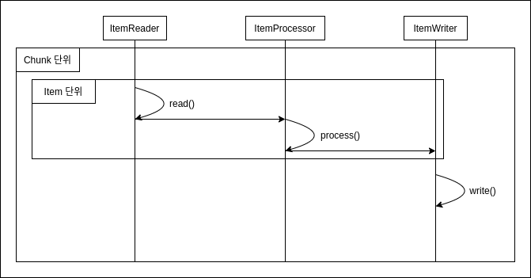
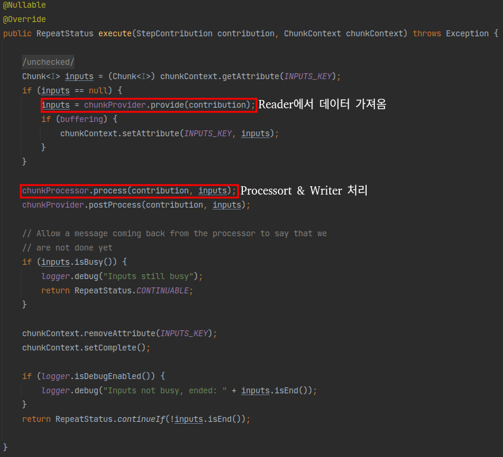
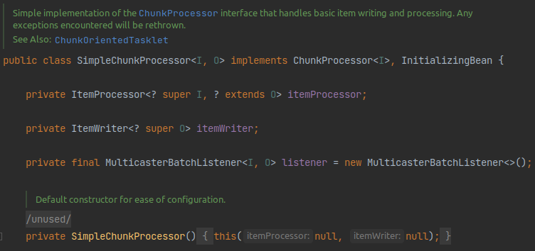
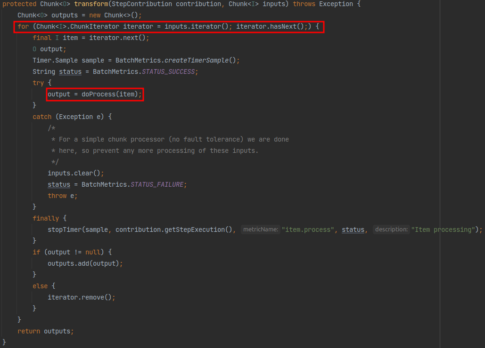
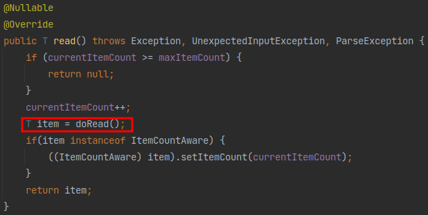
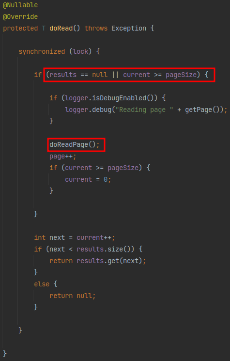
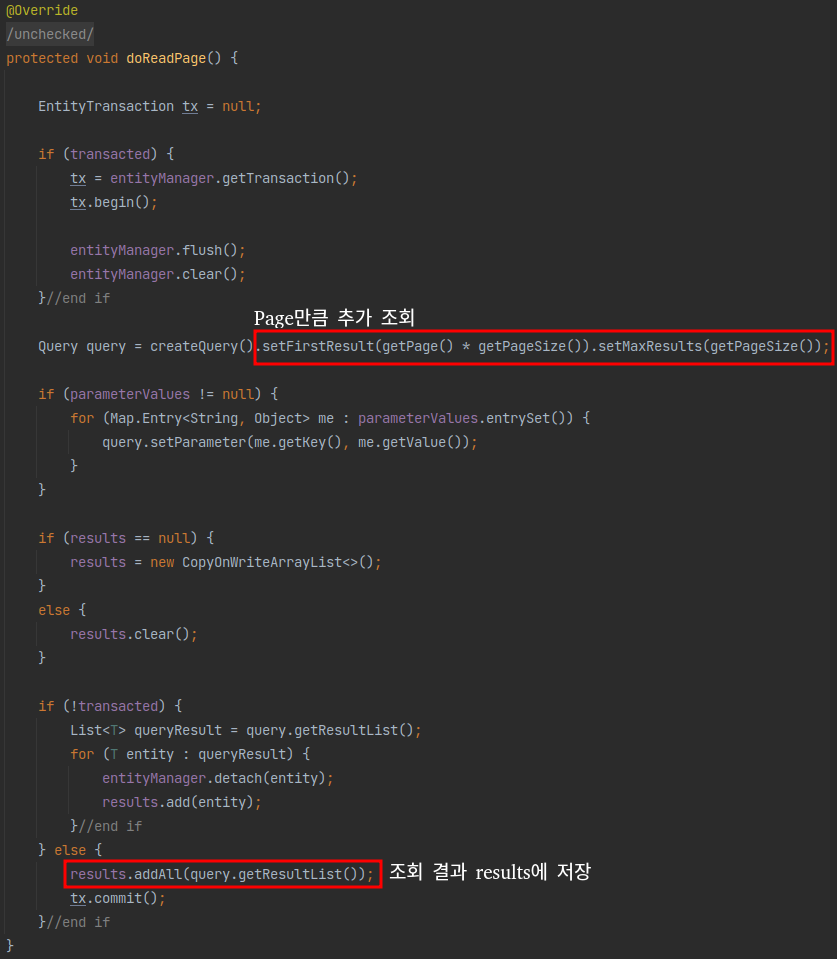

## Chunk 지향 처리
Spring Batch의 큰 장점 중 하나로 Chunk 지향 처리를 얘기합니다.  
이번 시간에는 Chunk 지향 처리가 무엇인지 한번 살펴보겠습니다.

### Chunk?
Spring Batch에서의 Chunk란 데이터 덩어리로 작업할 때 **각 커밋 사이에 처리되는 row 수**를 얘기합니다.  
즉, Chunk 지향 처리란 **한 번에 하나씩 데이터를 읽어 Chunk라는 덩어리를 만든 뒤, Chunk 단위로 트랜잭션**을 다루는 것을 의미합니다.

여기서 트랜잭션이라는 것이 중요합니다.  
Chunk 단위로 트랜잭션을 수행하기 때문에 **실패할 경우엔 해당 Chunk 만큼만 롤백**이 되고, 이전에 커밋된 트랜잭션 범위까지는 반영이 된다는 것 입니다.

Chunk 지향 처리는 Chunk 단위로 데이터를 처리하기 때문에 그림으로 표현하면 아래와 같습니다.  


>[개별 Item 처리 과정](https://docs.spring.io/spring-batch/docs/4.3.x/reference/html/index-single.html#chunkOrientedProcessing)

- Reader에서 데이터를 하나 읽어옵니다.
- 읽어온 데이터를 Processor에서 가공합니다.
- 가공된 데이터들을 별도의 공간에 모은 뒤, Chunk 단위만큼 쌓이게 되면 Writer에 전달하고 Writer는 일괄 저장합니다.

**Reader와 Processor에서는 1건씩 다뤄지고, Writer에선 Chunk 단위로 처리**된다는 것만 기억하시면 됩니다.

Chunk 지향 처리를 Java 코드로 표현하면 아래처럼 될 것 같습니다.
```java
for (int i = 0; i < totalSize; i += chunkSize) { // chunkSize 단위로 묶어서 처리
    List items = new ArrayList<>();
    for (int j = 0; j < chunkSize; j++) {
        Object item = itemReader.read();
        Object processedItem = itemProcessor.process(item);
        items.add(processedItem);
    }
    itemWriter.write(items);
}
```
**chunkSize별로 묶어서 처리**된다는 의미를 이해하셨나요?  
자 그럼 이제 Chunk 지향 처리가 어떻게 되고 있는지 실제 Spring Batch 내부 코드를 보면서 알아보겠습니다.

### ChunkOrientedTasklet 엿보기
Chunk 지향 처리의 전체 로직을 다루는 것은 ChunkOrientedTasklet 클래스입니다.  
클래스 이름만 봐도 어떤 일을 하는지 단번에 알 수 있을것 같습니다.


여기서 자세히 보셔야할 코드는 execute() 입니다.  
Chunk 단위로 작업하기 위한 전체 코드가 이곳에 있다고 보시면 됩니다.  
내부 코드는 아래와 같습니다.



- `chunkProvider.provide()`로 Reader에서 Chunk size만큼 데이터를 가져옵니다.
- `chunkProcessor.process()`에서 Reader로 받은 데이터를 가공(Processor)하고 저장(Writer)합니다.

데이터를 가져오는 `chunkProvider.provide()`를 가보시면 어떻게 데이터를 가져오는지 알 수 있습니다.


`inputs`이 ChunkSize만큼 쌓일때까지 read()를 호출합니다.  
이 `read()`는 내부를 보시면 실제로는 `ItemReder.read`를 호출합니다.


즉, `ItemReader.read`에서 1건씩 데이터를 조회해 ChunkSize만큼 데이터를 쌓는 것이 `provider()`가 하는 일입니다.

자 그럼 이렇게 쌓아준 데이터를 어떻게 가공하고 저장하는지 한번 확인해보겠습니다.

### SimpleChunkProcessor 엿보기
Processor와 Writer 로직을 담고 있는 것은 `ChunkProcessor`가 담당하고 있습니다.


인터페이스라 실제 구현체가 필요합니다.  
기본적으로 사용되는 것이 `SimpleChunkProcessor`입니다.



위 클래스를 보시면 Spring Batch에서 Chunk 단위 처리를 어떻게 하는지 아주 상세하게 확인할 수 있습니다.  
처리를 담당하는 핵심 로직은 `process()` 입니다.
이 `process()`의 코드는 아래와 같습니다.


- `Chunk<I> inputs`를 파라미터로 받습니다.
    - 이 데이터는 앞서 `chunkProvider.provide()`에서 받은 ChunkSize만큼 쌓인 item입니다.
- `transform()`에서는 전달받은 `inputs`을 `doProcess()`로 전달하고 변환 값을 받습니다.
- `transform()`을 통해 가공된 대량의 데이터는 `write()`를 통해 일괄 저장됩니다.
    - `write()`는 저장이 될 수도 있고, 외부 API로 전송도 가능합니다.
    - 이는 개발자가 ItemWriter를 어떻게 구현했는지에 따라 달라집니다.

여기서 `transform()`은 반복문을 통해 `doProcess()`를 호출합니다.  
해당 메소드는 ItemProcessor의 `process()`를 사용합니다.



`doProcess()`를 처리하는데 만약 ItemProcessor가 없다면 item을 그대로 반환하고  
있다면 ItemProcessor의 `process()`로 가공하여 반환합니다.


그리고 이렇게 가공된 데이터들은 위에서도 나와있듯이 SimpleChunkProcessor의 `doWrite()`를 호출하여 일괄처리합니다.


자 Chunk 지향 처리에 대해 실제 코드를 보면서 어떻게 처리되는지 알아보았습니다.  
아래에서는 ChunkSize에 대한 오해를 한번 풀어보겠습니다.

### Page Size vs Chunk Size
기존에 Spring Batch를 사용해보신 분들은 아마 PagingItemReader를 많이 사용해보셨을 거에요.  
PagingItemReader를 사용해보신 분들 중 간혹 Page Size와 Chunk Size를 같은 의미로 오해하시는 분들이 계십니다.  
**Page Size**와 **Chunk Size**는 **서로 의미하는 바가 다릅니다.**

**Chunk Size**는 **한번에 처리될 트랜잭션 단위**를 얘기하며, **Page Size**는 **한번에 조회할 Item의 양**을 얘기합니다.

자 그럼 이제 2개가 어떻게 다른지 실제 Spring Batch의 ItemReader 코드를 직접 들여다보겠습니다.

PagingItemReader의 부모 클래스인 `AbstractItemCountingItemStreamItemReader`의 `read()` 메소드를 먼저 보겠습니다.



보시는 것처럼 읽어올 데이터가 있다면 `doRead()`를 호출합니다.  
`doRead()`의 코드는 아래와 같습니다.



`doRead()`에서는 현재 읽어올 데이터가 없거나, Page Size를 초과한 경우 `doReadPage()`를 호출합니다.  
읽어올 데이터가 없는 경우는 read가 처음 시작할 때를 얘기합니다.  
Page Size를 초과하는 경우는 예를들면 Page Size가 10인데, 이번에 읽어야할 데이터가 11번째 데이터인 경우입니다.  
이럴 경우 Page Size를 초과했기 때문에 `doReadPage()`를 호출한다고 보시면 됩니다.

즉, **Page 단위로 끊어서 조회**하는 것입니다.

> 게시판 만들기에서 페이징 조회를 떠올려보시면 쉽게 이해가 되실것 같습니다.

`doReadPage()`부터는 하위 구현 클래스에서 각자만의 방식으로 페이징 쿼리를 생성합니다.  
여기서는 보편적으로 많이 사용하시는 JpaPagingItemReader 코드를 살펴보겠습니다.

JpaPagingItemReader의 `doReadPage()`의 코드는 아래와 같습니다.



Reader에서 지정한 Page Size만큼 `offset`, `limit` 값을 지정하여 페이징 쿼리를 생성 (`createQuery()`)하고, 사용 (`query.getResultList()`)합니다.  
쿼리 실행 결과는 `results`에 저장합니다.  
이렇게 저장된 `results`에서 `read()`가 **호출될 때마다 하나씩 꺼내서 전달**합니다.

즉, Page Size는 **페이징 쿼리에서 Page의 Size를 지정하기 위한 값**입니다.

만약 2개 값이 다르면 어떻게 될까요?  
PageSize가 10이고, ChunkSize가 50이라면 **ItemReader에서 Page 조회가 5번 일어나면 1번의 트랜잭션이 발생하여 Chunk가 처리**됩니다.

한번의 트랜잭션 처리를 위해 5번의 쿼리 조회가 발생하기 때문에 성능상 이슈가 발생할 수 있습니다.  
그래서 Spring Batch의 PagingItemReader에는 클래스 상단에 다음과 같은 주석을 남겨두었습니다.

> Setting a fairly large page size and using a commit interval that matches the page size should provide better performance.  
> (상당히 큰 페이지 크기를 설정하고 페이지 크기와 일치하는 커미트 간격을 사용하면 성능이 향상됩니다.)

성능상 이슈 이외에도 2개 값을 다르게 할 경우 JPA를 사용하신다면 영속성 컨텍스트가 깨지는 문제도 발생합니다.  
(이 부분에 대한 [정리](https://jojoldu.tistory.com/146) )

2개 값이 의미하는 바가 다르지만 위에서 언급한 여러 이슈로 **2개 값을 일치시켜 사용하시는 것을 추천**합니다.

