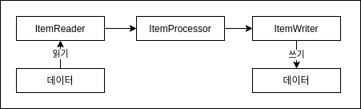
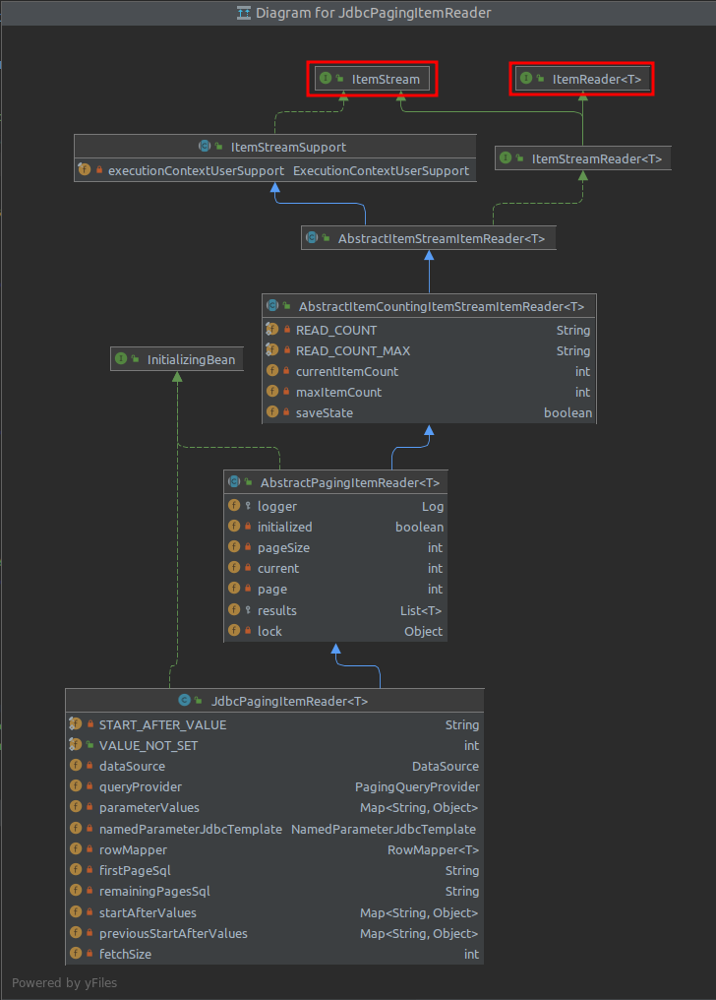
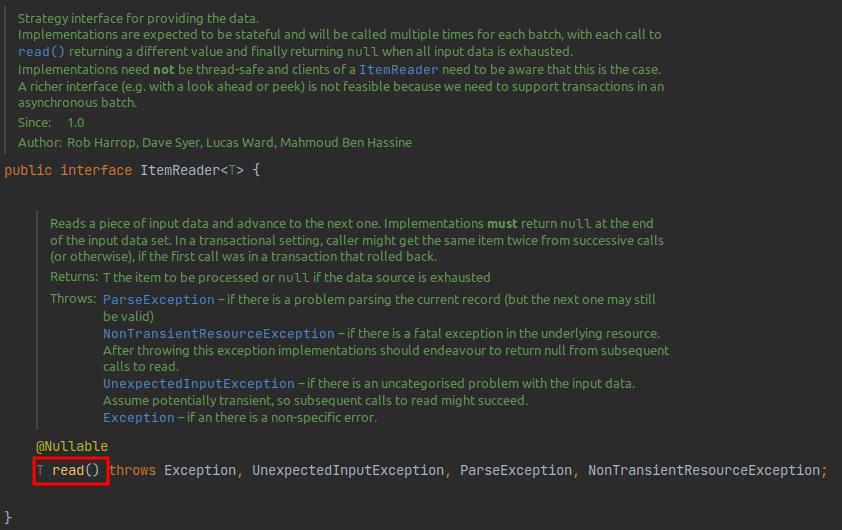
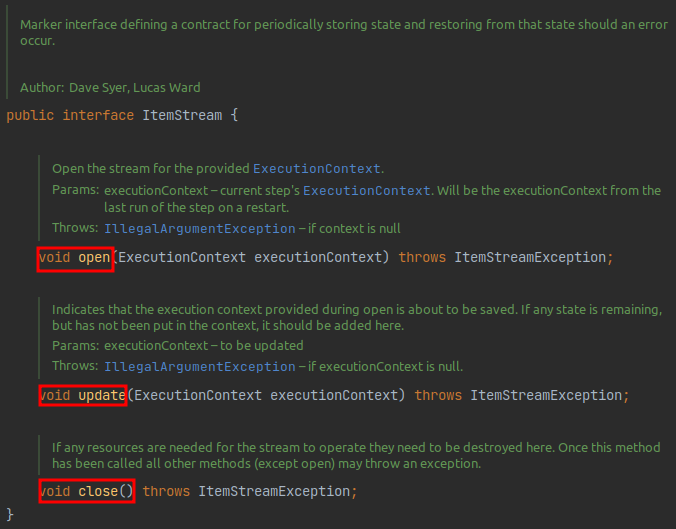
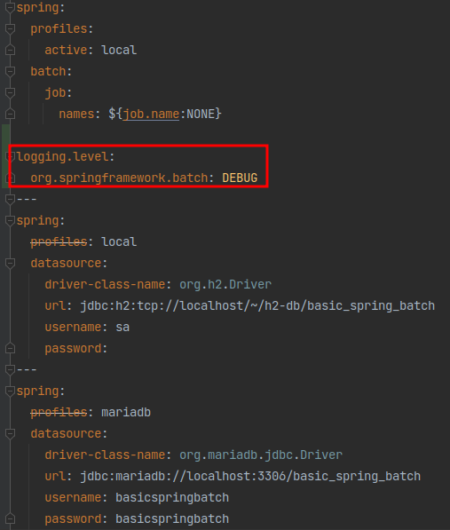
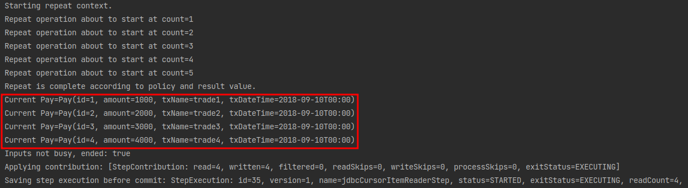
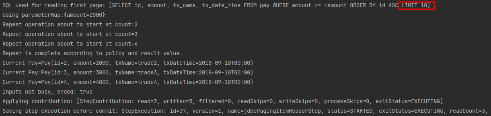
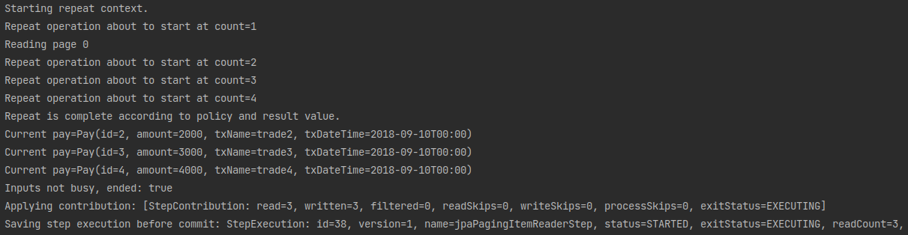

## ItemReader
***

앞의 과정들을 통해 Spring Batch가 Chunk 지향 처리를 하고 있으며 이를 Job과 Step으로 구성되어 있음을 배웠습니다.  
Step은 Tasklet 단위로 처리되고, Tasklet 중에서 ChunkOrientedTasklet을 통해 Chunk를 처리하며 이를 구성하는 3요소로 ItemReader, ItemWriter, ItemProcessor가 있음을 배웠습니다.

> 즉, ItemReader & ItemWriter & ItemProcessor의 묶음 역시 Tasklet이란 이야기입니다.  
> 이들의 묶음을 ChunkOrientedTasklet에서 관리하기 때문이죠.

이번에는 이 3요소를 차근차근 배워보겠습니다.

### ItemReader 소개
Spring Batch의 Chunk Tasklet은 아래와 같은 과정을 통해 진행됩니다.  


이번엔 이 과정의 가장 첫번째인 Reader에 대해 알아보겠습니다.  
그림에서 보시는 것처럼 Spring Batch의 ItemReader는 **데이터를 읽는 역할을 합니다.**  
~~그게 꼭 DB의 데이터만을 얘기하진 않습니다.~~

File, XML, JSON 등 다른 데이터 소스를 배치 처리의 입력으로 사용할 수 있습니다.  
또한 JMS(Java Message Service)와 같은 다른 유형의 데이터 소스도 지원합니다.

이외에도 **Spring Batch에서 지원하지 않는 Reader가 필요할 경우 직접 해당 Reader를 만드는 것도 가능합니다.  
Spring Batch는 이를 위해 Custom Reader 구현체를 만들기 쉽게 제공하고 있습니다.

정리하면 Spring Batch의 Reader에서 읽어올 수 있는 데이터 유형은 다음과 같습니다.
- 입력 데이터에서 읽어오기
- 파일에서 읽어오기
- Database에서 읽어오기
- Java Message Service등 다른 소스에서 읽어오기
- 본인만의 커스텀한 Reader로 읽어오기

이 ItemReader의 구현체들이 어떻게 되어있는지 살펴보겠습니다.  
가장 대표적인 구현체인 JdbcPagingItemReader가 있습니다.  
해당 클래스의 계층 구조를 살펴보면 아래와 같습니다.



ItemReader외에 **ItemStream 인터페이스도 같이 구현하고 있습니다.**

먼저 ItemReader를 살펴보면 `read()`만 가지고 있습니다.  


- `read()`의 경우 데이터를 읽어오는 메소드입니다.

Reader가 하는 본연의 임무를 담당하는 인터페이스임을 알 수 있습니다.

그럼 IteamStream 인터페이슨 무슨 역할을 할까요?  
IteamStream 인터페이스는 **주기적으로 상태를 저장하고 오류가 발생하면 해당 상태에서 복원**하기 위한 마커 인터페이스 입니다.  
즉, 배치 프로세스의 실행 컨텍스트와 연계해서 **ItemReader의 상태를 저장하고 실패한 곳에서 다시 실행할 수 있게 해주는 역할**을 합니다.



ItemStream의 3개 메소드는 다음과 같은 역할을 합니다.
- `open()`, `close()`는 스트림을 열고 닫습니다.
- `update()`를 사용하면 Batch 처리의 상태를 업데이트할 수 있습니다.

개발자는 **ItemReader와 ItemStream 인터페이스를 직접 구현해서 원하는 형태의 ItemReader**를 만들 수 있습니다.  
다만 Spring Batch에서 대부분의 데이터 형태는 ItemReader로 이미 제공하고 있기 때문에 커스텀한 ItemReader를 구현할 일은 많이 없을 것 입니다.

> 단, 본인의 조회 프레임워크가 Querydsl, Jooq 라면 직접 구현해야할 수도 있습니다.  
> 웬만하면 JdbcItemReader로 해결되지만, **JPA 영속성 컨텍스트가 지원이 안되서** HibernateItemReader를 이용하여 Reader 구현체를 직접 구현하셔야 합니다.

자 이제 ItemReader의 구현체를 알아보겠습니다.  
여기에서는 **Database의 구현체들만 다뤄보겠습니다.**  
이외의 다른 Reader들 (File, XML, JSON) 등은 실제 업무에서 많이 사용되지 않기 때문에 필요하시면 [공식문서](https://docs.spring.io/spring-batch/docs/4.3.x/reference/html/readersAndWriters.html#flatFiles) 를 참고해주시기 바랍니다.

## Database Reader
Spring 프레임워크의 강점 중 하나는 **개발자가 비즈니스 로직에만 집중할 수 있도록 JDBC와 같은 문제점을 추상화**한 것 입니다.

> 이를 보고 **서비스 추상화**라고 합니다.

그래서 Spring Batch 개발자들은 Spring 프레임워크의 JDBC 기능을 확장했습니다.

일반적으로 Batch 작업은 많은 양의 데이터를 처리해야 합니다.

> 보통 실시간 처리가 어려운 대용량 데이터나 대규모 데이터일 경우에 배치 어플리케이션을 작업합니다.

수백만 개의 데이터를 조회하는 쿼리가 있는 경우에 해당 데이터를 모두 한 번에 메모리에 불러오길 원하는 개발자는 없을 것 입니다.  
그러나 Spring의 Jdbc Template은 분할 처리를 지원하지 않기 때문에 (쿼리 결과를 그대로 반환하니) 개발자가 직접 `limit`, `offset`을 사용하는 등의 작업이 필요합니다.  
Spring Batch는 이런 문제점을 해결하기 위해 2개의 Reader 타입을 지원합니다.

Cursor는 실제로 JDBC ResultSet의 기본 기능입니다.  
ResultSet이 open될 때마다 `next()` 메소드가 호출되어 Database의 데이터가 반환됩니다.  
이를 통해 필요에 따라 **Database에서 데이터를 Streaming** 할 수 있습니다.

반면 Paging은 좀 더 많은 작업을 필요로 합니다.  
Paging 개념은 페이지라는 Chunk로 Database에서 데이터를 검색한다는 것 입니다.  
즉, **페이지 단위로 한번에 데이터를 조회**해오는 방식입니다.

Cursor와 Paging을 그림으로 비교하면 다음과 같습니다.


> Paging에서 10 Row는 PageSize를 얘기합니다.  
> 10 외에 다른 값도 가능하며 여기선 예시로 10개로 두었습니다.

Cursor 방식은 Database와 커넥션을 맺은 후, Cursor를 한칸씩 옮기면서 지속적을 데이터를 불러옵니다.  
반면 Paging 방식에서는 한번에 10개 (또는 개발자가 지정한 Paging Size) 만큼 데이터를 가져옵니다.

2개 방식의 구현체는 다음과 같습니다.
- Cursor 기반 ItemReader 구현체
    - JdbcCursorItemReader
    - HibernateCursorItemReader
    - StoreProcedureItemReader
- Paging 기반 ItemReader 구현체
    - JdbcPagingItemReader
    - HibernatePagingItemReader
    - JpaPagingItemReader

모든 ItemReader의 예제를 다루기에는 양이 많으니  
여기서는 각 Reader의 대표격인 JdbcCursorItemReader와 JdbcPagingItemReader, JpaPagingItemReader를 예제와 함께 소개해 드리겠습니다.

> 여기서 다루지 않는 예제는 [공식문서](https://docs.spring.io/spring-batch/docs/4.3.x/reference/html/readersAndWriters.html#database) 에서 아주 상세하게 예제 코드가 있으니 참고해 주세요.

## CursorItemReader
위에서 언급한대로 CursorItemReader는 Paging과 다르게 Streaming으로 데이터를 처리합니다.  
아주 쉽게 생각하면 Database와 Application 사이에 통로를 하나 연결하고 하나씩 불러온다고 생각하시면 됩니다.  
JSP 또는 Servlet으로 게시판을 작성해보신 분들은 ResultSet을 사용해서 `next()`로 하나씩 데이터를 가져왔던 것을 기억하시면 됩니다.

이런 Cursor 방식의 대표격인 JdbcCursorItemReader를 소개합니다.

### JdbcCursorItemReader
JdbcCursorItemReader는 Cursor 기반의 JDBC Reader 구현체입니다.  
아래 샘플 코드를 바로 보겠습니다.

###### Pay.java

```java
package com.hansoleee.basicspringbatch.entity;

import lombok.Getter;
import lombok.NoArgsConstructor;
import lombok.Setter;
import lombok.ToString;

import javax.persistence.Entity;
import javax.persistence.GeneratedValue;
import javax.persistence.Id;
import java.time.LocalDateTime;
import java.time.format.DateTimeFormatter;

@Entity
@NoArgsConstructor
@Getter
@Setter
@ToString
public class Pay {

  public static final DateTimeFormatter FORMATTER = DateTimeFormatter.ofPattern("yyyy-MM-dd hh:mm:ss");

  @Id
  @GeneratedValue
  private Long id;

  private Long amount;

  private String txName;

  private LocalDateTime txDateTime;

  public Pay(Long amount, String txName, LocalDateTime txDateTime) {
    this.amount = amount;
    this.txName = txName;
    this.txDateTime = txDateTime;
  }

  public Pay(Long id, Long amount, String txName, LocalDateTime txDateTime) {
    this.id = id;
    this.amount = amount;
    this.txName = txName;
    this.txDateTime = txDateTime;
  }
}
```

###### JdbcCursorItemReaderJobConfiguration.java

```java
package com.hansoleee.basicspringbatch.job;

import com.hansoleee.basicspringbatch.entity.Pay;
import lombok.RequiredArgsConstructor;
import lombok.extern.slf4j.Slf4j;
import org.springframework.batch.core.Job;
import org.springframework.batch.core.Step;
import org.springframework.batch.core.configuration.annotation.JobBuilderFactory;
import org.springframework.batch.core.configuration.annotation.StepBuilderFactory;
import org.springframework.batch.item.ItemWriter;
import org.springframework.batch.item.database.JdbcCursorItemReader;
import org.springframework.batch.item.database.builder.JdbcCursorItemReaderBuilder;
import org.springframework.context.annotation.Bean;
import org.springframework.context.annotation.Configuration;
import org.springframework.jdbc.core.BeanPropertyRowMapper;

import javax.sql.DataSource;

@Slf4j
@Configuration
@RequiredArgsConstructor
public class JdbcCursorItemReaderJobConfiguration {

  private final JobBuilderFactory jobBuilderFactory;
  private final StepBuilderFactory stepBuilderFactory;
  private final DataSource dataSource;

  public static final int chunkSize = 10;

  @Bean
  public Job jdbcCursorItemReaderJob() {
    return jobBuilderFactory.get("jdbcCursorItemReaderJob")
            .start(jdbcCursorItemReaderStep())
            .build();
  }

  @Bean
  public Step jdbcCursorItemReaderStep() {
    return stepBuilderFactory.get("jdbcCursorItemReaderStep")
            .<Pay, Pay>chunk(chunkSize)
            .reader(jdbcCursorItemReader())
            .writer(jdbcCursorItemWriter())
            .build();
  }

  @Bean
  public JdbcCursorItemReader<Pay> jdbcCursorItemReader() {
    return new JdbcCursorItemReaderBuilder<Pay>()
            .fetchSize(chunkSize)
            .dataSource(dataSource)
            .rowMapper(new BeanPropertyRowMapper<>(Pay.class))
            .sql("SELECT id, amount, tx_name, tx_date_time FROM pay")
            .name("jdbcCursorItemReader")
            .build();
  }

  private ItemWriter<Pay> jdbcCursorItemWriter() {
    return list -> {
      for (Pay pay : list) {
        log.info("Current Pay={}", pay);
      }
    };
  }
}
```

위에서 사용하는 `Pay.java`의 코드는 아래와 같습니다.

reader는 Tasklet이 아니기 때문에 reader만으로는 수행될 수 없고, 간단한 출력 Writer를 하나 추가했습니다.

> **processor는 필수가 아닙니다.  
> 위 예제처럼 reader에서 읽은 데이터에 대해 크게 변경 로직이 없다면 processor를 제외하고 writer만 구현하시면 됩니다.

jdbcCursorItemReader의 설정 값들은 다음과 같은 역할을 합니다.

- chunk
    - `<Pay, Pay>` 에서 **첫번째 Pay는 Reader에서 반환할 타입**이며, **두번째 Pay는 Writer에 파라미터로 넘어올 타입**을 얘기합니다.
    - `chunkSize`로 인자 값을 넣은 경우는 Reader & Writer 가 묶일 Chunk 트랜잭션 범위입니다.
- fetchSize
    - Database에서 한번에 가져올 데이터 양을 나타냅니다.
    - Paging과는 다를 것이, Paging은 실제 쿼리를 `limit`, `offset`을 이용해서 분할 처리합니다. 하지만 Cursor는 쿼리를 분할 처리 없이 실행하고 내부적으로 가져오는 데이터는 FetchSize만큼 가져와 `read()`를 통해서 하나씩 가져옵니다.
- dataSource
    - Database에 접근하기 위해 사용한 Datasource 객체를 할당합니다.
- rowMapper
    - 쿼리 결과를 Java 인스턴스로 매핑하기 위한 Mapper 입니다.
    - 커스텀하게 생성해서 사용할 수 있지만, 이렇게 될 경우 매번 Mapper 클래스를 생성해야 되서 Spring에서 공식적으로 지원하는 BeanPropertyRowMapper.class를 사용합니다.
- sql
    - Reader로 사용할 쿼리문을 사용하시면 됩니다.
- name
    - reader의 이름을 지정합니다.
    - Bean의 이름이 아니며 Spring Batch의 ExecutionCOntext에서 저장되어질 이름입니다.

문법을 보시면 익숙하실 것 같아요.  
이유는 JdbcItemReader는 `JdbcTemplate`과 인터페이스가 동일하기 때문에 별도로 공부할 필요없이 쉽게 사용하실 수 있습니다.  
위의 예제를 `jdbcTemplate`으로 구현하면 아래처럼 됩니다.

```java
JdbcTemplate jdbcTemplate = new JdbcTemplate(dataSource);
List<Pay> payList = jdbcTemplate.query("SELECT id, amount, tx_name, tx_date_time FROM pay", new BeanPropertyRowMapper<>(Pay.class));
```

거의 차이가 없죠?  
그러나 ItemReader의 가장 큰 장점은 **데이터를 Streaming 할 수 있다**는 것입니다.   
`read()` 메소드는 데이터를 하나씩 가져와 ItemWriter로 데이터를 전달하고, 다음 데이터를 다시 가져 옵니다.  
이를 통해 reader * processor * writer가 Chunk 단위로 수행되고 주기적으로 Commit 됩니다.  
이는 고성능의 배치처리에서는 핵심입니다.

그럼 위 코드를 한번 테스트 해보겠습니다.  
테스트를 위해 프로젝트에서 사용중인 DB에 insert문을 수행하겠습니다.  
아래 쿼리를 실행해 주시면 됩니다.
```sql
create table pay (
  id         bigint not null auto_increment,
  amount     bigint,
  tx_name     varchar(255),
  tx_date_time datetime,
  primary key (id)
) engine = InnoDB;

insert into pay (amount, tx_name, tx_date_time) VALUES (1000, 'trade1', '2018-09-10 00:00:00');
insert into pay (amount, tx_name, tx_date_time) VALUES (2000, 'trade2', '2018-09-10 00:00:00');
insert into pay (amount, tx_name, tx_date_time) VALUES (3000, 'trade3', '2018-09-10 00:00:00');
insert into pay (amount, tx_name, tx_date_time) VALUES (4000, 'trade4', '2018-09-10 00:00:00');
```

배치를 실행하겠습니다.  
먼저 Reader에서 어떻게 쿼리가 생성되고 실행되는지 확인하기 위해 Log Level을 변경해 보겠습니다.  
application.yml에 아래의 코드를 추가합니다.


###### application.yml
```yaml
logging.level.org.springframework.batch: DEBUG
```

그리고 배치를 실행한 결과는 아래와 같습니다.



이렇게 등록한 데이터가 잘 조회되어 Writer에 명시한대로 데이터를 Print 하는 것을 확인할 수 있습니다.
> JPA는 CursorItemReader가 없습니다.

#### CursorItemReader의 주의사항
CursorItemReader를 사용하실 때는 Database와 SocketTimeout을 충분히 큰 값으로 설정해야만 합니다.  
**Cursor는 하나의 Connection으로 Batch가 끝날때까지 사용**되기 때문에 Batch가 끝나기전에 Database와 Application의 Connection이 먼저 끊어질 수 있기 때문입니다.

그래서 **Batch 수행 시간이 오래 걸리는 경우에는 PagingItemReader를 사용하시는게 낫습니다.**  
Paging의 경우 한 페이지를 읽을때마다 Connection을 맺고 끊기 때문에 아무리 많은 데이터라도 타임아웃과 부하 없이 수행될 수 있습니다.

### PagingItemReader
Database Cursor를 사용하는 대신 여러 쿼리를 실행하여 각 쿼리가 결과의 일부를 가져오는 방법도 있습니다.  
이런 처리 방법을 Paging이라고 합니다.  
게시판의 페이징을 구현해보신 분들은 아시겠지만 페이징을 한다는 것은 각 쿼리에 시작 행 번호 (`offset`)와 페이지에서 반환할 행 수 (`limit`)를 지정해야함을 의미합니다.  
Spring Batch에서는 `offset`과 `limit`을 **PagingSize에 맞게 자동으로 생성해 줍니다.  
다만 각 쿼리는 개별적으로 실행한다는 점을 유의해야 합니다.  
각 페이지마다 새로운 쿼리를 실행하므로 **페이징시 결과를 정렬하는 것이 중요합니다.**  
데이터 결과의 순서가 보장될 수 있 order by가 권장됩니다.  
(이건 아래서 자세하게 알아보겠습니다.)

가장 먼저 JdbcPagingItemReader를 알아보겠습니다.

#### JdbcPagingItemReader
JdbcPagingItemReader는 JdbcCursorItemReader와 같은 JdbcTemplate 인터페이스를 이용한 PagingItemReader입니다.  
코드는 아래와 같습니다.

```java
package com.hansoleee.basicspringbatch.job;

import com.hansoleee.basicspringbatch.entity.Pay;
import lombok.RequiredArgsConstructor;
import lombok.extern.slf4j.Slf4j;
import org.springframework.batch.core.Job;
import org.springframework.batch.core.Step;
import org.springframework.batch.core.configuration.annotation.JobBuilderFactory;
import org.springframework.batch.core.configuration.annotation.StepBuilderFactory;
import org.springframework.batch.item.ItemWriter;
import org.springframework.batch.item.database.JdbcPagingItemReader;
import org.springframework.batch.item.database.Order;
import org.springframework.batch.item.database.PagingQueryProvider;
import org.springframework.batch.item.database.builder.JdbcPagingItemReaderBuilder;
import org.springframework.batch.item.database.support.SqlPagingQueryProviderFactoryBean;
import org.springframework.context.annotation.Bean;
import org.springframework.context.annotation.Configuration;
import org.springframework.jdbc.core.BeanPropertyRowMapper;

import javax.sql.DataSource;
import java.util.HashMap;
import java.util.Map;

@Slf4j
@Configuration
@RequiredArgsConstructor
public class JdbcPagingItemReaderJobConfiguration {

  private final JobBuilderFactory jobBuilderFactory;
  private final StepBuilderFactory stepBuilderFactory;
  private final DataSource dataSource;

  public static final int chunkSize = 10;

  @Bean
  public Job jdbcPagingItemReaderJob() throws Exception {
    return jobBuilderFactory.get("jdbcPagingItemReaderJob")
            .start(jdbcPagingItemReaderStep())
            .build();
  }

  @Bean
  public Step jdbcPagingItemReaderStep() throws Exception {
    return stepBuilderFactory.get("jdbcPagingItemReaderStep")
            .<Pay, Pay>chunk(chunkSize)
            .reader(jdbcPagingItemReader())
            .writer(jdbcPagingItemWriter())
            .build();
  }

  @Bean
  public JdbcPagingItemReader<Pay> jdbcPagingItemReader() throws Exception {
    Map<String, Object> parameterValues = new HashMap<>();
    parameterValues.put("amount", 2000);

    return new JdbcPagingItemReaderBuilder<Pay>()
            .pageSize(chunkSize)
            .fetchSize(chunkSize)
            .dataSource(dataSource)
            .rowMapper(new BeanPropertyRowMapper<>(Pay.class))
            .queryProvider(createQueryProvider())
            .parameterValues(parameterValues)
            .name("jdbcPagingItemReader")
            .build();
  }

  @Bean
  public PagingQueryProvider createQueryProvider() throws Exception {
    SqlPagingQueryProviderFactoryBean queryProvider = new SqlPagingQueryProviderFactoryBean();

    queryProvider.setDataSource(dataSource);
    queryProvider.setSelectClause("id, amount, tx_name, tx_date_time");
    queryProvider.setFromClause("from pay");
    queryProvider.setWhereClause("where amount >= :amout");

    Map<String, Order> sortKeys = new HashMap<>();
    sortKeys.put("id", Order.ASCENDING);

    queryProvider.setSortKeys(sortKeys);

    return queryProvider.getObject();
  }

  private ItemWriter<Pay> jdbcPagingItemWriter() {
    return list -> {
      for (Pay pay : list) {
        log.info("Current Pay={}", pay);
      }
    };
  }
}
```

코드를 보시면 jdbcCursorItemReader와 설정이 크게 다른것이 하나 있습니다.  
바로 쿼리(`createQueryProvider()`)입니다.  
JdbcCursorItemReader를 사용할 때는 단순히 `String` 타입으로 쿼리를 생성했지만, PagingItemReader에서는 PagingQueryProvider를 통해 쿼리를 생성합니다.  
이렇게 하는데는 큰 이유가 있습니다.

**각 Database에는 Paging을 지원하는 자체적인 전략들이 있습니다.**  
때문에 Spring Batch에는 각 Database의 Paging 전략에 맞춰 구현되어야만 합니다.  
그래서 아래와 같이 각 Database에 맞는 Provider들이 존재합니다.

###### SqlPagingQueryProviderFactoryBean.java
```java
...
  {
    providers.put(DB2, new Db2PagingQueryProvider());
    providers.put(DB2VSE, new Db2PagingQueryProvider());
    providers.put(DB2ZOS, new Db2PagingQueryProvider());
    providers.put(DB2AS400, new Db2PagingQueryProvider());
    providers.put(DERBY,new DerbyPagingQueryProvider());
    providers.put(HSQL,new HsqlPagingQueryProvider());
    providers.put(H2,new H2PagingQueryProvider());
    providers.put(MYSQL,new MySqlPagingQueryProvider());
    providers.put(ORACLE,new OraclePagingQueryProvider());
    providers.put(POSTGRES,new PostgresPagingQueryProvider());
    providers.put(SQLITE, new SqlitePagingQueryProvider());
    providers.put(SQLSERVER,new SqlServerPagingQueryProvider());
    providers.put(SYBASE,new SybasePagingQueryProvider());
  }
...
```

하지만 이렇게 되면 Database 마다 Provider 코드를 바꿔야하니 불편함이 많습니다.  
(로컬은 h2로 사용하면서 개발/운영은 MySQL을 사용하면 Provider를 하나로 고정시킬수가 없겠죠?)

그래서 Spring Batch에서는 **SqlPagingQueryProvierFactoryBean**을 통해 **Datsource 설정 값을 보고** 위 이미지에서 작성된 **Provider중 하나를 자동을 선택**하도록 합니다.

이렇게 하면 코드 변경 사항이 줄어들고 Spring Batch에서 공직 지원하는 방법입니다.

이외 다른 설정들의 값은 JdbcCursorItemReader와 크게 다르지 않습니다.
- parameterValues
    - 쿼리에 대한 매개 변수 값의 Map을 지정합니다.
    - `queryProvider.setWhereClause`을 보시면 어떻게 변수를 사용하느지 자세히 알 수 있습니다.
    - where 절에서 선언된 파라미터 변수명과 parameterValues에서 선언된 파라미터 변수명이 일치해야만 합니다.

이제 실행해 보겠습니다.



쿼리 로그를 보시면 `LIMIT 10`이 들어간 것을 알 수 있습니다.  
작성한 코드에서 LIMIT 선언은 없지만, 사용된 쿼리에선 추가되었습니다.  
이는 위에서 언급했듯이 JdbcPagingItemReader에서 선언된 pageSize (Cursor에서는 fetchSize)에 맞게 자동으로 쿼리에 추가해줬기 때문입니다.  
만약 조회할 데이터가 10개 이상이라면 `offset`으로 적절하게 다음 fetchSize만큼을 가져올 수 있습니다.

### JpaPagingItemReader
Jdbc 뿐만 아니라 Jpa 또한 Spring Batch에서도 사용하실 수 있습니다.
> 현재 Querydsl, Jooq 등을 통한 ItemReader 구현체는 공식 지원하지 않습니다.  
> CustomItemReader 구현체를 만드셔야만 합니다.  
> 이건 다른 글에서 알아보기로 하겠습니다.  
> 당장 필요하신 분들은 [공식문서](https://docs.spring.io/spring-batch/docs/4.3.x/reference/html/readersAndWriters.html#customReader) 를 참고해 주세요.

JPA는 Hibernate와 많은 유사점을 가지고 있습니다.   
다른 것도 물론 있고 그 중 한 가지는 Hibernate에서는 Cursor가 지원되지만 **JPA는 Cursor 기반 Database 접근을 지원하지 않습니다.**

자 그럼 코드를 한 번 살펴 보겠습니다.

```java
package com.hansoleee.basicspringbatch.job;

import com.hansoleee.basicspringbatch.entity.Pay;
import lombok.RequiredArgsConstructor;
import lombok.extern.slf4j.Slf4j;
import org.springframework.batch.core.Job;
import org.springframework.batch.core.Step;
import org.springframework.batch.core.configuration.annotation.JobBuilderFactory;
import org.springframework.batch.core.configuration.annotation.StepBuilderFactory;
import org.springframework.batch.item.ItemWriter;
import org.springframework.batch.item.database.JpaPagingItemReader;
import org.springframework.batch.item.database.builder.JpaPagingItemReaderBuilder;
import org.springframework.context.annotation.Bean;
import org.springframework.context.annotation.Configuration;

import javax.persistence.EntityManagerFactory;

@Slf4j
@Configuration
@RequiredArgsConstructor
public class JpaPagingItemReaderJobConfiguration {

  private final JobBuilderFactory jobBuilderFactory;
  private final StepBuilderFactory stepBuilderFactory;
  private final EntityManagerFactory entityManagerFactory;

  public static final int chunkSize = 10;

  @Bean
  public Job jpaPagingItemReaderJob() {
    return jobBuilderFactory.get("jpaPagingItemReaderJob")
            .start(jpaPagingItemReaderStep())
            .build();
  }

  @Bean
  public Step jpaPagingItemReaderStep() {
    return stepBuilderFactory.get("jpaPagingItemReaderStep")
            .<Pay, Pay>chunk(chunkSize)
            .reader(jpaPagingItemReader())
            .writer(jpaPagingItemWriter())
            .build();
  }

  @Bean
  public JpaPagingItemReader<Pay> jpaPagingItemReader() {
    return new JpaPagingItemReaderBuilder<Pay>()
            .name("jpaPagingItemReader")
            .entityManagerFactory(entityManagerFactory)
            .pageSize(chunkSize)
            .queryString("SELECT p FROM Pay p WHERE amount >= 2000")
            .build();
  }

  private ItemWriter<Pay> jpaPagingItemWriter() {
    return list -> {
      for (Pay pay : list) {
        log.info("Current pay={}", pay);
      }
    };
  }
}
```

**EntityManagerFactory를 지정하는 것**을 제외한다면 JdbcPagingItemReader와 크게 다른 점은 없습니다.  
한 번 실행해 보겠습니다.



정상적으로 배치가 실행되었습니다.

#### PagingItemReader의 주의사항
정렬 (`order`)가 반드시 포함되어 있어야 합니다.  
관련해서는 [Spring Batch Paging Reader시 주의사항 written by jojoldu](https://jojoldu.tistory.com/166) 를 참고해 주시기 바랍니다.

### IteamReader 주의사항
- JpaRepository를 ListItemRedaer, QueueItemReader에 사용하시면 안됩니다.
    - 간혹 JPA의 조회 쿼리를 쉽게 구현하기 위해 JpaRepository를 이용해서 `new ListItemReader<>(jpaRepository.findByAge(age)`)로 Reader를 구현하시는 분들이 계십니다.
    - 이렇게 할 경우 Spring Batch의 장점인 페이징 * Cursor 구현이 없어 대규모 데이터 처리가 불가능 합니다. (물론 Chunk 단위 트랜잭션은 됩니다.)
    - 만약 정말 JpaRepository를 사용해야 한다면 RepositoryitemReader를 사용하시는 것을 추천합니다.
        - [예제 코드](https://stackoverflow.com/questions/43003266/spring-batch-with-spring-data/43986718#43986718)
        - Paging을 기본적으로 지원합니다.
- Hibernate, JPA 등 영속성 컨텍스트가 필요한 Reader 사용시 fetchSize와 chunkSize는 같은 값을 유지해야 합니다.
    - [Spring Batch 영속성 컨텍스트 문제 written by jojoldu](https://jojoldu.tistory.com/146)

ItemReader는 Spring Batch를 구현하는데 있어 정말 중요한 구현체입니다.  
어디서 데이터를 읽어오고, 어떤 방식으로 읽느냐에 따라 Batch의 성능을 크게 좌지우지합니다.

