## ItemWriter
***
앞 시간에 Reader에 대해서 배웠습니다.  
Writer는 Reader, Processor와 함께 ChunkOrientedTasklet을 구성하는 3요소입니다.  
여기서 Processor가 아닌 Writer를 먼저 선택한 이유는 **Processor는 선택**이기 때문입니다.  
Processor는 없어도 ChunkOrientedTasklet은 구성할 수 있습니다.  
반면 Reader와 Writer는 ChunkOrientedTasklet에서 필수 요소입니다.

그래서 Writer를 먼저 다뤄보겠습니다.

### ItemWriter 소개
ItemWriter는 Spring Batch에서 사용하는 **출력** 기능입니다.  
Spring Batch가 처음 나왔을 때, ItemWriter는 ItemReader와 마찬가지로 item을 하나씩 다루었습니다.  
그러나 Spring Batch2와 Chunk 기반 처리의 도입으로 인해 ItemWriter에도 큰 변화가 있었습니다.

이 업데이트 이후부터 ItemWriter는 item 하나를 작성하지 않고 **Chunk 단위로 묶인 item List**를 다룹니다.  
이 때문에 ItemWriter 인터페이스는 ItemReader 인터페이스와 약간 다릅니다.  
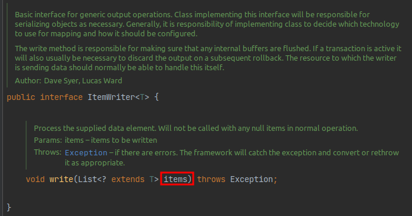

Reader의 `read()`는 Item 하나를 반환하는 반면, Writer의 `write()`는 인자로 Item List를 받습니다.

이를 그림으로 표현하면 아래와 같습니다.  
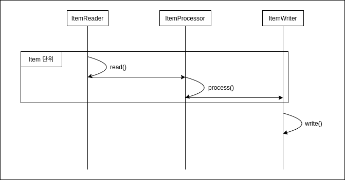

- ItemReader를 통해 각 항목을 개별적으로 읽고 이를 처리하기 위해 ItemProcessor에 전달합니다.
- 이 프로세스는 청크의 Item 개수만큼 처리될 때까지 계속됩니다.
- Chunk 단위만큼 처리가 완료되면 Writer에 전달되어 Writer에 명시되어 있는대로 일괄 처리합니다.

즉, Reader와 Processor를 거쳐 처리된 Item을 Chunk 단위만큼 쌓은 뒤 이를 Writer에 전달하는 것 입니다.

Spring Batch는 다양한 Output 타입을 처리할 수 있도록 많은 Writer를 지원합니다.  
Reader와 마찬가지로, 모든 내용을 다루기는 어렵기 때문에 Database와 관련된 내용들만 다루겠습니다.

### Database Writer
Java 세계에서는 JDBC 또는 ORM을 사용하여 RDBMS에 접근합니다.  
Spring Batch는 JDBC와 ORM 모두 Writer를 제공합니다.  
Writer는 Chunk 단위의 마지막 단계입니다.  
그래서 Database의 영속성과 관련해서는 **항상 마지막에 Flush를 해줘야만** 합니다.

예를들어 아래와 같이 영속성을 사용하는 JPA, Hibernate의 경우 ItemWriter 구현체에서는 `flush()`와 `session.clear()`가 따라옵니다.

###### HibernateWriter.java
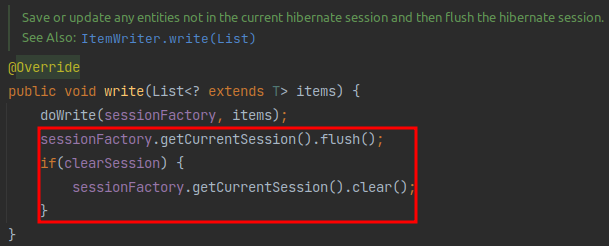

###### JpaItemWriter.java
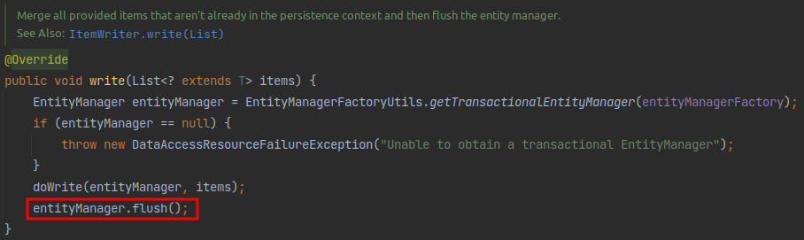

Writer가 받은 모든 Item이 처리된 후, Spring Batch는 현재 트랜잭션을 커밋합니다.  
데이터베이스와 관련된 Writer는 아래와 같이 3가지가 있습니다.
- JdbcBatchItemWriter
- HibernateItemWriter
- JpaItemWriter

이 중에서 많은 분들이 사용하고 계신 JdbcBatchItemWriter와 JpaItemWriter를 알아보겠습니다.

### JdbcBatchItemWriter
ORM을 사용하지 않는 경우 Writer는 대부분 JdbcBatchItemWriter를 사용합니다.  
이 JdbcBatchItemWriter는 아래 그림과 같이 **JDBC의 Batch 기능을 사용하여 한번에 Database로 전달하여 Databse 내부에서 쿼리들이 실행**되도록 합니다.  
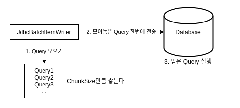

이렇게 처리하는 이유는 Application과 데이터베이스 사이의 데이터를 주고 받는 횟수를 최소화하여 성능 향상을 꾀하기 위함입니다.

실제로 JdbcBatchItemWriter의 `write()`를 확인해보시면 일괄처리하는 것을 확인할 수 있습니다.
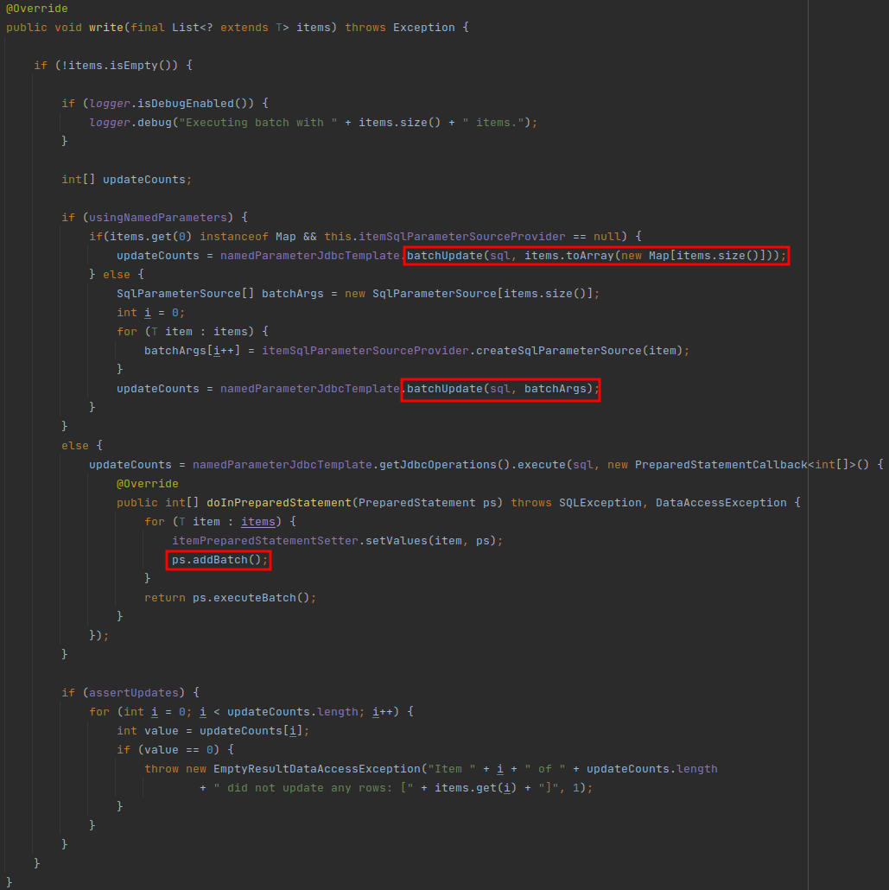

그럼 `JdbcBatchItemWriter`로 간단한 배치를 하나 작성해 보겠습니다.

```java
package com.hansoleee.basicspringbatch.job;

import com.hansoleee.basicspringbatch.entity.Pay;
import lombok.RequiredArgsConstructor;
import lombok.extern.slf4j.Slf4j;
import org.springframework.batch.core.Job;
import org.springframework.batch.core.Step;
import org.springframework.batch.core.configuration.annotation.JobBuilderFactory;
import org.springframework.batch.core.configuration.annotation.StepBuilderFactory;
import org.springframework.batch.item.ItemReader;
import org.springframework.batch.item.database.JdbcBatchItemWriter;
import org.springframework.batch.item.database.JdbcCursorItemReader;
import org.springframework.batch.item.database.builder.JdbcBatchItemWriterBuilder;
import org.springframework.batch.item.database.builder.JdbcCursorItemReaderBuilder;
import org.springframework.context.annotation.Bean;
import org.springframework.context.annotation.Configuration;
import org.springframework.jdbc.core.BeanPropertyRowMapper;

import javax.sql.DataSource;

@Slf4j
@Configuration
@RequiredArgsConstructor
public class JdbcBatchItemWriterJobConfiguration {

  private final JobBuilderFactory jobBuilderFactory;
  private final StepBuilderFactory stepBuilderFactory;
  private final DataSource dataSource;

  public static final int chunkSize = 10;

  @Bean
  public Job jdbcBatchItemWriterJob() {
    return jobBuilderFactory.get("jdbcBatchItemWriterJob")
            .start(jdbcBatchItemWriterStep())
            .build();
  }

  @Bean
  public Step jdbcBatchItemWriterStep() {
    return stepBuilderFactory.get("jdbcBatchItemWriterStep")
            .<Pay, Pay>chunk(chunkSize)
            .reader(jdbcBatchItemWriterReader())
            .writer(jdbcBatchItemWriter())
            .build();
  }

  @Bean
  public JdbcCursorItemReader<Pay> jdbcBatchItemWriterReader() {
    return new JdbcCursorItemReaderBuilder<Pay>()
            .fetchSize(chunkSize)
            .dataSource(dataSource)
            .rowMapper(new BeanPropertyRowMapper<>(Pay.class))
            .sql("SELECT id, amount, tx_name, tx_date_time FROM pay")
            .name("jdbcBatchItemWriter")
            .build();
  }

  /**
   * reader에서 넘어온 데이터를 하나씩 출력하는 writer
   */
  @Bean // beanMapper()을 사용할 경우 필수
  public JdbcBatchItemWriter<Pay> jdbcBatchItemWriter() {
    return new JdbcBatchItemWriterBuilder<Pay>()
            .dataSource(dataSource)
            .sql("INSERT INTO pay2(amount, tx_name, tx_date_time) values (:amount, :txName, :txDateTime)")
            .beanMapped()
            .build();
  }
}
```

JdbcBatchItemWriterBuilder를 사용하는 코드만 조금 다르기 때문에 조금 자세히 설명드리겠습니다.

JdbcBatchItemWriterBuilder는 다음과 같은 설정 값을 갖고 있습니다.

|**Property**|**Parameter Type**|**설명**| 
|:---:|:---:|:---| 
|assertUpdates|boolean|적어도 하나의 항목이 행을 업데이트하거나 삭제하지 않을 경우 예외를 throw할지 여부를 설정합니다.<br>기본 값은 `true`입니다.<br>Exception: `EmptyResultDataAccessException`|
|columnMapped|없음|Key, Value 기반으로 Insert SQL의 Values를 매핑합니다.<br>(ex: `Map<String, Object>`)|
|beanMapped|없음|Pojo 기반으로 Insert SQL의 Values를 매핑합니다.|

여기서 `columnMapped`와 `beanMapped`의 차이가 궁금하실 것 같습니다.  
위 예제 코드는 `beanMapped`로 작성되었습니다.  
만약 위 예제를 `columnMapped`로 변경하면 다음과 같은 코드가 됩니다.
```java
new JdbcBatchItemWriterBuilder<Map<String, Object>>()
        .columnMapped()
        .dataSource(this.dataSource)
        .sql("INSERT INTO pay2(amount, tx_name, tx_date_time) values (:amount, :txName, :txDateTime")
        .build();
```

차이는 간단합니다. Reader에서 Writer로 넘겨주는 타입이 `Map<String, Object>` 또는 `Pay.class`와 같은 POJO 타입이냐 입니다.

그외 궁금해 하실만한 것은 `values(:field)`일 것 같습니다.  
이 값의 경우 **DTO의 Getter 또는 Map의 Key**에 매핑되어 값이 할당됩니다.

추가로 JdbcBatchItemWriterBuilder가 아닌 `JdbcBatchItemWriter`의 설정에서 주의하실게 하나 있습니다.
- JdbcBatchItemWriter의 제네릭 타입은 **Reader에서 넘겨주는 값의 타입**입니다.

Spring Batch를 입문하시는 분들께서 자주 오해하시는게 이 부분입니다.  
위 코드에서도 나와있지만, **Pay2 테이블에 데이터를 넣은 Writer이지만 선언된 제네릭 타입은 Reader/Processor에서 넘겨준 Pay 클래스**입니다.

이외에도 추가로 아셔야할 메소드는 `afterPropertiesSet` 정도가 있습니다.  
이 메소드는 `InitializingBean` 인터페이스에서 갖고 있는 메소드입니다.  
JdbcBatchItemWriter, JpaItemWriter 등 ItemWriter의 구현체들은 모두 `InitialiazingBean` 인터페이스를 구현하고 있습니다.  
여기서 `afterPropertiesSet`이 하는 일은 각각의 Writer들이 실행되기 위해 필요한 필수 값들이 제대로 세팅되어있는 것을 체크합니다.

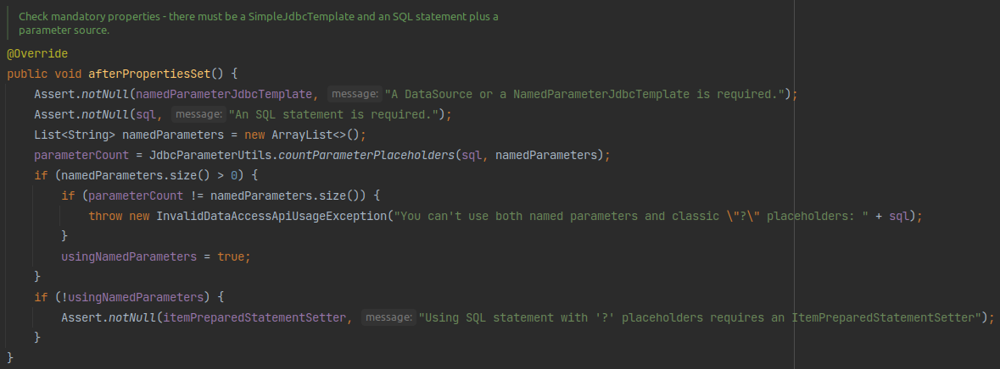

writer를 생성하시고 위 메소드를 그 아래에서 바로 실행해보시면 어느 값이 누락되었는지 명확하게 인지할 수 있어서 많이들 사용하는 옵션입니다.

### JpaItemWriter
두 번째로 알아볼 Writer는 ORM을 사용할 수 있는 `JpaItemWriter`입니다.  
Writer에 전달하는 데이터가 Entity 클래스라면 JpaItemWriter를 사용하시면 됩니다.

바로 샘플 코드로 가보겠습니다.

```java
package com.hansoleee.basicspringbatch.job;

import com.hansoleee.basicspringbatch.entity.Pay;
import com.hansoleee.basicspringbatch.entity.Pay2;
import lombok.RequiredArgsConstructor;
import lombok.extern.slf4j.Slf4j;
import org.springframework.batch.core.Job;
import org.springframework.batch.core.Step;
import org.springframework.batch.core.configuration.annotation.JobBuilderFactory;
import org.springframework.batch.core.configuration.annotation.StepBuilderFactory;
import org.springframework.batch.item.ItemProcessor;
import org.springframework.batch.item.ItemWriter;
import org.springframework.batch.item.database.JpaItemWriter;
import org.springframework.batch.item.database.JpaPagingItemReader;
import org.springframework.batch.item.database.builder.JpaItemWriterBuilder;
import org.springframework.batch.item.database.builder.JpaPagingItemReaderBuilder;
import org.springframework.context.annotation.Bean;
import org.springframework.context.annotation.Configuration;

import javax.persistence.EntityManagerFactory;

@Slf4j
@Configuration
@RequiredArgsConstructor
public class JpaItemWriterJobConfiguration {

  private final JobBuilderFactory jobBuilderFactory;
  private final StepBuilderFactory stepBuilderFactory;
  private final EntityManagerFactory entityManagerFactory;

  public static final int chunkSize = 10;

  @Bean
  public Job jpaItemWriterJob() {
    return jobBuilderFactory.get("jpaItemWriterJob")
            .start(jpaItemWriterStep())
            .build();
  }

  @Bean
  public Step jpaItemWriterStep() {
    return stepBuilderFactory.get("jpaItemWriterStep")
            .<Pay, Pay2>chunk(chunkSize)
            .reader(jpaItemWriterReader())
            .processor(jpaItemProcessor())
            .writer(jpaItemWriter())
            .build();
  }

  @Bean
  public JpaPagingItemReader<Pay> jpaItemWriterReader() {
    return new JpaPagingItemReaderBuilder<Pay>()
            .pageSize(chunkSize)
            .queryString("SELECT p FROM Pay p")
            .name("jpaItemWriterReader")
            .build();
  }

  @Bean
  public ItemProcessor<Pay, Pay2> jpaItemProcessor() {
    return pay -> new Pay2(pay.getAmount(), pay.getTxName(), pay.getTxDateTime());
  }

  @Bean
  public JpaItemWriter<Pay2> jpaItemWriter() {
    JpaItemWriter<Pay2> jpaItemWriter = new JpaItemWriter<>();
    jpaItemWriter.setEntityManagerFactory(entityManagerFactory);
    return jpaItemWriter;
  }
}
```

JpaItemWriter는 JPA를 사용하기 때문에 영속성 관리를 위해 EntityManager를 할당해줘야 합니다.

> 일반적으로 `spring-boot-starter-data-jpa`를 의존성에 등록하면 Entity Manager가 Bean으로 자동생성되어 DI 코드만 추가해 주시면 됩니다.

대신 **필수로 설정해야할 값이 EntityManager뿐**입니다.  
JdbcBatchItemWriter에 비해 필수 값이 Entity Manager 뿐이라 체크할 요소가 적다는 것이 장점 아닌 장점입니다.

###### JpaItemWriter.java
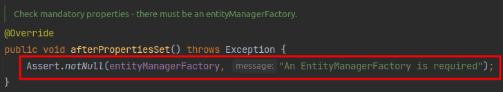
(필수 값 체크 메소드인 `afterPropertiesSet`)

EntityManager만 `set`하면 모든 설정이 끝납니다.

여기서 한가지 JdbcBatchItemWriter와 다른 것이 있다면 processor가 추가되었습니다.  
이유는 Pay Entity를 읽어서 Writer에는 Pay2 Entity를 전달해주기 위함입니다.

> Reader에서 읽은 데이터를 가공해야할 때 Processor가 필요합니다.

JpaItemWriter는 JdbcBatchItemWriter와 달리 **넘어온 Entity를 데이터베이스에 반영**합니다.

즉, JpaItemWriter는 **Entity 클래스를 제네릭 타입으로 받아야만 합니다.**
JdbcBatchItemWriter의 경우 DTO 클래스를 받더라도 `sql`로 지정된 쿼리가 실행되니 문제가 없지만,  
JpaItemWriter는 넘어온 Item을 그대로 `entityManager.merge()`로 테이블에 반영하기 때문입니다.

###### JpaItemWriter.java
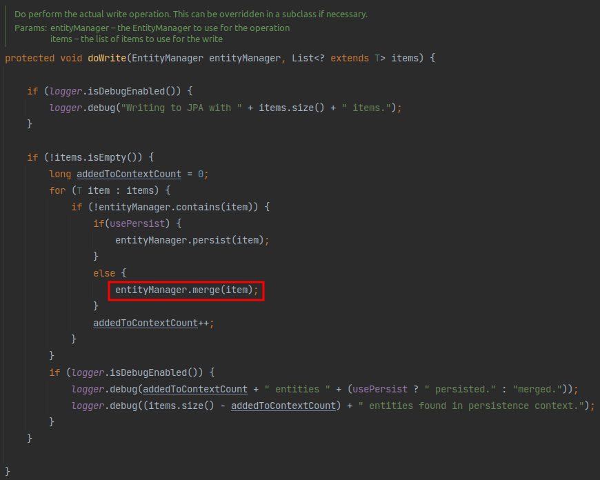

이렇게만 설정하시면 JpaItemWriter의 사용법은 끝입니다.  
실제로 실행해 보시면 정상적으로 결과가 나오는 것을 확인할 수 있습니다.

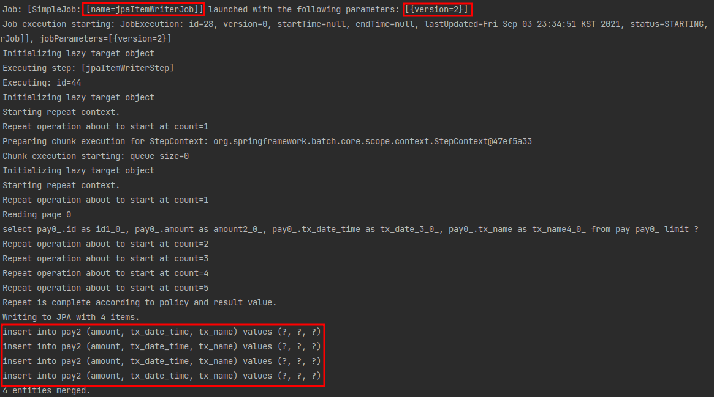

~~만약 entityManagerFactory를 설정하지 않으면 아래와 같은 결과가 나옵니다.~~

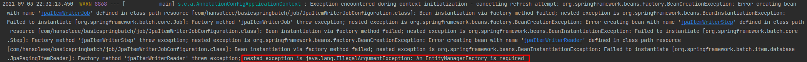

### Custom ItemWriter
Reader와 달리 Writer의 경우 Custom하게 구현해야할 일이 많습니다.

> 물론 Reader 역시 조회용 프레임워크를 어떤 것을 사용하는지에 따라 Reader를 Custom하게 구현해야할 수도 있습니다.  
> 예를들어 Querydsl 기반의 ItemReader를 만든다거나, Jooq 기반의 ItemReader를 만드는 등이 있을 수 있습니다.

Custom Writer 구현의 예는 다음과 같은 경우가 있습니다.
- Reader에서 읽어온 데이터를 RestTemplate으로 외부 API로 전달해야할 때
- 임시 저장을 하고 비교하기 위해 싱글톤 객체에 값을 넣어야할 때 ~~이런 경우를 경험해 보지 못해서 어떤 상황에 어떤 코드를 작성해서 어떤 결과가 나오는지 모르겠다.~~
- 여러 Entity를 동시에 save할 때

이렇게 Spring Batch에서 공식적으로 지원하지 않는 Writer를 사용하고 싶을 때 **ItemWriter 인터페이스를 구현**하시면 됩니다.

아래는 processor에서 넘어온 데이터를 `System.out.println`으로 출력하는 Writer를 만든 경우입니다.

```java
package com.hansoleee.basicspringbatch.job;

import com.hansoleee.basicspringbatch.entity.Pay;
import com.hansoleee.basicspringbatch.entity.Pay2;
import lombok.RequiredArgsConstructor;
import lombok.extern.slf4j.Slf4j;
import org.springframework.batch.core.Job;
import org.springframework.batch.core.Step;
import org.springframework.batch.core.configuration.annotation.JobBuilderFactory;
import org.springframework.batch.core.configuration.annotation.StepBuilderFactory;
import org.springframework.batch.item.ItemProcessor;
import org.springframework.batch.item.ItemWriter;
import org.springframework.batch.item.database.JpaItemWriter;
import org.springframework.batch.item.database.JpaPagingItemReader;
import org.springframework.batch.item.database.builder.JpaPagingItemReaderBuilder;
import org.springframework.context.annotation.Bean;
import org.springframework.context.annotation.Configuration;

import javax.persistence.EntityManagerFactory;
import java.util.List;

@Slf4j
@Configuration
@RequiredArgsConstructor
public class CustomItemWriterJobConfiguration {

  private final JobBuilderFactory jobBuilderFactory;
  private final StepBuilderFactory stepBuilderFactory;
  private final EntityManagerFactory entityManagerFactory;

  public static final int chunkSize = 10;

  @Bean
  public Job customItemWriterJob() {
    return jobBuilderFactory.get("customItemWriterJob")
            .start(customItemWriterStep())
            .build();
  }

  @Bean
  public Step customItemWriterStep() {
    return stepBuilderFactory.get("customItemWriterStep")
            .<Pay, Pay2>chunk(chunkSize)
            .reader(customItemWriterReader())
            .processor(customItemWriterProcessor())
            .writer(customItemWriter())
            .build();
  }

  @Bean
  public JpaPagingItemReader<Pay> customItemWriterReader() {
    return new JpaPagingItemReaderBuilder<Pay>()
            .name("customItemWriterReader")
            .entityManagerFactory(entityManagerFactory)
            .queryString("SELECT p FROM Pay p")
            .build();
  }

  @Bean
  public ItemProcessor<Pay, Pay2> customItemWriterProcessor() {
    return pay -> new Pay2(pay.getAmount(), pay.getTxName(), pay.getTxDateTime());
  }

  @Bean
  public ItemWriter<Pay2> customItemWriter() {
    return items -> {
      for (Pay2 item : items) {
        System.out.println(item);
      }
    };
  }
}
```

보시는 것처럼 `write()`만 `@Override`하시면 구현체 생성은 끝납니다.

### 주의사항
ItemWriter를 사용할 때 **Processor에서 Writer에 List를 전달**하고 싶은 때가 있습니다.  
이때 ItemWriter의 제네릭을 List로 선언해서는 문제를 해결할 수 없는데요.  
해결할 수 있는 방법은 [Writer에 List형 Item을 전달하고 싶을 때 by jojoldu](https://jojoldu.tistory.com/140)

