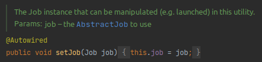
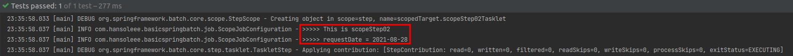

## Spring Batch 테스트 코드
일반적으로 Web Application의 경우 전문 테스터 분들 또는 QA분들께서 전체 기능 검증을 해주는 반면,  
Batch Application의 경우 DB의 최종 상태라던가 메세징 큐의 발행 내역 등 **개발자들이 직접 확인해주는 것** 외에는 검증하기가 쉽지 않습니다.  
(별도의 Admin을 제공하는 것을 포함합니다. ~~Admin? Web Application과 같이 기능 검증을 담당해 주시는 분을 의미하는 것인가?~~)

더군다나 개발자가 로컬 환경에서 Batch Application을 수행하는 것도 많은 수작업이 필요합니다.  
수정/삭제 등의 Batch Application이라면 **한 번 수행할 때마다 로컬 DB의 데이터를 원복**하고 다시 수행하는 작업을 반복해야 합니다.

이러다보니 당연하게 테스트 코드의 필요성이 많이 강조됩니다.

다행이라면 Batch Application은 Web Application보다 테스트 코드 작성이 수월하고, 한 번 작성하게 되면 그 효과가 좋습니다.

아무래도 UI 검증이 필요한 Web Application에 비해 **JAVA 코드에 대한 검증만** 필요한 Batch Application의 테스트 코드를 수월하게 작성할 수 있습니다.

이번에는 Spring Batch 환경에서의 테스트 코드에 관해 알아보겠습니다.

JUnit & Mockito 프레임워크와 H2를 이용한 테스트 환경 등에 대해서는 별도로 설명하지 않습니다.

해당 프레임워크에 대한 기본적인 사용법은 이미 충분히 많은 자료들이 있으니 참고해서 봐주시면 됩니다.

### 통합 테스트

스프링 배치 모듈들 사이에서 ItemReader만 뽑아내 **쿼리를 테스트 해볼 수 있는 환경**을 Setup하려면 여러가지 장치가 필요합니다.

배치의 테스트 코드를 작성할 때 **Reader / Processor의 단위 테스트 코드를 먼저 작성**후 통합 테스트 코드를 작성하도록 합니다.

그치만 배치의 경우 단위 테스트보단 통합 테스트 작성이 비교적 쉽기에 통합 테스트를 작성하는 방법부터 알아보겠습니다.

###### ScopeJobConfiguration.java (/src/main/java/com/hansoleee/basicspringbatch/job/ScopeJobConfiguration.java)
```java
package com.hansoleee.basicspringbatch.job;

import lombok.RequiredArgsConstructor;
import lombok.extern.slf4j.Slf4j;
import org.springframework.batch.core.Job;
import org.springframework.batch.core.Step;
import org.springframework.batch.core.configuration.annotation.JobBuilderFactory;
import org.springframework.batch.core.configuration.annotation.JobScope;
import org.springframework.batch.core.configuration.annotation.StepBuilderFactory;
import org.springframework.batch.core.configuration.annotation.StepScope;
import org.springframework.batch.core.step.tasklet.Tasklet;
import org.springframework.batch.repeat.RepeatStatus;
import org.springframework.beans.factory.annotation.Value;
import org.springframework.context.annotation.Bean;
import org.springframework.context.annotation.Configuration;

@Slf4j
@Configuration
@RequiredArgsConstructor
public class ScopeJobConfiguration {

    private final JobBuilderFactory jobBuilderFactory;
    private final StepBuilderFactory stepBuilderFactory;

    @Bean
    public Job scopeJob() {
        return jobBuilderFactory.get("scopeJob")
                .start(scopeStep01(null))
                .next(scopeStep02())
                .build();
    }

    @Bean
    @JobScope
    public Step scopeStep01(@Value("#{jobParameters[requestDate]}") String requestDate) {
        return stepBuilderFactory.get("scopeStep01")
                .tasklet((contribution, chunkContext) -> {
                    log.info(">>>>> This is scopeStep01");
                    log.info(">>>>> requestDate = {}", requestDate);
                    return RepeatStatus.FINISHED;
                })
                .build();
    }

    @Bean
    public Step scopeStep02() {
        return stepBuilderFactory.get("scopeStep02")
                .tasklet(scopeStep02Tasklet(null))
                .build();
    }

    @Bean
    @StepScope
    public Tasklet scopeStep02Tasklet(@Value("#{jobParameters[requestDate]}") String requestDate) {
        return (contribution, chunkContext) -> {
            log.info(">>>>> This is scopeStep02");
            log.info(">>>>> requestDate = {}", requestDate);
            return RepeatStatus.FINISHED;
        };
    }
}
```

###### ScopeJobConfigurationTest.java (/src/test/java/com/hansoleee/basicspringbatch/job/ScopeJobConfigurationTest.java)
```java
package com.hansoleee.basicspringbatch.job;

import com.hansoleee.basicspringbatch.TestBatchConfig;
import org.assertj.core.api.Assertions;
import org.junit.Test;
import org.junit.runner.RunWith;
import org.springframework.batch.core.BatchStatus;
import org.springframework.batch.core.JobExecution;
import org.springframework.batch.core.JobParameters;
import org.springframework.batch.core.JobParametersBuilder;
import org.springframework.batch.test.JobLauncherTestUtils;
import org.springframework.beans.factory.annotation.Autowired;
import org.springframework.test.context.ContextConfiguration;
import org.springframework.test.context.junit4.SpringRunner;

import java.time.LocalDate;

@RunWith(SpringRunner.class)
@ContextConfiguration(classes = {ScopeJobConfiguration.class, TestBatchConfig.class})
public class ScopeJobConfigurationTest {

    @Autowired
    public JobLauncherTestUtils jobLauncherTestUtils;

    @Test
    public void jobParameter정상출력() throws Exception {
        //given
        LocalDate requestDate = LocalDate.of(2021, 8, 28);

        JobParameters jobParameters = new JobParametersBuilder()
                .addString("requestDate", requestDate.toString())
                .toJobParameters();

        //when
        JobExecution jobExecution = jobLauncherTestUtils.launchJob(jobParameters);

        //then
        Assertions.assertThat(jobExecution.getStatus()).isEqualTo(BatchStatus.COMPLETED);
    }
}
```

1. `@ContextConfiguration(classes = {...})`
- 통합 테스트 실행시 사용할 java 설정들을 선택합니다.
- `ScopeJobConfiguration`: 테스트할 Batch job
- `TestBatchConfig`: 배치 테스트 환경

2. `JobLauncherTestUtils`
- Batch Job을 테스트 환경에서 실행할 Utils 클래스입니다.
- CLI 등으로 실행하는 Job을 **테스트 코드에서 Job을 실행**할 수 있도록 지원합니다.

3. `jobLauncherTestUtils.launchJob(jobParameters)`
- **JobParameter와 함께 Job을 실행**합니다.
    - 운영 환경에서는 CLI로 배치를 수행하겠지만, 테스트 코드에서는 `JobLauncherTestUtils`를 통해 Job을 수행하고 결과를 검증합니다.
- 해당 Job의 결과는 `JobExecution`에 담겨있습니다.
- 성공적으로 Batch가 수행되었는지는 `jobExecution.getStatus()`로 검증합니다.

코드를 보시면 어떤 Batch를 수행할지 **Config 클래스로 지정**되었습니다.  
(여기서는 `ScopeJobConfiguration` Job이 수행될거에요.)

이외에 나머지 클래스들은 불러오지 않기 때문에 **실행 대상에서 자동으로 제외**됩니다.  
자동으로 제외되는 이유는 `JobLauncherTestUtils`가 `@Autowired setJob()`로 현재 Bean에 올라간 Job을 주입받기 때문입니다.  


(`JobLauncherTestUtils`의 `setJob`메소드)

현재 실행하는 테스트 환경에서 `Job` 클래스의 Bean은 `@ContextConfiguration(classes = {...})`에 등록된 `ScopeJobConfiguration`의 Job 하나뿐이라 자동 선택되는 것입니다.

이렇게 하지 않을 경우 JobLauncherTestUtils에서는 **여러 개의 Job Bean 중 어떤 것을 선택해야 할지 알 수 없어 에러**가 발생합니다.

그래서 `@ContextConfiguration(classes = {...})`를 통해 **단일 Job Config**만 선택하도록 합니다.

> 이전에 사용하던 `@ConditionalOnProperty`와 `@TestPropertySource`를 사용하여 **특정 Batch Job**만 설정을 불러와 배치를 테스트했습니다.  
> 이 방식은
> 1. 흔히 말하는 행사 코드가 필요합니다.
     >    - Batch Job에는 `@ConditionalOnProperty(name = "job.name", havingValue = job이름)`,
     >    - 테스트 코드에는 `@TestPropertySource(properties = {"job.name=" = job이름})` 등의 코드가 항상 필요합니다.
> 2. 전체 테스트 수행할 때 매번 Spring Context가 재실행됩니다.
     >    - 앞에서 말씀드린 행사 코드인 `@TestPropertySource`로 인해 **전체 테스트 수행시에는 매번 Spring의 Context가 다시 생성**됩니다.
     >    - 단일 테스트 속도는 빠르지만 **전체 테스트에선 너무나 느립니다.**
> 3. Bean 충돌을 걱정하지 않아도 됩니다.
     >    - 운영 환경에서도 `@ConditionalOnProperty` 덕분에 Job/Step/Reader 등의 Bean 생성시 **다른 Job에서 사용된 Bean 이름**에 대해서 크게 신경쓰지 않아도 됩니다.
> 4. 운영 환경에서의 Spring 실행 속도가 빠릅니다.
     >    - 1번과 마찬가지로 운영 환경에서 배치가 수행될 때 단일 Job 설정들만 로딩되기 때문에 경량화된 상태로 실행 가능합니다.

현재 Spring Batch 공식 문서에서 권장하는 방법은 `@ContextConfiguration`입니다.
`@ContextConfiguration`은 이전 방식을 사용하기 위해 작성하는 행사 코드가 어느 정도 해소됩니다.

`@ContextConfiguration` 이 어노테이션은 `ApplicationContext`에서 관리할 Bean과 Configuration들을 지정할 수 있기 때문에 **특정 Batch Job**들의 설정들만 가져와서 수행할 수 있습니다.

Batch Job 코드에서는 별도로 `@ConditionalOnProperty`등을 사용할 필요가 없습니다.  
**테스트 코드에서 해당 클래스만 별도로 호출**해서 사용하기 때문입니다.

다만 `@ContextConfiguration` 방식을 선택해도 기본적으로 **전체 테스트 수행시 Spring Context가 재실행되는 것**은 마찬가지입니다.  
다행인것은 `@ContextConfiguration`를 선택한다면 테스트 코드를 어떻게 작성하는지에 따라서 **하나의 Spring Context를 사용하는 방법/각자의 Spring Context**를 사용하는 방법을 선택**할 수 있습니다.

이런 이유로 `@ConditionalOnProperty` 대신에 `@ContextConfiguration(classes = {...})`를 사용하여 Batch Job 클래스를 호출하였습니다.

그럼 나머지 호출 대상인 `TestBatchConfig`는 어떤 역할인지 알아보겠습니다.

###### TestBatchConfig.java (/src/test/java/com/hansoleee/basicspringbatch/TestBatchConfig.java)
```java
package com.hansoleee.basicspringbatch;

import org.springframework.batch.core.configuration.annotation.EnableBatchProcessing;
import org.springframework.batch.test.JobLauncherTestUtils;
import org.springframework.boot.autoconfigure.EnableAutoConfiguration;
import org.springframework.context.annotation.Bean;
import org.springframework.context.annotation.Configuration;

@Configuration
@EnableAutoConfiguration
@EnableBatchProcessing
public class TestBatchConfig {

    @Bean
    public JobLauncherTestUtils jobLauncherTestUtils() {
        return new JobLauncherTestUtils();
    }
}
```

1. `@EnableBatchProcessing`
    - 배치 환경을 자동 설정합니다.
    - 테스트 환경에서도 필요하기 때문에 별도의 설정에서 선언되어 사용합니다.
        - 모든 테스트 클래스에서 선언하는 불편함을 없애기 위함입니다.
2. `@Bean JobLauncherTestUtils`
    - 스프링 배치 테스트 유틸인 `JobLauncherTestUtils`을 Bean으로 등록합니다.
        - `JobLauncherTestUtils`를 이용해서 JobParameter를 사용한 Job 실행 등이 이루어집니다.
    - `JobLauncherTestUtils` Bean을 각 테스트 코드에서 `@Autowired`로 호출해서 사용합니다.

실행한 결과는 아래와 같습니다.



