# 출처
[jojoldu님의 Spring Batch 가이드](https://jojoldu.tistory.com/325?category=902551)   
아래의 작성된 내용은 jojoldu 님의 Batch 글을 바탕으로 학습을 위해 작성한 것을 알려드립니다.
***

# 아주 간단한 실습 (Hello World)
***
```java
package com.hansoleee.basicspringbatch.job;

import lombok.RequiredArgsConstructor;
import lombok.extern.slf4j.Slf4j;
import org.springframework.batch.core.Job;
import org.springframework.batch.core.Step;
import org.springframework.batch.core.configuration.annotation.JobBuilderFactory;
import org.springframework.batch.core.configuration.annotation.StepBuilderFactory;
import org.springframework.batch.repeat.RepeatStatus;
import org.springframework.context.annotation.Bean;
import org.springframework.context.annotation.Configuration;

@Slf4j
@Configuration
@RequiredArgsConstructor
public class SimpleJobConfiguration {

    private final JobBuilderFactory jobBuilderFactory;
    private final StepBuilderFactory stepBuilderFactory;
    
    @Bean
    public Job simpleJob() {
        return jobBuilderFactory.get("simpleJob")
                .start(simpleStep01())
                .build();
    }
    
    @Bean
    public Step simpleStep01() {
        return stepBuilderFactory.get("simpleStep01")
                .tasklet((contribution, chunkContext) -> {
                    log.info(">>>>> Hello World, This is Step01.");
                    return RepeatStatus.FINISHED;
                })
                .build();
    }
}

```
- @Configuration
  - Spring Batch의 모든 job은 @configuration으로 등록해서 사용합니다.
- jobBuilderFactory.get("simpleJob")
  - simpleJob이란 이름의 Batch Job을 생성합니다.
  - job의 이름은 별도로 지정하지 않고, Builder를 이용해 지정합니다.
- stepBuilderFactory.get("simpleStep01")
  - simpleStep01이란 이름의 Batch Step을 생성합니다.
  - jobBuilderFactory.get("simpleJob")와 마찬가지로 Builder를 이용해 이름을 지정합니다.
- .tasklet((contribution, chunkContext))
  - Step 안에서 수행될 기능들을 명시합니다.
  - Tasklet은 Step 안에서 단일로 수행될 커스텀한 기능들을 선언할 때 사용합니다.
  - 지금은 Batch가 수행되면 log.info(">>>>> This is Step01")가 출력되도록 합니다.

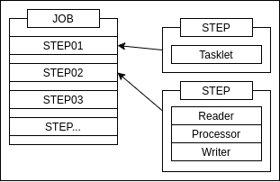 

Job 안에는 여러 Step이 포함될 수 있습니다.   
Step은 2종류가 있습니다.   
1. Tasklet 으로 구성된 Step
2. Reader, Processor, Writer 묶음로 구성된 Step   
   
Step은 1번과 2번을 섞어서 구성할 수 없습니다.   
예를 들어, Reader와 Processor를 마치고 Tasklet으로 마무리하는 코드는 짤 수 없습니다.

위 Batch Job과 Tasklet을 이용한 코드를 실행해보겠습니다.
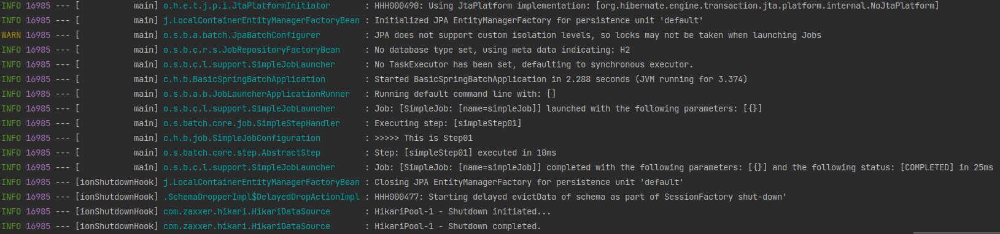
***

# 간단한 실습 (DB 연결)
***
## Spring Batch 실행을 위한 메타데이터 설명
Spring Batch를 사용하기위해서 메타데이터 테이블이 필요합니다.
>**메타데이터**란 **다른 데이터를 설명해 주는 데이터**입니다.   
>자세한 설명은 [위키백과의 메타데이터](https://ko.wikipedia.org/wiki/%EB%A9%94%ED%83%80%EB%8D%B0%EC%9D%B4%ED%84%B0) 또는 [나무위키의 메타데이터](https://namu.wiki/w/%EB%A9%94%ED%83%80%EB%8D%B0%EC%9D%B4%ED%84%B0) 을 참고해주세요.

Spring Batch의 메타데이터는 다음과 같은 내용을 담고 있습니다.
- 이전에 실행한 Job이 어떤 것들이 잇는지
- 최근 실패한 Batch Parameter가 어떤 것들이 있고, 성공한 Job은 어떤 것들이 있는지
- 다시 실행한다면 어디서부터 시작하면 될지
- 어떤 Job에 어떤 Step들이 있었고, Step들 중 성공한 Step과 실패한 Step들은 어떤 것들이 있는지

Batch 어플리케이션을 운영하기 위한 메타데이터가 여러 테이블에 나눠져 있습니다.   
메타데이터 테이블 구조는 아래와 같습니다.

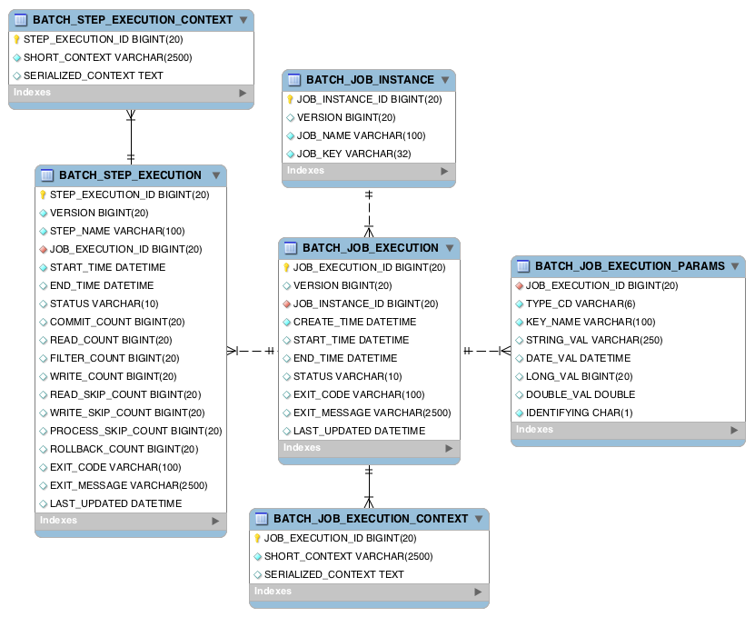

출처: [metaDataSchema](https://docs.spring.io/spring-batch/docs/3.0.x/reference/html/metaDataSchema.html)

이 테이블들이 있어야만 Spring Batch가 정상 작동합니다. ~~아주 간단한 실습으로 돌린건 Batch가 아니란 말인가?~~   
H2 DB를 사용할 경우에는 해당 테이블을 Spring Boot가 자동으로 생성해주기 때문에 테이블을 생성하지 않았아도 에러가 없었습니다.   
하지만 MySQL 또는 PostgreSQL 이외의 다른 DB를 사용할 경우에는 개발자가 직접 생성해야만 합니다.   

해당 Table의 SQL은 Spring Batch에서 제공함으로 아래의 경로에서 사용하는 DBMS에 맞는 것으로 복붙하시면 됩니다.
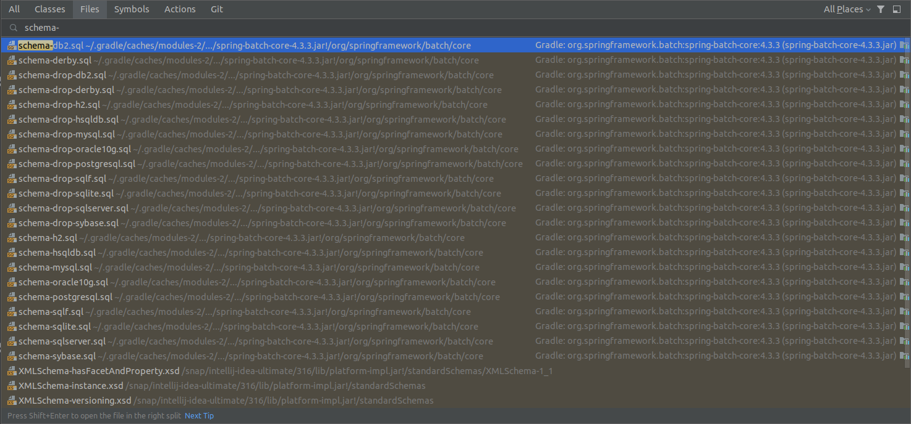

## DB 연결 (MariaDB 사용)
프로젝트의 src/main/resources/application.yml에 다음과 같이 Datasource 설정을 추가하겠습니다.
```yaml
spring:
  profiles:
    active: local
---
spring:
  profiles: local
  datasource:
    driver-class-name: org.h2.Driver
    url: jdbc:h2:tcp://localhost/~/h2-db/basic_spring_batch
    username: sa
    password:
---
spring:
  profiles: mariadb
  datasource:
    driver-class-name: org.mariadb.jdbc.Driver
    url: jdbc:mariadb://localhost:3306/basic_spring_batch
    username: basicspringbatch
    password: basicspringbatch
```

설정을 마치셨다면 실행해봅니다.   

실행 환경을 application.yml에 작성된 Profile 중에서 mariadb 적용을 위한 설정을 해보겠습니다.
상단의 실행환경 버튼을 클릭합니다.
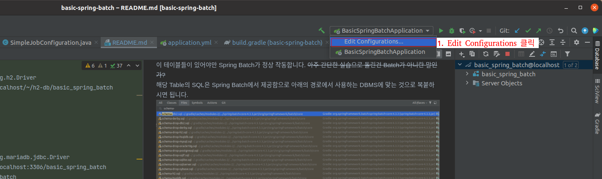

기본 실행 환경을 복사합니다.
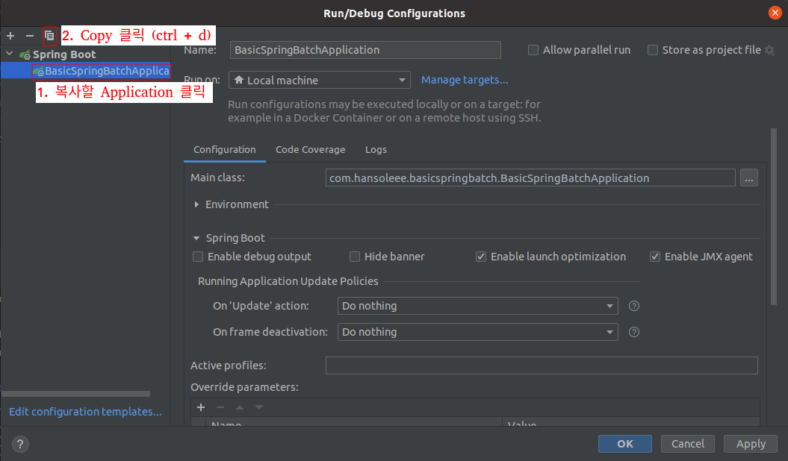

복사된 실행 환경의 이름과 적용할 Profile 을 입력합니다.
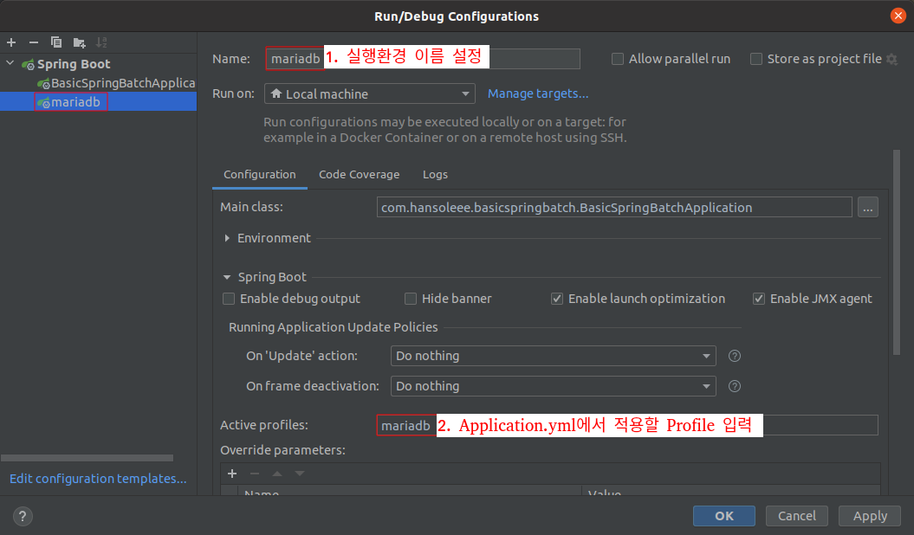

생성한 실행 환경(mariadb)를 선택하고 Run 버튼을 눌러 실행합니다.


이제 콘솔을 확인해보면 mariadb 로 실행되었다는 것을 확인할 수 있습니다.
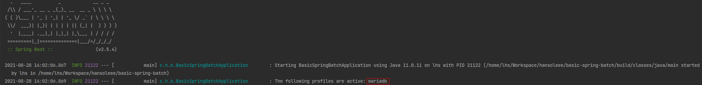

콘솔을 좀 더 아래로 내려보시면
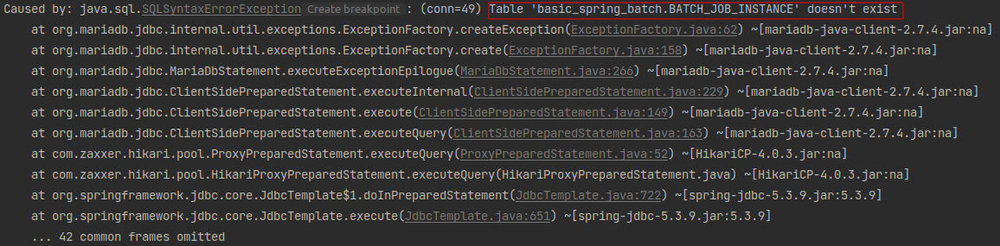

메타데이터 테이블인 BATCH_JOB_INSTANCE가 존재하지 않는다는 에러와 함께 배치 어플리케이션이 종료되었다는 것을 알 수 있습니다.

메타데이터 테이블은 위에 말씀드린 것처럼 schema-mysql.sql 파일을 검색하고 해당 SQL문을 사용하는 DB에서 실행해줍니다.   
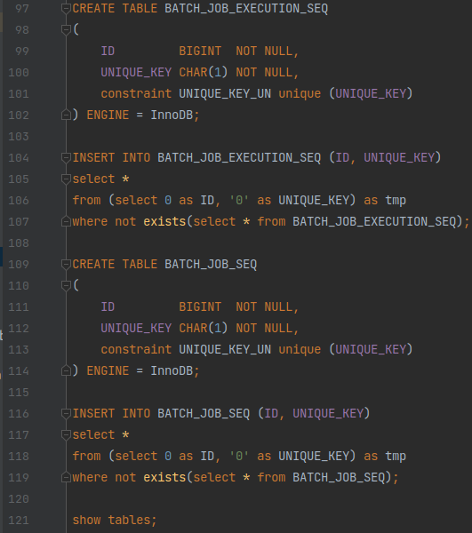

그리고 테이블이 잘 생성되었는지 확인해봅니다.
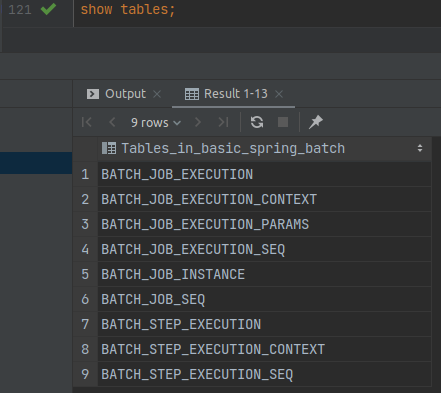

메타데이터 테이블을 생성한 뒤 다시 배치를 실행해보겠습니다.
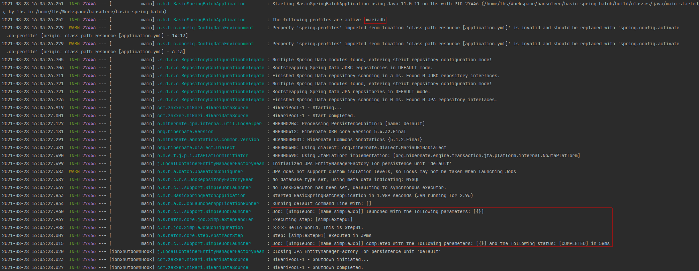

MariaDB에서도 정상적으로 배치가 실행된 것을 확인할 수 있습니다.
***

