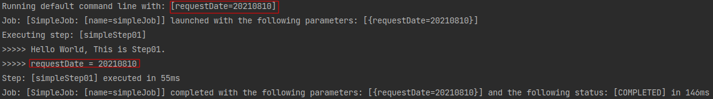

# 출처
[jojoldu님의 Spring Batch 가이드](https://jojoldu.tistory.com/325?category=902551)   
아래의 작성된 내용은 jojoldu 님의 글의 거의 모든 부분을 Copy 한 것임을 알려드립니다.
***

# 아주 간단한 실습 (Hello World)
***
```java
package com.hansoleee.basicspringbatch.job;

import lombok.RequiredArgsConstructor;
import lombok.extern.slf4j.Slf4j;
import org.springframework.batch.core.Job;
import org.springframework.batch.core.Step;
import org.springframework.batch.core.configuration.annotation.JobBuilderFactory;
import org.springframework.batch.core.configuration.annotation.StepBuilderFactory;
import org.springframework.batch.repeat.RepeatStatus;
import org.springframework.context.annotation.Bean;
import org.springframework.context.annotation.Configuration;

@Slf4j
@Configuration
@RequiredArgsConstructor
public class SimpleJobConfiguration {

    private final JobBuilderFactory jobBuilderFactory;
    private final StepBuilderFactory stepBuilderFactory;
    
    @Bean
    public Job simpleJob() {
        return jobBuilderFactory.get("simpleJob")
                .start(simpleStep01())
                .build();
    }
    
    @Bean
    public Step simpleStep01() {
        return stepBuilderFactory.get("simpleStep01")
                .tasklet((contribution, chunkContext) -> {
                    log.info(">>>>> Hello World, This is Step01.");
                    return RepeatStatus.FINISHED;
                })
                .build();
    }
}

```
- @Configuration
  - Spring Batch의 모든 job은 @configuration으로 등록해서 사용합니다.
- jobBuilderFactory.get("simpleJob")
  - simpleJob이란 이름의 Batch Job을 생성합니다.
  - job의 이름은 별도로 지정하지 않고, Builder를 이용해 지정합니다.
- stepBuilderFactory.get("simpleStep01")
  - simpleStep01이란 이름의 Batch Step을 생성합니다.
  - jobBuilderFactory.get("simpleJob")와 마찬가지로 Builder를 이용해 이름을 지정합니다.
- .tasklet((contribution, chunkContext))
  - Step 안에서 수행될 기능들을 명시합니다.
  - Tasklet은 Step 안에서 단일로 수행될 커스텀한 기능들을 선언할 때 사용합니다.
  - 지금은 Batch가 수행되면 log.info(">>>>> This is Step01")가 출력되도록 합니다.

 

Job 안에는 여러 Step이 포함될 수 있습니다.   
Step은 2종류가 있습니다.   
1. Tasklet 으로 구성된 Step
2. Reader, Processor, Writer 묶음로 구성된 Step   
   
Step은 1번과 2번을 섞어서 구성할 수 없습니다.   
예를들어 Reader와 Processor를 마치고 Tasklet으로 마무리하는 코드는 짤 수 없습니다.

위 Batch Job과 Tasklet을 이용한 코드를 실행해보겠습니다.

***

# 간단한 실습 (DB 연결)
***
## Spring Batch 실행을 위한 메타데이터 설명
Spring Batch를 사용하기위해서 메타데이터 테이블이 필요합니다.
>**메타데이터**란 **다른 데이터를 설명해 주는 데이터**입니다.   
>자세한 설명은 [위키백과의 메타데이터](https://ko.wikipedia.org/wiki/%EB%A9%94%ED%83%80%EB%8D%B0%EC%9D%B4%ED%84%B0) 또는 [나무위키의 메타데이터](https://namu.wiki/w/%EB%A9%94%ED%83%80%EB%8D%B0%EC%9D%B4%ED%84%B0) 을 참고해주세요.

Spring Batch의 메타데이터는 다음과 같은 내용을 담고 있습니다.
- 이전에 실행한 Job이 어떤 것들이 잇는지
- 최근 실패한 Batch Parameter가 어떤 것들이 있고, 성공한 Job은 어떤 것들이 있는지
- 다시 실행한다면 어디서부터 시작하면 될지
- 어떤 Job에 어떤 Step들이 있었고, Step들 중 성공한 Step과 실패한 Step들은 어떤 것들이 있는지

Batch 어플리케이션을 운영하기 위한 메타데이터가 여러 테이블에 나눠져 있습니다.   
메타데이터 테이블 구조는 아래와 같습니다.


출처: [metaDataSchema](https://docs.spring.io/spring-batch/docs/3.0.x/reference/html/metaDataSchema.html)

이 테이블들이 있어야만 Spring Batch가 정상 작동합니다. ~~아주 간단한 실습으로 돌린건 Batch가 아니란 말인가?~~   
H2 DB를 사용할 경우에는 해당 테이블을 Spring Boot가 자동으로 생성해주기 때문에 테이블을 생성하지 않았아도 에러가 없었습니다.   
하지만 MySQL 또는 PostgreSQL 이외의 다른 DB를 사용할 경우에는 개발자가 직접 생성해야만 합니다.   

해당 Table의 SQL은 Spring Batch에서 제공함으로 아래의 경로에서 사용하는 DBMS에 맞는 것으로 복붙하시면 됩니다.


## DB 연결 (MariaDB 사용)
프로젝트의 src/main/resources/application.yml에 다음과 같이 Datasource 설정을 추가하겠습니다.
```yaml
spring:
  profiles:
    active: local
---
spring:
  profiles: local
  datasource:
    driver-class-name: org.h2.Driver
    url: jdbc:h2:tcp://localhost/~/h2-db/basic_spring_batch
    username: sa
    password:
---
spring:
  profiles: mariadb
  datasource:
    driver-class-name: org.mariadb.jdbc.Driver
    url: jdbc:mariadb://localhost:3306/basic_spring_batch
    username: basicspringbatch
    password: basicspringbatch
```

설정을 마치셨다면 실행해봅니다.   

실행 환경을 application.yml에 작성된 Profile 중에서 mariadb 적용을 위한 설정을 해보겠습니다.
상단의 실행환경 버튼을 클릭합니다.


기본 실행 환경을 복사합니다.


복사된 실행 환경의 이름과 적용할 Profile 을 입력합니다.


생성한 실행 환경(mariadb)를 선택하고 Run 버튼을 눌러 실행합니다.


이제 콘솔을 확인해보면 mariadb 로 실행되었다는 것을 확인할 수 있습니다.


콘솔을 좀 더 아래로 내려보시면


메타데이터 테이블인 BATCH_JOB_INSTANCE가 존재하지 않는다는 에러와 함께 배치 어플리케이션이 종료되었다는 것을 알 수 있습니다.

메타데이터 테이블은 위에 말씀드린 것처럼 schema-mysql.sql 파일을 검색하고 해당 SQL문을 사용하는 DB에서 실행해줍니다.   


그리고 테이블이 잘 생성되었는지 확인해봅니다.


메타데이터 테이블을 생성한 뒤 다시 배치를 실행해보겠습니다.


MariaDB에서도 정상적으로 배치가 실행된 것을 확인할 수 있습니다.
***

# 메타데이터 테이블에 대한 학습
***


위 메타데이터 테이블들의 역할이 무엇인지, 어떤 데이터를 저장하는 실습을 통해 하나씩 알아보겠습니다.

## BATCH_JOB_INSTANCE
가장 먼저 확인할 테이블은 BATCH_JOB_INSTANCE 입니다.   


- JOB_INSTANCE_ID : BATCH_JOB_INSTANCE 테이블의 PK
- JOB_NAME : 수행한 Batch Job 이름

방금 실행한 simpleJob을 확인할 수 있습니다.   
BATCH_JOB_INSTANCE 테이블은 **Job Parameter에 따라 생성되는 테이블**입니다.   
Job Parameter란
Spring Batch가 실행될 때 **외부에서 받을 수 있는 Parameter**입니다.   

예를들어, 특정 날짜를 Job Parameter로 넘기면 **Spring Batch에서는 해당 날짜 데이터로 조회/가공/입력 등의 작업**을 할 수 있습니다.

같은 Batch Job이라도 Job Parameter가 다르면 BATCH_JOB_INSTANCE에는 기록되며,    
**Job Parameter가 같다면 기록되지 않습니다.**

확인해보겠습니다.
SimpleJobConfiguration 코드를 아래와 같이 수정합니다.
```java
package com.hansoleee.basicspringbatch.job;

import lombok.RequiredArgsConstructor;
import lombok.extern.slf4j.Slf4j;
import org.springframework.batch.core.Job;
import org.springframework.batch.core.Step;
import org.springframework.batch.core.configuration.annotation.JobBuilderFactory;
import org.springframework.batch.core.configuration.annotation.JobScope;
import org.springframework.batch.core.configuration.annotation.StepBuilderFactory;
import org.springframework.batch.repeat.RepeatStatus;
import org.springframework.beans.factory.annotation.Value;
import org.springframework.context.annotation.Bean;
import org.springframework.context.annotation.Configuration;

@Slf4j
@Configuration
@RequiredArgsConstructor
public class SimpleJobConfiguration {

    private final JobBuilderFactory jobBuilderFactory;
    private final StepBuilderFactory stepBuilderFactory;
    
    @Bean
    public Job simpleJob() {
        return jobBuilderFactory.get("simpleJob")
                .start(simpleStep01(null))
                .build();
    }
    
    @Bean
    @JobScope
    public Step simpleStep01(@Value("#{jobParameters[requestDate]}") String requestDate) {
        return stepBuilderFactory.get("simpleStep01")
                .tasklet((contribution, chunkContext) -> {
                    log.info(">>>>> Hello World, This is Step01.");
                    log.info(">>>>> requestDate = {}", requestDate);
                    return RepeatStatus.FINISHED;
                })
                .build();
    }
}
```
빨간색 부분만 추가/수정하였습니다.


변경된 코드는 Job Parameter로 받은 값을 로그에 출력하는 기능을 추가하였습니다.

그럼 Job Parameter를 넣어서 Batch Application을 실행해보겠습니다.
좀 전과 마찬가지로 실행환경 설정창으로 이동합니다.   


아래와 같이 **Program arguments**에 requestDate=20210828을 입력합니다.   


프로그램을 실행봅니다.
그러면 전달된 Job Parameter가 로그에 찍힌 것을 확인할 수 있습니다.


BATCH_JOB_INSTANCE도 확인해보겠습니다.


새로운 JOB_INSTANCE_ID가 추가되었습니다.

그러면 Job Parameter가 같으면 어떻게 되는지도 확인해보겠습니다.   
(JOB_INSTANCE_ID는 Job Parameter에 따라 생성됩니다.)


실행 결과는 JobInstanceAlreadyCompleteException 예외와 메세지가 있습니다.
```text
A job instance already exists and is complete for parameters={requestDate=20210828}.  If you want to run this job again, change the parameters.
```
해당 Parameter에 대한 Job Instance가 존재하니 Parameter를 바꾸어 실행하라고 하네요.

이번에는 Parameter를 requestDate=20210810로 설정하고 실행해보겠습니다.


Parameter가 바뀌니 정상적으로 프로그램이 동작하였습니다.    
그리고 BATCH_JOB_INSTANCE 테이블에 JOB_INSTANCE_ID가 추가되었는지 확인해보겠습니다.


정리해보면, 동일한 Job은 Job Parameter가 달라지면 그때마다 BATCH_JOB_INSTANCE에 생성되며,   
동일한 Job Parameter를 통해 실행된 Job Instance는 여러개 존재할 수 없습니다.
***

## BATCH_JOB_EXECUTION
다음으로 알아볼 것은 BATCH_JOB_EXECUTION 테이블입니다.   


BATCH_JOB_EXECUTION 테이블을 보시면 4개의 ROW가 있습니다.   
이전에 실행했던 파라미터가 없는 simpleJob 2개(JOB_INSTANCE_ID=1),   
~~위의 실습과정 상으로는 파라미터가 없는 simpleJob 실행 결과는 1개가 되어야합니다.    
저는 개인적인 호기심으로 2번 실행시켜 2개가 생겼습니다.~~    
requestDate=20210828 파라미터로 실행했던 simpleJob,   
requestDate=20210810 파라미터로 실행했던 simpleJob 까지 총 4개의 실행 데이터 입니다.

**BATCH_JOB_EXECUTION**과 **BATCH_JOB_INSTANCE**는 **부모-자식 관계**입니다.   
BATCH_JOB_EXECUTION은 자신의 부모 JOB_INSTANCE가 성공/실패했던 모든 내역을 가지고 있습니다.   
한 번 실습해보겠습니다.

SimpleJobConfiguration 코드를 아래와 같이 변경해보겠습니다.
```java
package com.hansoleee.basicspringbatch.job;

import lombok.RequiredArgsConstructor;
import lombok.extern.slf4j.Slf4j;
import org.springframework.batch.core.Job;
import org.springframework.batch.core.Step;
import org.springframework.batch.core.configuration.annotation.JobBuilderFactory;
import org.springframework.batch.core.configuration.annotation.JobScope;
import org.springframework.batch.core.configuration.annotation.StepBuilderFactory;
import org.springframework.batch.repeat.RepeatStatus;
import org.springframework.beans.factory.annotation.Value;
import org.springframework.context.annotation.Bean;
import org.springframework.context.annotation.Configuration;

@Slf4j // log 사용을 위한 lombok Annotation
@Configuration
@RequiredArgsConstructor // 생성자 DI를 위한 lombok Annotation
public class SimpleJobConfiguration {

    private final JobBuilderFactory jobBuilderFactory;
    private final StepBuilderFactory stepBuilderFactory;
    
    @Bean
    public Job simpleJob() {
        return jobBuilderFactory.get("simpleJob")
                .start(simpleStep01(null))
                .next(simpleStep02(null))
                .build();
    }

    @Bean
    @JobScope
    public Step simpleStep01(@Value("#{jobParameters[requestDate]}") String requestDate) {
        return stepBuilderFactory.get("simpleStep01")
                .tasklet((contribution, chunkContext) -> {
                    log.info(">>>>> Hello World, This is Step01.");
                    log.info(">>>>> requestDate = {}", requestDate);
                    return RepeatStatus.FINISHED;
                })
                .build();
    }

    @Bean
    @JobScope
    public Step simpleStep02(@Value("#{jobParameters[requestDate]}") String requestDate) {
        return stepBuilderFactory.get("simpleStep02")
                .tasklet((contribution, chunkContext) -> {
                    log.info(">>>>> This is Step02.");
                    log.info(">>>>> requestDate = {}", requestDate);
                    return RepeatStatus.FINISHED;
                })
                .build();
    }
}
```
아래와 같이 빨간색 부분만 추가/수정을 해주세요.   


이번에는 Job Parameter를 requestDate=20210807로 변경하겠습니다.   


이제 실행해보겠습니다.   

```text
java.lang.IllegalArgumentException: Step01에서 실패합니다.
```

아래로 조금 내려보시면   

```text
Job: [SimpleJob: [name=simpleJob]] completed with the following parameters: [{requestDate=20210807}] and the following status: [FAILED] in 86ms
```

저희가 발생시킨 Exception과 함께 Batch Job이 실패했음을 볼 수 있습니다.   
그럼 BATCH_JOB_EXECUTION 테이블은 어떻게 변화되었는지 확인해보겠습니다.

JOB_INSTANCE_ID를 FK로 물고있는 EXECUTION이 FAILED 라는 것과   
EXIT_MESSAGE로 Exception까지 저장되있는 것을 확인할 수 있습니다.

그럼 코드를 수정해서 JOB을 성공시켜보겠습니다.
```java
package com.hansoleee.basicspringbatch.job;

import lombok.RequiredArgsConstructor;
import lombok.extern.slf4j.Slf4j;
import org.springframework.batch.core.Job;
import org.springframework.batch.core.Step;
import org.springframework.batch.core.configuration.annotation.JobBuilderFactory;
import org.springframework.batch.core.configuration.annotation.JobScope;
import org.springframework.batch.core.configuration.annotation.StepBuilderFactory;
import org.springframework.batch.repeat.RepeatStatus;
import org.springframework.beans.factory.annotation.Value;
import org.springframework.context.annotation.Bean;
import org.springframework.context.annotation.Configuration;

@Slf4j
@Configuration
@RequiredArgsConstructor
public class SimpleJobConfiguration {

    private final JobBuilderFactory jobBuilderFactory;
    private final StepBuilderFactory stepBuilderFactory;
    
    @Bean
    public Job simpleJob() {
        return jobBuilderFactory.get("simpleJob")
                .start(simpleStep01(null))
                .next(simpleStep02(null))
                .build();
    }

    @Bean
    @JobScope
    public Step simpleStep01(@Value("#{jobParameters[requestDate]}") String requestDate) {
        return stepBuilderFactory.get("simpleStep01")
                .tasklet((contribution, chunkContext) -> {
                    log.info(">>>>> This is Step01.");
                    log.info(">>>>> requestDate = {}", requestDate);
                    return RepeatStatus.FINISHED;
                })
                .build();
    }

    @Bean
    @JobScope
    public Step simpleStep02(@Value("#{jobParameters[requestDate]}") String requestDate) {
        return stepBuilderFactory.get("simpleStep02")
                .tasklet((contribution, chunkContext) -> {
                    log.info(">>>>> This is Step02.");
                    log.info(">>>>> requestDate = {}", requestDate);
                    return RepeatStatus.FINISHED;
                })
                .build();
    }
}
```
아래와 같이 simpleStep01에서 Exception 발생 부분을 로그 출력과 정상 종료 코드로 변경해주세요.


변경된 코드로 Batch를 실행해보겠습니다.

```text
Executing step: [simpleStep01]
>>>>> This is Step01.
>>>>> requestDate = 20210807
Step: [simpleStep01] executed in 31ms
Executing step: [simpleStep02]
>>>>> This is Step02.
>>>>> requestDate = 20210807
Step: [simpleStep02] executed in 18ms
```

JOB은 성공적으로 수행되었습니다.   
BATCH_JOB_EXECUTION 테이블을 확인해보겠습니다.   


노란색 박스의 JOB_INSTANCE_ID의 값이 4인 Row가 2개 있습니다.   
각 Row의 STATUS, EXIT_CODE Column을 보시면 FAILED와 COMPLETED가 있는 것을 확인할 수 있습니다.   
Job Parameter requestDate=20210807로 생성된 JOB_INSTANCE_ID(id=4)가 2번 실행되었고,   
첫번째는 실패, 두번째는 성공했다는 것을 알 수 있습니다.   

여기서 BATCH의 실행 조건은 
1. 동일한 Job Parameter로 2번 실행할 수 있다.
2. 동일한 Job Parameter로 성공한 기록이 있다면 재수행이 안된다.   

이라는 것을 알 수 있습니다.

그럼 여기까지의 내용을 정리해보겠습니다.   
위에서 나온 두 테이블(BATCH_JOB_INSTANCE, BATCH_JOB_EXECUTIOIN)과  
저희가 만든 Spring Batch Job의 관계를 정리하면 아래와 같습니다.  


여기서 Job이란 저희가 SimpleJobConfiguration에 작성한 Spring Batch Job을 얘기합니다.

위 2개의 테이블 외에도 Job 관련된 테이블은 더 있습니다.  
예를들면 BATCH_JOB_EXECUTION_PARAM 테이블은 BATCH_JOB_EXECUTION 테이블이 생성될 당시에 입력받은 Job Parameter를 담고 있습니다.  


이외에도 다양한 메타데이터 테이블이 존재합니다.  
각각의 테이블은 앞으로 과정에서 필요할 때마다 추가적으로 소개드리겠습니다.  
~~각각의 테이블은 앞으로 과정을 학습하면서 추가적으로 작성하겠습니다.~~  
>JOB_EXECUTION 이외에도 STEP_EXECUTION 관련 테이블이 여러개 존재합니다.  
> 이 부분을 지금 다루기에는 내용이 너무 커지기 때문에 이후에 진행될 **Spring Batch 재시도/SKIP 전략**편에서 자세하게 소개드리겠습니다.

이후 과정에서는 Spring Batch 예제와 코드를 소개드리겠습니다.

### Spring Batch Test 코드는?
아래 내용은 위 글과 마찬가지로 jojoldu님의 원분을 그대로 옮겨적었습니다.  
글 첫 부분에 나오는 인칭 대명사의 '저'는 jojoldu님이라는 것을 미리 말씀드립니다.  
***
저의 이전 [Spring Batch](https://jojoldu.tistory.com/search/batch) 글을 보시면 아시겠지만, 저는 Spring Batch 예제를 항상 테스트 코드로 작성했습니다.
그러나 이 방식에 단점이 존재했는데요.
develop/production 환경에서 Spring Batch를 사용하시는 분들이 Batch Job Intstance Context 문제로 어려움을 겪는걸 많이 봤습니다.
Spring Batch에 적응하시기 전까지는 H2를 이용한 테스트 코드는 자제하시길 추천합니다.
H2를 이용한 테스트 코드는 최대한 나중에 보여드리겠습니다.
초반부에는 MySQL을 이용하면서 메타 테이블 정보가 남아 있는 상태에서의 Spring Batch에 최대한 적응하시도록 진행하겠습니다.