# 출처
[jojoldu님의 Spring Batch 가이드](https://jojoldu.tistory.com/325?category=902551)   
아래의 작성된 내용은 jojoldu 님의 글의 거의 모든 부분을 Copy 한 것임을 알려드립니다.
***

# 아주 간단한 실습 (Hello World)
***
```java
package com.hansoleee.basicspringbatch.job;

import lombok.RequiredArgsConstructor;
import lombok.extern.slf4j.Slf4j;
import org.springframework.batch.core.Job;
import org.springframework.batch.core.Step;
import org.springframework.batch.core.configuration.annotation.JobBuilderFactory;
import org.springframework.batch.core.configuration.annotation.StepBuilderFactory;
import org.springframework.batch.repeat.RepeatStatus;
import org.springframework.context.annotation.Bean;
import org.springframework.context.annotation.Configuration;

@Slf4j
@Configuration
@RequiredArgsConstructor
public class SimpleJobConfiguration {

    private final JobBuilderFactory jobBuilderFactory;
    private final StepBuilderFactory stepBuilderFactory;
    
    @Bean
    public Job simpleJob() {
        return jobBuilderFactory.get("simpleJob")
                .start(simpleStep01())
                .build();
    }
    
    @Bean
    public Step simpleStep01() {
        return stepBuilderFactory.get("simpleStep01")
                .tasklet((contribution, chunkContext) -> {
                    log.info(">>>>> Hello World, This is Step01.");
                    return RepeatStatus.FINISHED;
                })
                .build();
    }
}

```
- @Configuration
  - Spring Batch의 모든 job은 @configuration으로 등록해서 사용합니다.
- jobBuilderFactory.get("simpleJob")
  - simpleJob이란 이름의 Batch Job을 생성합니다.
  - job의 이름은 별도로 지정하지 않고, Builder를 이용해 지정합니다.
- stepBuilderFactory.get("simpleStep01")
  - simpleStep01이란 이름의 Batch Step을 생성합니다.
  - jobBuilderFactory.get("simpleJob")와 마찬가지로 Builder를 이용해 이름을 지정합니다.
- .tasklet((contribution, chunkContext))
  - Step 안에서 수행될 기능들을 명시합니다.
  - Tasklet은 Step 안에서 단일로 수행될 커스텀한 기능들을 선언할 때 사용합니다.
  - 지금은 Batch가 수행되면 log.info(">>>>> This is Step01")가 출력되도록 합니다.

 

Job 안에는 여러 Step이 포함될 수 있습니다.   
Step은 2종류가 있습니다.   
1. Tasklet 으로 구성된 Step
2. Reader, Processor, Writer 묶음로 구성된 Step   
   
Step은 1번과 2번을 섞어서 구성할 수 없습니다.   
예를 들어, Reader와 Processor를 마치고 Tasklet으로 마무리하는 코드는 짤 수 없습니다.

위 Batch Job과 Tasklet을 이용한 코드를 실행해보겠습니다.

***

# 간단한 실습 (DB 연결)
***
## Spring Batch 실행을 위한 메타데이터 설명
Spring Batch를 사용하기위해서 메타데이터 테이블이 필요합니다.
>**메타데이터**란 **다른 데이터를 설명해 주는 데이터**입니다.   
>자세한 설명은 [위키백과의 메타데이터](https://ko.wikipedia.org/wiki/%EB%A9%94%ED%83%80%EB%8D%B0%EC%9D%B4%ED%84%B0) 또는 [나무위키의 메타데이터](https://namu.wiki/w/%EB%A9%94%ED%83%80%EB%8D%B0%EC%9D%B4%ED%84%B0) 을 참고해주세요.

Spring Batch의 메타데이터는 다음과 같은 내용을 담고 있습니다.
- 이전에 실행한 Job이 어떤 것들이 잇는지
- 최근 실패한 Batch Parameter가 어떤 것들이 있고, 성공한 Job은 어떤 것들이 있는지
- 다시 실행한다면 어디서부터 시작하면 될지
- 어떤 Job에 어떤 Step들이 있었고, Step들 중 성공한 Step과 실패한 Step들은 어떤 것들이 있는지

Batch 어플리케이션을 운영하기 위한 메타데이터가 여러 테이블에 나눠져 있습니다.   
메타데이터 테이블 구조는 아래와 같습니다.


출처: [metaDataSchema](https://docs.spring.io/spring-batch/docs/3.0.x/reference/html/metaDataSchema.html)

이 테이블들이 있어야만 Spring Batch가 정상 작동합니다. ~~아주 간단한 실습으로 돌린건 Batch가 아니란 말인가?~~   
H2 DB를 사용할 경우에는 해당 테이블을 Spring Boot가 자동으로 생성해주기 때문에 테이블을 생성하지 않았아도 에러가 없었습니다.   
하지만 MySQL 또는 PostgreSQL 이외의 다른 DB를 사용할 경우에는 개발자가 직접 생성해야만 합니다.   

해당 Table의 SQL은 Spring Batch에서 제공함으로 아래의 경로에서 사용하는 DBMS에 맞는 것으로 복붙하시면 됩니다.


## DB 연결 (MariaDB 사용)
프로젝트의 src/main/resources/application.yml에 다음과 같이 Datasource 설정을 추가하겠습니다.
```yaml
spring:
  profiles:
    active: local
---
spring:
  profiles: local
  datasource:
    driver-class-name: org.h2.Driver
    url: jdbc:h2:tcp://localhost/~/h2-db/basic_spring_batch
    username: sa
    password:
---
spring:
  profiles: mariadb
  datasource:
    driver-class-name: org.mariadb.jdbc.Driver
    url: jdbc:mariadb://localhost:3306/basic_spring_batch
    username: basicspringbatch
    password: basicspringbatch
```

설정을 마치셨다면 실행해봅니다.   

실행 환경을 application.yml에 작성된 Profile 중에서 mariadb 적용을 위한 설정을 해보겠습니다.
상단의 실행환경 버튼을 클릭합니다.


기본 실행 환경을 복사합니다.


복사된 실행 환경의 이름과 적용할 Profile 을 입력합니다.


생성한 실행 환경(mariadb)를 선택하고 Run 버튼을 눌러 실행합니다.


이제 콘솔을 확인해보면 mariadb 로 실행되었다는 것을 확인할 수 있습니다.


콘솔을 좀 더 아래로 내려보시면


메타데이터 테이블인 BATCH_JOB_INSTANCE가 존재하지 않는다는 에러와 함께 배치 어플리케이션이 종료되었다는 것을 알 수 있습니다.

메타데이터 테이블은 위에 말씀드린 것처럼 schema-mysql.sql 파일을 검색하고 해당 SQL문을 사용하는 DB에서 실행해줍니다.   


그리고 테이블이 잘 생성되었는지 확인해봅니다.


메타데이터 테이블을 생성한 뒤 다시 배치를 실행해보겠습니다.


MariaDB에서도 정상적으로 배치가 실행된 것을 확인할 수 있습니다.
***

# 메타데이터 테이블에 대한 학습
***


위 메타데이터 테이블들의 역할이 무엇인지, 어떤 데이터를 저장하는 실습을 통해 하나씩 알아보겠습니다.

## BATCH_JOB_INSTANCE
가장 먼저 확인할 테이블은 BATCH_JOB_INSTANCE 입니다.   


- JOB_INSTANCE_ID : BATCH_JOB_INSTANCE 테이블의 PK
- JOB_NAME : 수행한 Batch Job 이름

방금 실행한 simpleJob을 확인할 수 있습니다.   
BATCH_JOB_INSTANCE 테이블은 **Job Parameter에 따라 생성되는 테이블**입니다.   
Job Parameter란
Spring Batch가 실행될 때 **외부에서 받을 수 있는 Parameter**입니다.   

예를 들어,, 특정 날짜를 Job Parameter로 넘기면 **Spring Batch에서는 해당 날짜 데이터로 조회/가공/입력 등의 작업**을 할 수 있습니다.

같은 Batch Job이라도 Job Parameter가 다르면 BATCH_JOB_INSTANCE에는 기록되며,    
**Job Parameter가 같다면 기록되지 않습니다.**

확인해보겠습니다.
SimpleJobConfiguration 코드를 아래와 같이 수정합니다.
```java
package com.hansoleee.basicspringbatch.job;

import lombok.RequiredArgsConstructor;
import lombok.extern.slf4j.Slf4j;
import org.springframework.batch.core.Job;
import org.springframework.batch.core.Step;
import org.springframework.batch.core.configuration.annotation.JobBuilderFactory;
import org.springframework.batch.core.configuration.annotation.JobScope;
import org.springframework.batch.core.configuration.annotation.StepBuilderFactory;
import org.springframework.batch.repeat.RepeatStatus;
import org.springframework.beans.factory.annotation.Value;
import org.springframework.context.annotation.Bean;
import org.springframework.context.annotation.Configuration;

@Slf4j
@Configuration
@RequiredArgsConstructor
public class SimpleJobConfiguration {

    private final JobBuilderFactory jobBuilderFactory;
    private final StepBuilderFactory stepBuilderFactory;
    
    @Bean
    public Job simpleJob() {
        return jobBuilderFactory.get("simpleJob")
                .start(simpleStep01(null))
                .build();
    }
    
    @Bean
    @JobScope
    public Step simpleStep01(@Value("#{jobParameters[requestDate]}") String requestDate) {
        return stepBuilderFactory.get("simpleStep01")
                .tasklet((contribution, chunkContext) -> {
                    log.info(">>>>> Hello World, This is Step01.");
                    log.info(">>>>> requestDate = {}", requestDate);
                    return RepeatStatus.FINISHED;
                })
                .build();
    }
}
```
빨간색 부분만 추가/수정하였습니다.


변경된 코드는 Job Parameter로 받은 값을 로그에 출력하는 기능을 추가하였습니다.

그럼 Job Parameter를 넣어서 Batch Application을 실행해보겠습니다.
좀 전과 마찬가지로 실행환경 설정창으로 이동합니다.   


아래와 같이 **Program arguments**에 requestDate=20210828을 입력합니다.   


프로그램을 실행봅니다.
그러면 전달된 Job Parameter가 로그에 찍힌 것을 확인할 수 있습니다.


BATCH_JOB_INSTANCE도 확인해보겠습니다.


새로운 JOB_INSTANCE_ID가 추가되었습니다.

그러면 Job Parameter가 같으면 어떻게 되는지도 확인해보겠습니다.   
(JOB_INSTANCE_ID는 Job Parameter에 따라 생성됩니다.)


실행 결과는 JobInstanceAlreadyCompleteException 예외와 메세지가 있습니다.
```text
A job instance already exists and is complete for parameters={requestDate=20210828}.  If you want to run this job again, change the parameters.
```
해당 Parameter에 대한 Job Instance가 존재하니 Parameter를 바꾸어 실행하라고 하네요.

이번에는 Parameter를 requestDate=20210810로 설정하고 실행해보겠습니다.


Parameter가 바뀌니 정상적으로 프로그램이 동작하였습니다.    
그리고 BATCH_JOB_INSTANCE 테이블에 JOB_INSTANCE_ID가 추가되었는지 확인해보겠습니다.


정리해보면, 동일한 Job은 Job Parameter가 달라지면 그때마다 BATCH_JOB_INSTANCE에 생성되며,   
동일한 Job Parameter를 통해 실행된 Job Instance는 여러개 존재할 수 없습니다.
***

## BATCH_JOB_EXECUTION
다음으로 알아볼 것은 BATCH_JOB_EXECUTION 테이블입니다.   


BATCH_JOB_EXECUTION 테이블을 보시면 4개의 ROW가 있습니다.   
이전에 실행했던 파라미터가 없는 simpleJob 2개(JOB_INSTANCE_ID=1),   
~~위의 실습과정 상으로는 파라미터가 없는 simpleJob 실행 결과는 1개가 되어야합니다.    
저는 개인적인 호기심으로 2번 실행시켜 2개가 생겼습니다.~~    
requestDate=20210828 파라미터로 실행했던 simpleJob,   
requestDate=20210810 파라미터로 실행했던 simpleJob 까지 총 4개의 실행 데이터 입니다.

**BATCH_JOB_EXECUTION**과 **BATCH_JOB_INSTANCE**는 **부모-자식 관계**입니다.   
BATCH_JOB_EXECUTION은 자신의 부모 JOB_INSTANCE가 성공/실패했던 모든 내역을 가지고 있습니다.   
한 번 실습해보겠습니다.

SimpleJobConfiguration 코드를 아래와 같이 변경해보겠습니다.
```java
package com.hansoleee.basicspringbatch.job;

import lombok.RequiredArgsConstructor;
import lombok.extern.slf4j.Slf4j;
import org.springframework.batch.core.Job;
import org.springframework.batch.core.Step;
import org.springframework.batch.core.configuration.annotation.JobBuilderFactory;
import org.springframework.batch.core.configuration.annotation.JobScope;
import org.springframework.batch.core.configuration.annotation.StepBuilderFactory;
import org.springframework.batch.repeat.RepeatStatus;
import org.springframework.beans.factory.annotation.Value;
import org.springframework.context.annotation.Bean;
import org.springframework.context.annotation.Configuration;

@Slf4j // log 사용을 위한 lombok Annotation
@Configuration
@RequiredArgsConstructor // 생성자 DI를 위한 lombok Annotation
public class SimpleJobConfiguration {

    private final JobBuilderFactory jobBuilderFactory;
    private final StepBuilderFactory stepBuilderFactory;
    
    @Bean
    public Job simpleJob() {
        return jobBuilderFactory.get("simpleJob")
                .start(simpleStep01(null))
                .next(simpleStep02(null))
                .build();
    }

    @Bean
    @JobScope
    public Step simpleStep01(@Value("#{jobParameters[requestDate]}") String requestDate) {
        return stepBuilderFactory.get("simpleStep01")
                .tasklet((contribution, chunkContext) -> {
                    log.info(">>>>> Hello World, This is Step01.");
                    log.info(">>>>> requestDate = {}", requestDate);
                    return RepeatStatus.FINISHED;
                })
                .build();
    }

    @Bean
    @JobScope
    public Step simpleStep02(@Value("#{jobParameters[requestDate]}") String requestDate) {
        return stepBuilderFactory.get("simpleStep02")
                .tasklet((contribution, chunkContext) -> {
                    log.info(">>>>> This is Step02.");
                    log.info(">>>>> requestDate = {}", requestDate);
                    return RepeatStatus.FINISHED;
                })
                .build();
    }
}
```
아래와 같이 빨간색 부분만 추가/수정을 해주세요.   


이번에는 Job Parameter를 requestDate=20210807로 변경하겠습니다.   


이제 실행해보겠습니다.   

```text
java.lang.IllegalArgumentException: Step01에서 실패합니다.
```

아래로 조금 내려보시면   

```text
Job: [SimpleJob: [name=simpleJob]] completed with the following parameters: [{requestDate=20210807}] and the following status: [FAILED] in 86ms
```

저희가 발생시킨 Exception과 함께 Batch Job이 실패했음을 볼 수 있습니다.   
그럼 BATCH_JOB_EXECUTION 테이블은 어떻게 변화되었는지 확인해보겠습니다.

JOB_INSTANCE_ID를 FK로 물고있는 EXECUTION이 FAILED 라는 것과   
EXIT_MESSAGE로 Exception까지 저장되있는 것을 확인할 수 있습니다.

그럼 코드를 수정해서 JOB을 성공시켜보겠습니다.
```java
package com.hansoleee.basicspringbatch.job;

import lombok.RequiredArgsConstructor;
import lombok.extern.slf4j.Slf4j;
import org.springframework.batch.core.Job;
import org.springframework.batch.core.Step;
import org.springframework.batch.core.configuration.annotation.JobBuilderFactory;
import org.springframework.batch.core.configuration.annotation.JobScope;
import org.springframework.batch.core.configuration.annotation.StepBuilderFactory;
import org.springframework.batch.repeat.RepeatStatus;
import org.springframework.beans.factory.annotation.Value;
import org.springframework.context.annotation.Bean;
import org.springframework.context.annotation.Configuration;

@Slf4j
@Configuration
@RequiredArgsConstructor
public class SimpleJobConfiguration {

    private final JobBuilderFactory jobBuilderFactory;
    private final StepBuilderFactory stepBuilderFactory;
    
    @Bean
    public Job simpleJob() {
        return jobBuilderFactory.get("simpleJob")
                .start(simpleStep01(null))
                .next(simpleStep02(null))
                .build();
    }

    @Bean
    @JobScope
    public Step simpleStep01(@Value("#{jobParameters[requestDate]}") String requestDate) {
        return stepBuilderFactory.get("simpleStep01")
                .tasklet((contribution, chunkContext) -> {
                    log.info(">>>>> This is Step01.");
                    log.info(">>>>> requestDate = {}", requestDate);
                    return RepeatStatus.FINISHED;
                })
                .build();
    }

    @Bean
    @JobScope
    public Step simpleStep02(@Value("#{jobParameters[requestDate]}") String requestDate) {
        return stepBuilderFactory.get("simpleStep02")
                .tasklet((contribution, chunkContext) -> {
                    log.info(">>>>> This is Step02.");
                    log.info(">>>>> requestDate = {}", requestDate);
                    return RepeatStatus.FINISHED;
                })
                .build();
    }
}
```
아래와 같이 simpleStep01에서 Exception 발생 부분을 로그 출력과 정상 종료 코드로 변경해주세요.


변경된 코드로 Batch를 실행해보겠습니다.
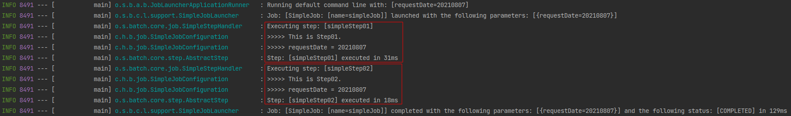
```text
Executing step: [simpleStep01]
>>>>> This is Step01.
>>>>> requestDate = 20210807
Step: [simpleStep01] executed in 31ms
Executing step: [simpleStep02]
>>>>> This is Step02.
>>>>> requestDate = 20210807
Step: [simpleStep02] executed in 18ms
```

JOB은 성공적으로 수행되었습니다.   
BATCH_JOB_EXECUTION 테이블을 확인해보겠습니다.   
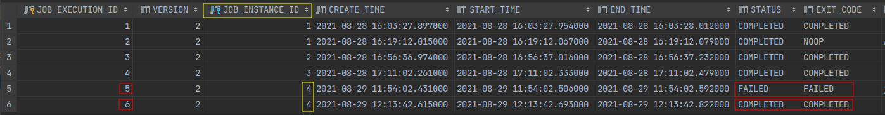

노란색 박스의 JOB_INSTANCE_ID의 값이 4인 Row가 2개 있습니다.   
각 Row의 STATUS, EXIT_CODE Column을 보시면 FAILED와 COMPLETED가 있는 것을 확인할 수 있습니다.   
Job Parameter requestDate=20210807로 생성된 JOB_INSTANCE_ID(id=4)가 2번 실행되었고,   
첫번째는 실패, 두번째는 성공했다는 것을 알 수 있습니다.   

여기서 BATCH의 실행 조건은 
1. 동일한 Job Parameter로 2번 실행할 수 있다.
2. 동일한 Job Parameter로 성공한 기록이 있다면 재수행이 안된다.   

이라는 것을 알 수 있습니다.

그럼 여기까지의 내용을 정리해보겠습니다.   
위에서 나온 두 테이블(BATCH_JOB_INSTANCE, BATCH_JOB_EXECUTIOIN)과  
저희가 만든 Spring Batch Job의 관계를 정리하면 아래와 같습니다.  
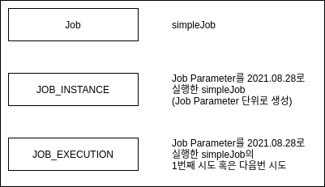

여기서 Job이란 저희가 SimpleJobConfiguration에 작성한 Spring Batch Job을 얘기합니다.

위 2개의 테이블 외에도 Job 관련된 테이블은 더 있습니다.  
예를들면 BATCH_JOB_EXECUTION_PARAM 테이블은 BATCH_JOB_EXECUTION 테이블이 생성될 당시에 입력받은 Job Parameter를 담고 있습니다.  


이외에도 다양한 메타데이터 테이블이 존재합니다.  
각각의 테이블은 앞으로 과정에서 필요할 때마다 추가적으로 소개드리겠습니다.  
~~각각의 테이블은 앞으로 과정을 학습하면서 추가적으로 작성하겠습니다.~~  
>JOB_EXECUTION 이외에도 STEP_EXECUTION 관련 테이블이 여러개 존재합니다.  
> 이 부분을 지금 다루기에는 내용이 너무 커지기 때문에 이후에 진행될 **Spring Batch 재시도/SKIP 전략**편에서 자세하게 소개드리겠습니다.

이후 과정에서는 Spring Batch 예제와 코드를 소개드리겠습니다.

### Spring Batch Test 코드는?
아래 내용은 위 글과 마찬가지로 jojoldu님의 원분을 그대로 옮겨적었습니다.  
글 첫 부분에 나오는 인칭 대명사의 '저'는 jojoldu님이라는 것을 미리 말씀드립니다.  
***
저의 이전 [Spring Batch](https://jojoldu.tistory.com/search/batch) 글을 보시면 아시겠지만, 저는 Spring Batch 예제를 항상 테스트 코드로 작성했습니다.
그러나 이 방식에 단점이 존재했는데요.
develop/production 환경에서 Spring Batch를 사용하시는 분들이 Batch Job Intstance Context 문제로 어려움을 겪는걸 많이 봤습니다.
Spring Batch에 적응하시기 전까지는 H2를 이용한 테스트 코드는 자제하시길 추천합니다.
H2를 이용한 테스트 코드는 최대한 나중에 보여드리겠습니다.
초반부에는 MySQL을 이용하면서 메타 테이블 정보가 남아 있는 상태에서의 Spring Batch에 최대한 적응하시도록 진행하겠습니다.
***

## Spring Batch Job Flow
Spring Batch의 Job은 하나 또는 여러 Step으로 구성할 수 있다고 말씀드렸습니다.  
Step은 **실제 Batch 작업을 수행하는 역할**을 합니다.  
실제로 Batch 비즈니스 로직을 처리하는 (ex: log.info()) 기능은 Step에 구현되어 있습니다.  
이처럼 Step에서는 **Batch로 실제 처리하고자 하는 기능과 설정을 모두 포함**하는 장소라고 생각하시면 됩니다.  

Batch 처리 내용을 담다보니, **Job 내부의 Step들 사이의 순서 또는 처리 흐름을 제어**할 필요가 생기게됩니다.  
이번엔 여러 Step들을 어떻게 관리할지에 대해서 알아보겠습니다.

### Next 
첫번째로 배워볼 것은 Next 입니다.

바로 샘플코드를 한번 작성해보겠습니다.
이번에 만들 Job은 StepNextJobConfiguration.java로 만들겠습니다.
```java
package com.hansoleee.basicspringbatch.job;

import lombok.RequiredArgsConstructor;
import lombok.extern.slf4j.Slf4j;
import org.springframework.batch.core.Job;
import org.springframework.batch.core.Step;
import org.springframework.batch.core.configuration.annotation.JobBuilderFactory;
import org.springframework.batch.core.configuration.annotation.StepBuilderFactory;
import org.springframework.batch.repeat.RepeatStatus;
import org.springframework.context.annotation.Bean;
import org.springframework.context.annotation.Configuration;

@Slf4j
@Configuration
@RequiredArgsConstructor
public class StepNextJobConfiguration {

    private final JobBuilderFactory jobBuilderFactory;
    private final StepBuilderFactory stepBuilderFactory;

    @Bean
    public Job stepNextJob() {
        return jobBuilderFactory.get("stepNextJob")
                .start(step01())
                .next(step02())
                .next(step03())
                .build();
    }

    @Bean
    public Step step01() {
        return stepBuilderFactory.get("step01")
                .tasklet((contribution, chunkContext) -> {
                    log.info(">>>>> This is Step01");
                    return RepeatStatus.FINISHED;
                })
                .build();
    }

    @Bean
    public Step step02() {
        return stepBuilderFactory.get("step02")
                .tasklet((contribution, chunkContext) -> {
                    log.info(">>>>> This is Step02");
                    return RepeatStatus.FINISHED;
                })
                .build();
    }

    @Bean
    public Step step03() {
        return stepBuilderFactory.get("step03")
                .tasklet((contribution, chunkContext) -> {
                    log.info(">>>>> This is Step03");
                    return RepeatStatus.FINISHED;
                })
                .build();
    }
}
```
위 코드처럼 next()는 순차적으로 Step들 연결시킬때 사용됩니다.  
step01 -> step02 -> step03 순으로 하나씩 실행시킬 때 next()는 좋은 방법입니다.  

그럼 순차적으로 호출되는지 한번 실행해보겠습니다.  
이번에는 Job Parameter를 version=1로 변경하신 뒤  


실행 결과는 다음과 같습니다.


이번에 새로 만든 stepNextJob 배치가 실행되었습니다.  
하지만 기존에 있던 simpleJob 배치도 실행되었습니다.

저희는 방금 만든 stepNextJob 배치만 실행하고 싶어집니다.  
그래서 **지정한 배치만 수행하도록** 설정은 변경해보겠습니다.

프로젝트의 src/main/resources/application.yml 에 아래의 코드를 추가합니다.  
```yaml
spring:
  profiles:
    active: local
  batch:
    job:
      names: ${job.name:NONE}
---
spring:
  profiles: local
  datasource:
    driver-class-name: org.h2.Driver
    url: jdbc:h2:tcp://localhost/~/h2-db/basic_spring_batch
    username: sa
    password:
---
spring:
  profiles: mariadb
  datasource:
    driver-class-name: org.mariadb.jdbc.Driver
    url: jdbc:mariadb://localhost:3306/basic_spring_batch
    username: basicspringbatch
    password: basicspringbatch
```


추가한 설정이 하는 일은 간단합니다.  
Spring Batch가 실행될 때 **Program arguments**로 **job.name 값**이 넘어오면 **해당 값과 일치하는 Job을 실행**합니다.  
여기서 ${job.name:NONE}을 보면 :을 사이에 두고 좌측에 job.name 우측에 NONE이 있습니다.  
이 코드는 Program arguments로 **job.name**이 있으면 **job.name 값을 할당**하고, 없으면 **NONE을 할당**하겠다는 의미입니다.  
중요한 것은 **spring.batch.job.name**에 **NONE**이 할당되면 **어떤 배치도 실행하지 않습니다**  
즉, 혹시라도 **값이 없을 때 모든 배치가 실행되지 않도록 막는 역할**입니다.

이제 Program arguments로 job.name을 설정하여 원하는 Job만 실행하겠습니다.

Program arguments로 
```text
--job.name=stepNextJob 
```
입력합니다. (version=1은 이미 실행되었으니 version=2로 변경하셔야 합니다.)

실행해보겠습니다.


지정한 stepNextJob만 수행하였습니다.  
앞으로 실무에서 사용할 때 수행하려는 job.name과 parameter를 바꿔서 배치를 실행시키면 되겠습니다.
> 실제 운영 환경에서는 java -jar batch-application.jar --job.name=simpleJob 과 같이 배치를 실행합니다.  
> ~~실제 노하우도 전달해 주시는 jojoldu님에게 매번 감동 spring batch에 대한 책 출간 빨리 해주세요~~

### 조건별 흐름 제어 (Flow)
Next가 순차적으로 Step의 순서를 제어한다는 것을 알았습니다.  
여기서 중요한 것은, **앞의 step에서 오류가 나면 나머지 뒤에 있는 step들은 실행되지 못한다**는 것 입니다.  

하지만 상황에 따라 Step의 수행 결과가 정상일 때는 Step B로,오류가 났을 때는 Step C로 수행해야할 때가 있습니다.  


이럴 경우에 Spring Batch Job에서는 조건별로 Step을 사용할 수 있습니다.  
새로운 클래스 StepNextConditionalJobConfiguration.java 를 작성하고 살펴보겠습니다.
```java
package com.hansoleee.basicspringbatch.job;

import lombok.RequiredArgsConstructor;
import lombok.extern.slf4j.Slf4j;
import org.springframework.batch.core.ExitStatus;
import org.springframework.batch.core.Job;
import org.springframework.batch.core.Step;
import org.springframework.batch.core.configuration.annotation.JobBuilderFactory;
import org.springframework.batch.core.configuration.annotation.StepBuilderFactory;
import org.springframework.batch.repeat.RepeatStatus;
import org.springframework.context.annotation.Bean;
import org.springframework.context.annotation.Configuration;

@Slf4j
@Configuration
@RequiredArgsConstructor
public class StepNextConditionalJobConfiguration {

    private final JobBuilderFactory jobBuilderFactory;
    private final StepBuilderFactory stepBuilderFactory;

    @Bean
    public Job stepNextConditionalJob() {
        return jobBuilderFactory.get("stepNextConditionalJob")

                .start(conditionalStep01())
                .on("FAILED") // FAILED 경우에
                .to(conditionalStep03()) // step03으로 이동
                .on("*") // step03 결과에 관계 없이
                .end() // step03으로 이동하면 Flow를 종료

                .from(conditionalStep01()) // step01로부터
                .on("*") // FAILED를 제외한 모든 경우
                .to(conditionalStep02()) // step02로 이동
                .next(conditionalStep03()) // step02가 정상 종료된다면 step03으로 이동
                .on("*") // step03 결과에 관계 없이
                .end() // step03으로 이동하면 Flow를 종료

                .end() // Job 종료
                .build();
    }

    @Bean
    public Step step01() {
        return stepBuilderFactory.get("step01")
                .tasklet((contribution, chunkContext) -> {
                    log.info(">>>>> This is stepNextConditionalJob Step01");

                    /**
                     * ExitStatus.FAILED로 지정
                     * 해당 Status 확인 후 다음 Flow를 진행
                     */
                    contribution.setExitStatus(ExitStatus.FAILED);
                    return RepeatStatus.FINISHED;
                })
                .build();
    }

    @Bean
    public Step conditionalStep02() {
        return stepBuilderFactory.get("conditionalStep02")
                .tasklet((contribution, chunkContext) -> {
                    log.info(">>>>> This is stepNextConditionalJob Step02");
                    return RepeatStatus.FINISHED;
                })
                .build();
    }

    @Bean
    public Step conditionalStep03() {
        return stepBuilderFactory.get("conditionalStep03")
                .tasklet((contribution, chunkContext) -> {
                    log.info(">>>>> This is stepNextConditionalJob Step03");
                    return RepeatStatus.FINISHED;
                })
                .build();
    }
}
```
위 코드는 step01의 결과(성공/실패)에 따라 시나리오가 달라집니다.
- step01 실패 시나리오: step01 -> step03
- step01 성공 시나리오: step01 -> step02 -> step03

이런 전체 Flow를 관리하는 코드가 아래 코드입니다.
```java
@Bean
public Job stepNextConditionalJob() {
    return jobBuilderFactory.get("stepNextConditionalJob")

            .start(conditionalStep01())
            .on("FAILED") // FAILED 경우에
            .to(conditionalStep03()) // step03으로 이동
            .on("*") // step03 결과에 관계 없이
            .end() // step03으로 이동하면 Flow를 종료

            .from(conditionalStep01()) // step01로부터
            .on("*") // FAILED를 제외한 모든 경우
            .to(conditionalStep02()) // step02로 이동
            .next(conditionalStep03()) // step02가 정상 종료된다면 step03으로 이동
            .on("*") // step03 결과에 관계 없이
            .end() // step03으로 이동하면 Flow를 종료

            .end() // Job 종료
            .build();
}
```
- on()
  - 감지할 ExitStatus 지정
  - '*' 일 경우 모든 ExitStatus가 지정
- to()
  - 다음으로 이동할 Step 지정
- from()
  - 일종의 이벤트 리스너 역할
  - 상태 값을 보고 일치하는 상태라면 to()에 포함된 step을 호출
  - step01의 이벤트 캐치가 FAILED로 되있는 상태에서 추갛로 이벤트 감지하려면 from 사용
- end()
  - end는 FlowBuilder를 반환하는 end와 FlowBuilder를 종료하는 end 2개가 존재
  - on("*") 뒤에 있는 end는 FlowBuilder를 반환하는 end
  - build() 앞에 있는 end는 FlowBuilder를 종료하는 end
  - FlowBuilder를 반환하는 end 사용할 경우 계속해서 from 사용 가능

여기서 중요한 점은 on이 캐치하는 상태 값이 BatchStatus가 아닌 ExitStatus라는 점 입니다.  
그래서 분기처리를 위해 상태 값 조정이 필요하다면 ExitStatus를 조정해야합니다.  
조정하는 코드는 아래와 같습니다.  

```java
@Bean
public Step conditionalStep01() {
    return stepBuilderFactory.get("step01")
            .tasklet((contribution, chunkContext) -> {
                log.info(">>>>> This is stepNextConditionalJob Step01");

                /**
                 * ExitStatus.FAILED로 지정
                 * 해당 Status 확인 후 다음 Flow를 진행
                 */
                contribution.setExitStatus(ExitStatus.FAILED);
                
                return RepeatStatus.FINISHED;
            })
            .build();
}
```
본인이 원하는 상황에 따라 분기 로직을 작성하여 contribution.setExitStatus의 값을 변경하시면 됩니다.  
여기서는 먼저 FAILED를 발생하여 step01 -> step03 Flow 테스트를 해보겠습니다.

이제 실행해보겠습니다.  
**Program arguments의 job.name을 변경해 주세요.**

```text
--job.name=stepNextConditionalJob version=1
```
version 값은 중복되지 않도록 설정해 주세요.


**step01과 step03만 실행**된 것을 확인할 수 있습니다.  
ExitStatus.FAILED로 인해 step02가 실행되지 않았습니다.  

그럼 코드를 수정해서 step01 -> step02 -> step03이 되는지 확인해보겠습니다.

```java
@Bean
public Step conditionalStep01() {
    return stepBuilderFactory.get("step01")
            .tasklet((contribution, chunkContext) -> {
                log.info(">>>>> This is stepNextConditionalJob Step01");

                /**
                 * ExitStatus.FAILED로 지정
                 * 해당 Status 확인 후 다음 Flow를 진행
                 */
                // contribution.setExitStatus(ExitStatus.FAILED);

                return RepeatStatus.FINISHED;
            })
            .build();
}
```
주석 처리하고 프로그램을 실행해보겠습니다.  
마찬가지로 실행을 위해 version을 변경해줍니다.  

실행 결과를 보겠습니다.


step01이 정상 종료되었고 이후 step02 -> step03 순서로 수행된 것을 확인할 수 있습니다.  
이 과정을 통해 조건별로 다른 step을 호출해야하는 로직도 쉽게 작성할 수 있게되었습니다.

### Batch Status vs Exit Status
위에서 나온 조건별 흐름 제어를 설명할 때 잠깐 언급했지만, **BatchStatus와 ExitStatus의 차이를 아는 것이 중요합니다.  

BatchStatus는 **Job 또는 Step의 실행 결과를 Spring에서 기록할 때 사용하는 Enum입니다.  
BatchStatus로 사용되는 값은 COMPLETED, STARTING, STARTED, STOPPING, STOPPED, FAILED, ABANDONED, UNKNOWN 값이 있습니다.  
대부분의 값들은 단어와 같은 뜻으로 해석하여 이해하시면 됩니다.  


예를 들어,
```text
.on("FAILED").to(stepB())
```
위 코드에서 on 메소드가 참조하는 것은 BatchStatus으로 생각할 수 있지만 실제 참조되는 값은 Step의 ExitStatus입니다.  

ExitStatus는 **Step의 실행 후 상태**를 얘기합니다.  


(ExitStatus는 Enum이 아닙니다.)

위 예제 (.on("FAILED").to(stepB()))를 풀이하면 **ExitStatus가 FAILED로 끝나게 되면 stepB를 실행하라**는 뜻입니다.  
Spring Batch는 **기본적으로 ExitStatus의 exitCode는 Step의 BatchStatus와 같도록 설정**되어 있습니다.  

만약 본인만의 exitCode가 필요한 경우 아래 예제를 통해 알아보겠습니다.(즉, BatchStatus와 ExitStatus가 다른 경우)
```text
.start(step01())
    .on("FAILED")
    .end()
.from(step01())
    .on("COMPLETED WITH SKIPS")
    .to(errorPrint01())
    .end()
.from(step01())
    .on("*")
    .to(step02())
    .end()
```
위 step01의 실행 결과는 아래의 3가지가 될 수 있습니다.
- step01이 실패하면, Job은 실패한다.
- step01이 성공적으로 수행되면, step02를 수행한다.
- step01이 ExitStatus를 COMPLETED WITH SKIPS로 종료하면, errorPrint01()을 수행한다.

위 코드에 나오는 COMPLETED WITH SKIPS는 ExitStatus에 없는 코드입니다.  
.on("COMPLETED WITH SKIPS")를 실행하기위해 COMPLETED WITH SKIPS exitCode를 반환하는 별도의 로직이 필요합니다.  

```java
public class SkipCheckingListener extends StepExecutionListenerSupport {
    public ExitStatus afterStep(StepExecution stepExecution) {
        String exitCode = stepExecution.getExitStatus().getExitCode();
        if (!exitCode.equals(ExitStatus.FAILED.getEixtCode()) && 
                stepExecution.getSkipCount() > 0) {
            return new ExitStatus("COMPLETED WITH SKIPS");
        } else {
            return null;
        }
    }
}
```
위 코드를 설명하면 StepExecutionListener에서는 먼저 Step이 성공적으로 수행되었는지 확인하고,  
**StepExecution의 skip 횟수가 0보다 클 경우 COPLETED WITH SKIPS의 exitCode를 갖는 ExitStatus를 반환**합니다.

### Decide
위 과정을 통해서 Step의 결과에 따라 서로 다른 Step으로 이동하는 방법을 알아보았습니다.  
이번에는 다른 방식의 분기 처리를 알아보겠습니다.  
위에서 작성한 코드는 2가지 문제가 있습니다.
1. Step이 담당하는 역할이 2개 이상이 됩니다.
   1. 실제 해당 Step이 처리해야할 로직 이외에도 분기 처리를 위해 ExitStatus 조작이 필요합니다. 
2. 다양한 분기 로직 처리의 어려움이 있습니다.
   1. ExitStatus를 커스텀하게 고치기 위해선 Listener를 생성하고 Job Flow에 등록하는 등 번거로움이 존재합니다.

명확하게 Step들 사이의 Flow 분기만 담당하면서 다양한 분기 처리가 가능한 타입이 있으면 좋겠습니다.  
그래서 Spring Batch에서는 Step들의 Flow속에서 **분기만 담당하는 타입**이 있습니다.  
JobExecutionDecider라고 하며, 이를 사용한 샘플 코드(DeciderJobConfiguration.java)를 한번 만들어보겠습니다.
```java
package com.hansoleee.basicspringbatch.job;

import lombok.RequiredArgsConstructor;
import lombok.extern.slf4j.Slf4j;
import org.springframework.batch.core.Job;
import org.springframework.batch.core.JobExecution;
import org.springframework.batch.core.Step;
import org.springframework.batch.core.StepExecution;
import org.springframework.batch.core.configuration.annotation.JobBuilderFactory;
import org.springframework.batch.core.configuration.annotation.StepBuilderFactory;
import org.springframework.batch.core.job.flow.FlowExecutionStatus;
import org.springframework.batch.core.job.flow.JobExecutionDecider;
import org.springframework.batch.repeat.RepeatStatus;
import org.springframework.context.annotation.Bean;
import org.springframework.context.annotation.Configuration;

import java.util.Random;

@Slf4j
@Configuration
@RequiredArgsConstructor
public class DeciderJobConfiguration {

    private final JobBuilderFactory jobBuilderFactory;
    private final StepBuilderFactory stepBuilderFactory;

    @Bean
    public Job deciderJob() {
        return jobBuilderFactory.get("deciderJob")
                .start(startStep())
                .next(decider())

                .from(decider())
                .on("ODD")
                .to(oddStep())

                .from(decider())
                .on("EVEN")
                .to(evenStep())

                .end()
                .build();
    }

    @Bean
    public Step startStep() {
        return stepBuilderFactory.get("startStep")
                .tasklet((contribution, chunkContext) -> {
                    log.info(">>>>> Start!");
                    return RepeatStatus.FINISHED;
                })
                .build();
    }

    @Bean
    public Step evenStep() {
        return stepBuilderFactory.get("evenStep")
                .tasklet((contribution, chunkContext) -> {
                    log.info(">>>>> 짝수입니다.");
                    return RepeatStatus.FINISHED;
                })
                .build();
    }

    @Bean
    public Step oddStep() {
        return stepBuilderFactory.get("oddStep")
                .tasklet((contribution, chunkContext) -> {
                    log.info(">>>>> 홀수입니다.");
                    return RepeatStatus.FINISHED;
                })
                .build();
    }

    @Bean
    public JobExecutionDecider decider() {
        return new OddDecider();
    }

    public static class OddDecider implements JobExecutionDecider {

        @Override
        public FlowExecutionStatus decide(JobExecution jobExecution, StepExecution stepExecution) {
            Random random = new Random();

            int randomNumber = random.nextInt(50) + 1;
            log.info("랜덤 숫자: {}", randomNumber);

            if (randomNumber % 2 == 0) {
                return new FlowExecutionStatus("EVEN");
            } else {
                return new FlowExecutionStatus("ODD");
            }
        }
    }
}
```
이 Batch의 Flow는 다음과 같습니다.
1. startStep -> oddDecider에서 홀수인지 짝수인지 구분 -> oddStep or evenStep 진행

decider()를 Flow 사이에 넣은 로직은 아래와 같습니다.
```java
@Bean
public Job deciderJob() {
    return jobBuilderFactory.get("deciderJob")
            .start(startStep())
            .next(decider())

            .from(decider())
            .on("ODD")
            .to(oddStep())

            .from(decider())
            .on("EVEN")
            .to(evenStep())

            .end()
            .build();
}
```
- start() 
  - Job Flow의 첫번째 Step을 시작합니다.
- next()
  - startStep 이후에 decider를 실행합니다.
- from()
  - Event Listener 역할을 합니다.
  - decider의 상태 값을 보고 일치하는 상태라면 to()에 포함된 step을 호출합니다.

코드는 이전 **조건별 흐름 제어 (Flow)**와 비슷하여 이해하기 쉬울 것 같습니다.

코드를 보시면, 분기 로직에 대한 모든 일은 OddDecider가 전담하고 있습니다.  
아무리 복잡한 분기 로직이 필요하더라도 Step과는 명확히 **역할과 책임이 분리**하여 진행할 수 있게 되었습니다.  

그럼 Decider 구현체를 살펴보겠습니다.


JobExecutionDecider 인터페이스를 구현한 OddDecider입니다.

여기서는 랜덤 숫자를 생성하여 홀수/짝수인지에 따라 서로 다른 상태를 반환합니다.  
주의하실 것은 Step으로 처리하는게 아니기 때문에 ExitStatus가 아닌 FlowExecutionStatus로 상태를 관리합니다.  

아주 쉽게 EVEN, ODD라는 상태를 생성하여 반환하였고, 이를 from().on()에서 사용하는 것을 알 수 있습니다.  
그럼 실행해보겠습니다.


실행해보시면  홀수/짝수가 낭면서 서로 다른 step(oddStep, evenStep)이 실행되는 것을 확인할 수 있습니다.  
~~정말 운이 좋게 홀수, 짝수가 연속해서 나왔습니다~~

###### 다음 시간 예고 
###### Spring Batch의 가장 중요한 개념인 Scope에 대해서 진행 
***

## Spring Batch Scope & Job Parameter
이번 시간에는 Spring Batch의 Scope에 대해서 배워보겠습니다.  
여기서 말하는 Scope란 @StepScope, @JobScope를 의미합니다.  
무의식적으로 사용하는 이 Annotation들이 실제로 어떤 일들을 하는지 알아보겠습니다.  
그리고 이 둘과 떨어질 수 없는 **Job Parameter**도 함께 배워보겠습니다.  

### Job Parameter와 Scope
Spring Batch의 경우 외부 혹은 내부에서 Parameter를 받아 여러 Batch Component에서 사용할 수 있도록 지원하고 있습니다.  
이 Parameter를 **Job Parameter**라고 합니다.  
Job Parameter를 사용하기 위해선 항상 Spring Batch 전용 Scope를 선언해야합니다.  
크게 **@StepScope**와 **@JobScope** 2가지가 있습니다.  
사용법은 아래와 같습니다.
```java
@Value("#{jobParameters[파라미터명]}")
```
이와 같이 SpEL로 선언해서 사용하시면 됩니다.
> jobParamters 이외에도 JobExecutionContext, stepExecutionContext 등 SpEL로 사용할 수 있습니다.  
> @JobScope에선 stepExecutionContext는 사용할 수 없고, jobParameters와 jobExecutionContext만 사용할 수 있습니다.

각각의 Scope에서 사용하는 샘플 코드는 아래와 같습니다.

##### JobScope


##### StepScope

```java
package com.hansoleee.basicspringbatch.job;

import lombok.RequiredArgsConstructor;
import lombok.extern.slf4j.Slf4j;
import org.springframework.batch.core.Job;
import org.springframework.batch.core.Step;
import org.springframework.batch.core.configuration.annotation.JobBuilderFactory;
import org.springframework.batch.core.configuration.annotation.JobScope;
import org.springframework.batch.core.configuration.annotation.StepBuilderFactory;
import org.springframework.batch.core.configuration.annotation.StepScope;
import org.springframework.batch.core.step.tasklet.Tasklet;
import org.springframework.batch.repeat.RepeatStatus;
import org.springframework.beans.factory.annotation.Value;
import org.springframework.context.annotation.Bean;
import org.springframework.context.annotation.Configuration;

@Slf4j
@Configuration
@RequiredArgsConstructor
public class ScopeJobConfiguration {

  private final JobBuilderFactory jobBuilderFactory;
  private final StepBuilderFactory stepBuilderFactory;

  @Bean
  public Job scopeJob() {
    return jobBuilderFactory.get("scopeJob")
            .start(scopeStep01(null))
            .next(scopeStep02())
            .build();
  }

  @Bean
  @JobScope
  public Step scopeStep01(@Value("#{jobParameters[requestDate]}") String requestDate) {
    return stepBuilderFactory.get("scopeStep01")
            .tasklet((contribution, chunkContext) -> {
              log.info(">>>>> This is scopeStep01");
              log.info(">>>>> requestDate = {}", requestDate);
              return RepeatStatus.FINISHED;
            })
            .build();
  }

  @Bean
  public Step scopeStep02() {
    return stepBuilderFactory.get("scopeStep02")
            .tasklet(scopeStep02Tasklet(null))
            .build();
  }

  @Bean
  @StepScope
  public Tasklet scopeStep02Tasklet(@Value("#{jobParameters[requestDate]}") String requestDate) {
    return (contribution, chunkContext) -> {
      log.info(">>>>> This is scopeStep02");
      log.info(">>>>> requestDate = {}", requestDate);
      return RepeatStatus.FINISHED;
    };
  }
}
```
**@JobScope**는 **선언문에서 사용 가능**하고, **@StepScope**는 **Tasklet 또는 ItemReader, ItemWriter, ItemProcessor**에서 사용할 수 있습니다.  

현재 Job Parameter의 타입으로 사용할 수 있는 것은 Double, Long, Date, String이 있습니다.  
아쉽지만 LocalDate와 LocalDateTime이 없어 String으로 받아 타입 변환 후 사용해야합니다.  

예제 코드를 보시면 호출하는 쪽에서 null를 할당하고 있습니다.  
이는 **Job Parameter의 할당이 어플리케이션 실행을 하지 않기 때문에 가능**합니다.  
이게 무슨 이야기인지 더 자세히 알아보겠습니다.  

### @StepScope & @JobScope 소개
Spring Batch는 @StepScope와 @JobScope라는 아주 특별한 Bean Scope를 지원합니다.  
아시다시피, **Spring Bean의 기본 Scope는 singleton**입니다.  
그러나 아래처럼 Spring Batch 컴포넌트 (Tasklet, ItemReader, ItemWriter, ItemProcessor 등)에 @StepScope를 사용하게 되면  
```java
@Bean
@StepScope
public ListItemReader<Integer> simpleWriterReader() {
    List<Integer> items = new ArrayList<>();
    
    for (int i = 0; i < 100; i++) {
        items.add(i);
        }
    
    return new ListItemReader<>(items);
}
```


Spring Batch가 Spring 컨테이너를 통해 지정된 **Step의 실행 시점에 해당 Component를 Spring Bean으로 생성**합니다.  
마찬가지로 @JobScope는 **Job 실행 시점**에 Bean이 생성됩니다.  
즉, **Bean의 생성 시점을 지정된 Scope가 실행되는 시점으로 지연**시킵니다.  

> 어떻게 보면 MVC의 request scope와 비슷할 수 있겠습니다.  
> request scope가 request가 왔을 때 생성되고, response를 반환하면 삭제되는 것처럼  
> JobScope, StepScope 역시 Job이 실행되고 끝날 때 Step이 실행되고 끝날 때 생성/삭제가 이루어진다고 보시면 됩니다.  

이렇게 Bean의 생성 시점을 Application 실행 시점이 아니라  
Step 또는 Job의 실행 시점으로 지연시키면서 얻는 장점은 크게 2가지가 있습니다.  

1. **JobParameter의 Late Binding**이 가능합니다.  
Job Parameter가 StepContext 또는 JobExecutionContext 레벨에서 할당시킬 수 있습니다.  
꼭 Application이 실행되는 시점이 아니더라도 Controller 또는 Service와 같은 **비즈니스 로직 처리 단계에서 Job Parameter를 할당**시킬 수 있습니다.  
이 부분은 아래에서 예제와 함께 더 자세히 알아보겠습니다.
  

2. 동일한 Component를 병렬 또는 동시에 사용할 때 유용합니다.  
Step 안에 Tasklet이 있고, 이 Tasklet은 멤버 변수와 이 멤버 변수를 변경하는 로직이 있다고 가정해봅시다.  
이 경우 @StepScope 없이 Step을 병렬로 실행시키게 되면 **서로 다른 Step에서 하나의 Tasklet을 두고 마구잡이로 상태를 변경**하려고 할 것 입니다.  
하지만 @StepScope가 있다면 **각각의 Step에서 별도의 Tasklet을 생성하고 관리하기 때문에 서로의 상태를 침범할 일이 없습니다.**

### Job Parameter의 오해
Job Paramters는 @Value(import org.springframework.beans.factory.annotation.Value)를 통해서 사용 가능합니다.  
~~주의 import lombok.Value 아님~~  
그러다보니 여러가지 오해가 있을 수 있습니다.  
Job Parameters는 Step 또는 Tasklet, Reader 등 Batch Component Bean의 생성 시점에 호출할 수 있습니다.  
하지만 정확히는 **Scope Bean을 생성할 때만 가능**합니다.  
즉, **@StepScope, @JobScope Bean을 생성할 때만 Job Parameters가 생성**되어 사용할 수 있게됩니다.

예를 들어, 아래와 같이 메소드를 통해 Bean을 생성하지 않고, 클래스에서 직접 Bean을 생성해보겠습니다.  
Job과 Step의 코드에서 @Bean과 @Value("#{jobParameters[파라미터명]}")를 **제거**하고  
SimpleJobTasklet을 생성자 DI로 받도록 합니다.  

###### TaskletDiJobConfiguration.java

```java
package com.hansoleee.basicspringbatch.job;

import lombok.RequiredArgsConstructor;
import lombok.extern.slf4j.Slf4j;
import org.springframework.batch.core.Job;
import org.springframework.batch.core.Step;
import org.springframework.batch.core.configuration.annotation.JobBuilderFactory;
import org.springframework.batch.core.configuration.annotation.JobScope;
import org.springframework.batch.core.configuration.annotation.StepBuilderFactory;
import org.springframework.batch.repeat.RepeatStatus;
import org.springframework.beans.factory.annotation.Value;
import org.springframework.context.annotation.Bean;
import org.springframework.context.annotation.Configuration;

@Slf4j
@Configuration
@RequiredArgsConstructor
public class TaskletDiJobConfiguration {

  private final JobBuilderFactory jobBuilderFactory;
  private final StepBuilderFactory stepBuilderFactory;

  @Bean
  public Job taskletDiJob() {
    log.info(">>>>> definition taskletDiJob");
    return jobBuilderFactory.get("taskletDiJob")
            .start(taskletDiStep01())
            .next(taskletDiStep02(null))
            .build();
  }

  private final TaskletDiJobJobTasklet tasklet1;

  @Bean
  public Step taskletDiStep01() {
    return stepBuilderFactory.get("simpleStep01")
            .tasklet(tasklet1)
            .build();
  }

  @Bean
  @JobScope
  public Step taskletDiStep02(@Value("#{jobParameters[requestDate]}") String requestDate) {
    return stepBuilderFactory.get("simpleStep02")
            .tasklet((contribution, chunkContext) -> {
              log.info(">>>>> This is simpleStep02");
              log.info(">>>>> requestDate: {}", requestDate);
              return RepeatStatus.FINISHED;
            })
            .build();
  }
}
```

그리고 SimpleJobTasklet은 아래와 같이 @Component와 @StepScope로 **Scope가 Step인 Bean**으로 생성합니다.    
이 상태에서 @Value("#{jobParameters[파라미터명]}")를 Tasklet의 멤버 변수로 할당합니다.  
###### SimpleJobTasklet.java

```java
package com.hansoleee.basicspringbatch.job;

import lombok.RequiredArgsConstructor;
import lombok.extern.slf4j.Slf4j;
import org.springframework.batch.core.StepContribution;
import org.springframework.batch.core.configuration.annotation.StepScope;
import org.springframework.batch.core.scope.context.ChunkContext;
import org.springframework.batch.core.step.tasklet.Tasklet;
import org.springframework.batch.repeat.RepeatStatus;
import org.springframework.beans.factory.annotation.Value;
import org.springframework.stereotype.Component;

@Slf4j
@Component
@StepScope
public class TaskletDiJobJobTasklet implements Tasklet {

  @Value("#{jobParameters[requestDate]}")
  private String requestDate;

  public TaskletDiJobJobTasklet() {
    log.info(">>>>> tasklet 생성");
  }

  @Override
  public RepeatStatus execute(StepContribution contribution, ChunkContext chunkContext) throws Exception {
    log.info(">>>>> This is Step01");
    log.info(">>>>> requestDate: {}", requestDate);
    return RepeatStatus.FINISHED;
  }
}
```
이렇게 **메소드의 파라미터로 JobParameter를 할당받지 않고, 클래스의 멤버 변수로 JobParameter를 할당**하고 실행해보시면


정상적으로 JobParameter를 받아 사용할 수 있습니다.  
이는 **TaskletDiJobTasklet Bean이 @StepScope로 생성**되었기 때문입니다.  

반면에, 이 TaskletDiJobTasklet Bean을 일반 singletone Bean으로 생성할 경우 아래와 같이 'jobParameters' cannot be found 에러가 발생합니다.  
###### TaskletDiJobTasklet.java 
```java
package com.hansoleee.basicspringbatch.job;

import lombok.extern.slf4j.Slf4j;
import org.springframework.batch.core.StepContribution;
import org.springframework.batch.core.configuration.annotation.StepScope;
import org.springframework.batch.core.scope.context.ChunkContext;
import org.springframework.batch.core.step.tasklet.Tasklet;
import org.springframework.batch.repeat.RepeatStatus;
import org.springframework.beans.factory.annotation.Value;
import org.springframework.stereotype.Component;

@Slf4j
@Component
//@StepScope
public class TaskletDiJobJobTasklet implements Tasklet {

    @Value("#{jobParameters[requestDate]}")
    private String requestDate;

    public TaskletDiJobJobTasklet() {
        log.info(">>>>> tasklet 생성");
    }

    @Override
    public RepeatStatus execute(StepContribution contribution, ChunkContext chunkContext) throws Exception {
        log.info(">>>>> This is taskletDiStep01");
        log.info(">>>>> requestDate: {}", requestDate);
        return RepeatStatus.FINISHED;
    }
}
```

```text
EL1008E: Property or field 'jobParameters' cannot be found on object of type 'org.springframework.beans.factory.config.BeanExpressionContext' - maybe not public or not valid?
```

즉, Bean 생성을 위해 Method 방식 또는 Class 방식 어느 것을 사용해도 무방하나  
Bean의 Scope는 Step이나 Job이어야 한다는 것을 알 수 있습니다.

**JobParameters를 사용**하기 위해선 꼭 **@StepScope, @JobScope로 Bean을 생성**해야하는 것을 잊지마세요.

### JobParameter vs 시스템 변수
앞의 내용을 보면서 아마 이런 의문이 있을 수 있습니다.

- 꼭 Job Parameter를 써야하지?
- 기존에 Spring Boot에서 사용하던 여러 환경 변수 또는 시스템 변수를 사용하면 되지않나?
- CommandLineRunner를 사용한다면 'java -jar application.jar -D파라미터'로 시스템 변수를 지정하면 되지 않나?

그래서 왜 Job Parameter를 써야하는지 알아보겠습니다.  
아래 2가지 코드를 보겠습니다.
###### JobParameter
```java
@Bean
@StepScope
public FlatFileItemReader<Partner> reader(
        @Value("#{jobParameters[pathToFile]}") String pathToFile) {
    FlatFileItemReader<Partner> itemReader = new FlatFileItemReader<Partner>();
    itemReader.setLineMapper(lineMapper());
    itemReader.setResource(new ClassPathResource(pathToFile));
    return itemReader;
}
```

###### 시스템 변수
> 여기에서 얘기하는 시스템 변수는 application.yml과 -D 옵션으로 실행하는 변수까지 포함합니다.
```java
@Bean
@ConfigurationProperties(prefix = "my.prefix")
protected class JobProperties {
    String pathToFile;
    
    // getters & setters
}

@Autowired
private JobProperties jobProperties;

@Bean
public FlatFileItemReader<Partner> reader() {
  FlatFileItemReader<Partner> itemReader = new FlatFileItemReader<Partner>();
  itemReader.setLineMapper(lineMapper());
  String pathToFile = jobProperties.getPathToFile();
  itemReader.setResource(new ClassPathResource(pathToFile));
  return itemReader;
}
```
위 2가지 방식에는 몇 가지 차이점이 있습니다.

1. 시스템 변수를 사용할 경우 **Spring Batch의 Job Parameter 관련 기능을 못쓰게** 됩니다.  
예를 들어, Spring Batch는 **동일한 Job Parameter로 같은 Job을 두 번 실행할 수 없습니다.**  
하지만 시스템 변수를 사용하게 될 경우 이 기능이 전혀 작동하지 않습니다.  
또한 Spring Batch 에서 자동으로 관리해주는 Parameter 관련 메타 테이블이 전혀 관리되지 않습니다.  


2. Command Line이 아닌 다른 방법으로 Job을 실행하기가 어렵습니다.  
만약 실행해야 한다면 **전역 상태(시스템 변수 또는 환경 변수)를 동적으로 계속해서 변경시킬 수 있도록  
Spring Batch를 구성**해야 합니다.  
동시에 여러 Job을 실행하려는 경우 또는 테스트 코드로 Job을 실행해야할 때 문제가 발생할 수 있습니다.  


3. Job Parameter를 사용하지 못합니다.  
Job Parameter를 못쓴다는 것은 **Late Binding을 못한다**는 의미입니다.  
   
예를 들어, 웹 서버가 있고 이 웹 서버에서 Batch를 수행한다고 가정해 봅시다.  
외부에서 넘겨주는 Parameter에 따라 Batch가 다르게 동작해야 한다면  
이를 시스템 변수로 풀어내는 것은 너무나 어렵습니다.  
하지만 아래와 같이 Job Parameter를 이용한다면 아주 쉽게 해결할 수 있습니다.  
```java
@Slf4j
@RequiredArgsConstructor
@RestController
public class JobLauncherController {

    private final JobLauncher jobLauncher;
    private final Job job;

    @GetMapping("/launchjob")
    public String handle(@RequestParam("fileName") String fileName) throws Exception {

        try {
            JobParameters jobParameters = new JobParametersBuilder()
                                    .addString("input.file.name", fileName)
                                    .addLong("time", System.currentTimeMillis())
                                    .toJobParameters();
            jobLauncher.run(job, jobParameters);
        } catch (Exception e) {
            log.info(e.getMessage());
        }

        return "Done";
    }
}
```
예제를 보시면 Controller에서 Request Parameter로 받은 값을 Job Parameter로 생성합니다. 
```java
JobParameters jobParameters = new JobParametersBuilder()
                        .addString("input.file.name", fileName)
                        .addLong("time", System.currentTimeMillis())
                        .toJobParameters();
```
그리고 생성한 Job Parameter로 Job을 수행합니다.  
```java
JobLauncher.run(job, jobParameters);
```

즉, 개발자가 원하는 어느 타이밍이든 Job Parameter를 생성하고 Job을 수행할 수 있음을 알 수 있습니다.  
Job Parameter를 각각의 Batch Component들이 사용하면 되니 **변경이 심한 경우에도 쉽게 대응**할 수 있습니다.  

> 웹 서버에서 Batch를 관리하는 것은 권장하지 않습니다.  
> 위 코드는 예제를 위한 코드입니다.  
> 실제 운영 환경에서 Spring Batch를 관리하는 방법은 시리즈 후반부에 소개해 드리겠습니다.
> ~~빨리 배우고 싶지만 순서대로 배우는게 좋겠다.~~

### 주의사항
아래 코드를 보시면 아시겠지만,  
@Bean과 @StepScope를 함께 사용하는 것은 @Scope (value = "step", proxyMode = TARGET_CLASS) 로 표시하는 것과 같습니다.  


@JobScope도 마찬가지 입니다.  


이 proxyMode로 인해서 문제가 발생할 수 있습니다.  
어떤 문제가 있고, 어떻게 해결하면 될지는 이전에 작성한 [@StepScope 사용시 주의 사항](https://jojoldu.tistory.com/132) 을 꼭 참고해보세요.
***

## Chunk 지향 처리
Spring Batch의 큰 장점 중 하나로 Chunk 지향 처리를 얘기합니다.  
이번 시간에는 Chunk 지향 처리가 무엇인지 한번 살펴보겠습니다.  

### Chunk?
Spring Batch에서의 Chunk란 데이터 덩어리로 작업할 때 **각 커밋 사이에 처리되는 row 수**를 얘기합니다.  
즉, Chunk 지향 처리란 **한 번에 하나씩 데이터를 읽어 Chunk라는 덩어리를 만든 뒤, Chunk 단위로 트랜잭션**을 다루는 것을 의미합니다.  

여기서 트랜잭션이라는 것이 중요합니다.  
Chunk 단위로 트랜잭션을 수행하기 때문에 **실패할 경우엔 해당 Chunk 만큼만 롤백**이 되고, 이전에 커밋된 트랜잭션 범위까지는 반영이 된다는 것 입니다.

Chunk 지향 처리는 Chunk 단위로 데이터를 처리하기 때문에 그림으로 표현하면 아래와 같습니다.  


>[개별 Item 처리 과정](https://docs.spring.io/spring-batch/docs/4.3.x/reference/html/index-single.html#chunkOrientedProcessing) 

- Reader에서 데이터를 하나 읽어옵니다. 
- 읽어온 데이터를 Processor에서 가공합니다. 
- 가공된 데이터들을 별도의 공간에 모은 뒤, Chunk 단위만큼 쌓이게 되면 Writer에 전달하고 Writer는 일괄 저장합니다. 

**Reader와 Processor에서는 1건씩 다뤄지고, Writer에선 Chunk 단위로 처리**된다는 것만 기억하시면 됩니다. 

Chunk 지향 처리를 Java 코드로 표현하면 아래처럼 될 것 같습니다.
```java
for (int i = 0; i < totalSize; i += chunkSize) { // chunkSize 단위로 묶어서 처리
    List items = new ArrayList<>();
    for (int j = 0; j < chunkSize; j++) {
        Object item = itemReader.read();
        Object processedItem = itemProcessor.process(item);
        items.add(processedItem);
    }
    itemWriter.write(items);
}
```
**chunkSize별로 묶어서 처리**된다는 의미를 이해하셨나요?  
자 그럼 이제 Chunk 지향 처리가 어떻게 되고 있는지 실제 Spring Batch 내부 코드를 보면서 알아보겠습니다.  

### ChunkOrientedTasklet 엿보기
Chunk 지향 처리의 전체 로직을 다루는 것은 ChunkOrientedTasklet 클래스입니다.  
클래스 이름만 봐도 어떤 일을 하는지 단번에 알 수 있을것 같습니다. 


여기서 자세히 보셔야할 코드는 execute() 입니다.  
Chunk 단위로 작업하기 위한 전체 코드가 이곳에 있다고 보시면 됩니다.  
내부 코드는 아래와 같습니다.  


- `chunkProvider.provide()`로 Reader에서 Chunk size만큼 데이터를 가져옵니다.  
- `chunkProcessor.process()`에서 Reader로 받은 데이터를 가공(Processor)하고 저장(Writer)합니다. 

데이터를 가져오는 `chunkProvider.provide()`를 가보시면 어떻게 데이터를 가져오는지 알 수 있습니다.  

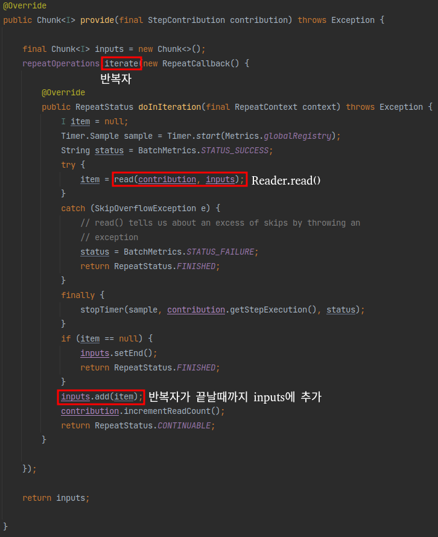

`inputs`이 ChunkSize만큼 쌓일때까지 read()를 호출합니다.  
이 `read()`는 내부를 보시면 실제로는 `ItemReder.read`를 호출합니다.  


즉, `ItemReader.read`에서 1건씩 데이터를 조회해 ChunkSize만큼 데이터를 쌓는 것이 `provider()`가 하는 일입니다.

자 그럼 이렇게 쌓아준 데이터를 어떻게 가공하고 저장하는지 한번 확인해보겠습니다.  

### SimpleChunkProcessor 엿보기
Processor와 Writer 로직을 담고 있는 것은 `ChunkProcessor`가 담당하고 있습니다.  


인터페이스라 실제 구현체가 필요합니다.  
기본적으로 사용되는 것이 `SimpleChunkProcessor`입니다.  


위 클래스를 보시면 Spring Batch에서 Chunk 단위 처리를 어떻게 하는지 아주 상세하게 확인할 수 있습니다.  
처리를 담당하는 핵심 로직은 `process()` 입니다.
이 `process()`의 코드는 아래와 같습니다.  


- `Chunk<I> inputs`를 파라미터로 받습니다.
  - 이 데이터는 앞서 `chunkProvider.provide()`에서 받은 ChunkSize만큼 쌓인 item입니다.
- `transform()`에서는 전달받은 `inputs`을 `doProcess()`로 전달하고 변환 값을 받습니다.
- `transform()`을 통해 가공된 대량의 데이터는 `write()`를 통해 일괄 저장됩니다.
  - `write()`는 저장이 될 수도 있고, 외부 API로 전송도 가능합니다.
  - 이는 개발자가 ItemWriter를 어떻게 구현했는지에 따라 달라집니다.

여기서 `transform()`은 반복문을 통해 `doProcess()`를 호출합니다.  
해당 메소드는 ItemProcessor의 `process()`를 사용합니다.  


`doProcess()`를 처리하는데 만약 ItemProcessor가 없다면 item을 그대로 반환하고  
있다면 ItemProcessor의 `process()`로 가공하여 반환합니다.


그리고 이렇게 가공된 데이터들은 위에서도 나와있듯이 SimpleChunkProcessor의 `doWrite()`를 호출하여 일괄처리합니다.


자 Chunk 지향 처리에 대해 실제 코드를 보면서 어떻게 처리되는지 알아보았습니다.  
아래에서는 ChunkSize에 대한 오해를 한번 풀어보겠습니다.  

### Page Size vs Chunk Size 
기존에 Spring Batch를 사용해보신 분들은 아마 PagingItemReader를 많이 사용해보셨을 거에요.  
PagingItemReader를 사용해보신 분들 중 간혹 Page Size와 Chunk Size를 같은 의미로 오해하시는 분들이 계십니다.  
**Page Size**와 **Chunk Size**는 **서로 의미하는 바가 다릅니다.**

**Chunk Size**는 **한번에 처리될 트랜잭션 단위**를 얘기하며, **Page Size**는 **한번에 조회할 Item의 양**을 얘기합니다.

자 그럼 이제 2개가 어떻게 다른지 실제 Spring Batch의 ItemReader 코드를 직접 들여다보겠습니다.  

PagingItemReader의 부모 클래스인 `AbstractItemCountingItemStreamItemReader`의 `read()` 메소드를 먼저 보겠습니다.


보시는 것처럼 읽어올 데이터가 있다면 `doRead()`를 호출합니다.  
`doRead()`의 코드는 아래와 같습니다.  


`doRead()`에서는 현재 읽어올 데이터가 없거나, Page Size를 초과한 경우 `doReadPage()`를 호출합니다.  
읽어올 데이터가 없는 경우는 read가 처음 시작할 때를 얘기합니다.  
Page Size를 초과하는 경우는 예를들면 Page Size가 10인데, 이번에 읽어야할 데이터가 11번째 데이터인 경우입니다.  
이럴 경우 Page Size를 초과했기 때문에 `doReadPage()`를 호출한다고 보시면 됩니다.

즉, **Page 단위로 끊어서 조회**하는 것입니다.

> 게시판 만들기에서 페이징 조회를 떠올려보시면 쉽게 이해가 되실것 같습니다.

`doReadPage()`부터는 하위 구현 클래스에서 각자만의 방식으로 페이징 쿼리를 생성합니다.  
여기서는 보편적으로 많이 사용하시는 JpaPagingItemReader 코드를 살펴보겠습니다.  

JpaPagingItemReader의 `doReadPage()`의 코드는 아래와 같습니다.  


Reader에서 지정한 Page Size만큼 `offset`, `limit` 값을 지정하여 페이징 쿼리를 생성 (`createQuery()`)하고, 사용 (`query.getResultList()`)합니다.  
쿼리 실행 결과는 `results`에 저장합니다.  
이렇게 저장된 `results`에서 `read()`가 **호출될 때마다 하나씩 꺼내서 전달**합니다.  

즉, Page Size는 **페이징 쿼리에서 Page의 Size를 지정하기 위한 값**입니다.  

만약 2개 값이 다르면 어떻게 될까요?  
PageSize가 10이고, ChunkSize가 50이라면 **ItemReader에서 Page 조회가 5번 일어나면 1번의 트랜잭션이 발생하여 Chunk가 처리**됩니다.

한번의 트랜잭션 처리를 위해 5번의 쿼리 조회가 발생하기 때문에 성능상 이슈가 발생할 수 있습니다.  
그래서 Spring Batch의 PagingItemReader에는 클래스 상단에 다음과 같은 주석을 남겨두었습니다.  

> Setting a fairly large page size and using a commit interval that matches the page size should provide better performance.  
> (상당히 큰 페이지 크기를 설정하고 페이지 크기와 일치하는 커미트 간격을 사용하면 성능이 향상됩니다.)

성능상 이슈 이외에도 2개 값을 다르게 할 경우 JPA를 사용하신다면 영속성 컨텍스트가 깨지는 문제도 발생합니다.  
(이 부분에 대한 [정리](https://jojoldu.tistory.com/146) )

2개 값이 의미하는 바가 다르지만 위에서 언급한 여러 이슈로 **2개 값을 일치시켜 사용하시는 것을 추천**합니다.

## ItemReader
***

앞의 과정들을 통해 Spring Batch가 Chunk 지향 처리를 하고 있으며 이를 Job과 Step으로 구성되어 있음을 배웠습니다.  
Step은 Tasklet 단위로 처리되고, Tasklet 중에서 ChunkOrientedTasklet을 통해 Chunk를 처리하며 이를 구성하는 3요소로 ItemReader, ItemWriter, ItemProcessor가 있음을 배웠습니다.  

> 즉, ItemReader & ItemWriter & ItemProcessor의 묶음 역시 Tasklet이란 이야기입니다.  
> 이들의 묶음을 ChunkOrientedTasklet에서 관리하기 때문이죠.  

이번에는 이 3요소를 차근차근 배워보겠습니다. 

### ItemReader 소개
Spring Batch의 Chunk Tasklet은 아래와 같은 과정을 통해 진행됩니다.  
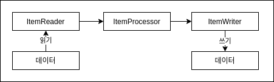

이번엔 이 과정의 가장 첫번째인 Reader에 대해 알아보겠습니다.  
그림에서 보시는 것처럼 Spring Batch의 ItemReader는 **데이터를 읽는 역할을 합니다.**  
~~그게 꼭 DB의 데이터만을 얘기하진 않습니다.~~

File, XML, JSON 등 다른 데이터 소스를 배치 처리의 입력으로 사용할 수 있습니다.  
또한 JMS(Java Message Service)와 같은 다른 유형의 데이터 소스도 지원합니다.  

이외에도 **Spring Batch에서 지원하지 않는 Reader가 필요할 경우 직접 해당 Reader를 만드는 것도 가능합니다.  
Spring Batch는 이를 위해 Custom Reader 구현체를 만들기 쉽게 제공하고 있습니다.  

정리하면 Spring Batch의 Reader에서 읽어올 수 있는 데이터 유형은 다음과 같습니다.  
- 입력 데이터에서 읽어오기
- 파일에서 읽어오기
- Database에서 읽어오기
- Java Message Service등 다른 소스에서 읽어오기
- 본인만의 커스텀한 Reader로 읽어오기 

이 ItemReader의 구현체들이 어떻게 되어있는지 살펴보겠습니다.  
가장 대표적인 구현체인 JdbcPagingItemReader가 있습니다.  
해당 클래스의 계층 구조를 살펴보면 아래와 같습니다.

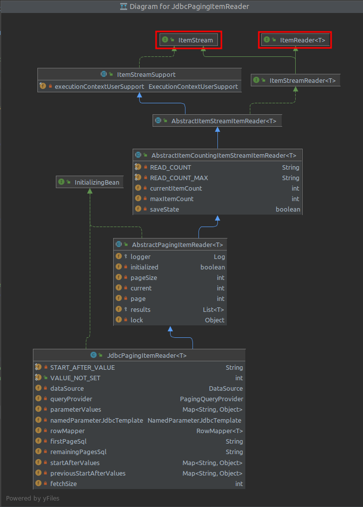

ItemReader외에 **ItemStream 인터페이스도 같이 구현하고 있습니다.**  

먼저 ItemReader를 살펴보면 `read()`만 가지고 있습니다.  
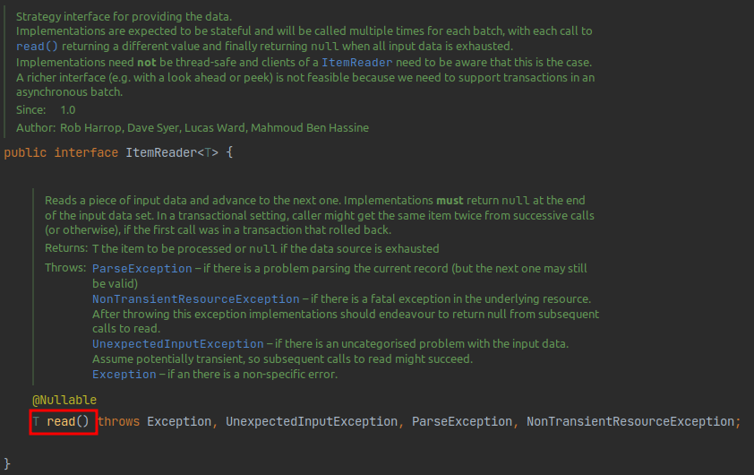

- `read()`의 경우 데이터를 읽어오는 메소드입니다.

Reader가 하는 본연의 임무를 담당하는 인터페이스임을 알 수 있습니다.

그럼 IteamStream 인터페이슨 무슨 역할을 할까요?  
IteamStream 인터페이스는 **주기적으로 상태를 저장하고 오류가 발생하면 해당 상태에서 복원**하기 위한 마커 인터페이스 입니다.  
즉, 배치 프로세스의 실행 컨텍스트와 연계해서 **ItemReader의 상태를 저장하고 실패한 곳에서 다시 실행할 수 있게 해주는 역할**을 합니다.  

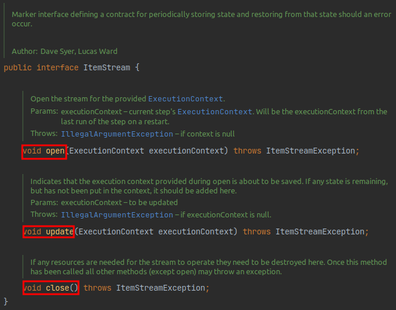

ItemStream의 3개 메소드는 다음과 같은 역할을 합니다.  
- `open()`, `close()`는 스트림을 열고 닫습니다.
- `update()`를 사용하면 Batch 처리의 상태를 업데이트할 수 있습니다. 

개발자는 **ItemReader와 ItemStream 인터페이스를 직접 구현해서 원하는 형태의 ItemReader**를 만들 수 있습니다.  
다만 Spring Batch에서 대부분의 데이터 형태는 ItemReader로 이미 제공하고 있기 때문에 커스텀한 ItemReader를 구현할 일은 많이 없을 것 입니다.

> 단, 본인의 조회 프레임워크가 Querydsl, Jooq 라면 직접 구현해야할 수도 있습니다.  
> 웬만하면 JdbcItemReader로 해결되지만, **JPA 영속성 컨텍스트가 지원이 안되서** HibernateItemReader를 이용하여 Reader 구현체를 직접 구현하셔야 합니다.

자 이제 ItemReader의 구현체를 알아보겠습니다.  
여기에서는 **Database의 구현체들만 다뤄보겠습니다.**  
이외의 다른 Reader들 (File, XML, JSON) 등은 실제 업무에서 많이 사용되지 않기 때문에 필요하시면 [공식문서](https://docs.spring.io/spring-batch/docs/4.3.x/reference/html/readersAndWriters.html#flatFiles) 를 참고해주시기 바랍니다.

## Database Reader
Spring 프레임워크의 강점 중 하나는 **개발자가 비즈니스 로직에만 집중할 수 있도록 JDBC와 같은 문제점을 추상화**한 것 입니다.  

> 이를 보고 **서비스 추상화**라고 합니다. 

그래서 Spring Batch 개발자들은 Spring 프레임워크의 JDBC 기능을 확장했습니다.  

일반적으로 Batch 작업은 많은 양의 데이터를 처리해야 합니다. 

> 보통 실시간 처리가 어려운 대용량 데이터나 대규모 데이터일 경우에 배치 어플리케이션을 작업합니다.  

수백만 개의 데이터를 조회하는 쿼리가 있는 경우에 해당 데이터를 모두 한 번에 메모리에 불러오길 원하는 개발자는 없을 것 입니다.  
그러나 Spring의 Jdbc Template은 분할 처리를 지원하지 않기 때문에 (쿼리 결과를 그대로 반환하니) 개발자가 직접 `limit`, `offset`을 사용하는 등의 작업이 필요합니다.  
Spring Batch는 이런 문제점을 해결하기 위해 2개의 Reader 타입을 지원합니다.  

Cursor는 실제로 JDBC ResultSet의 기본 기능입니다.  
ResultSet이 open될 때마다 `next()` 메소드가 호출되어 Database의 데이터가 반환됩니다.  
이를 통해 필요에 따라 **Database에서 데이터를 Streaming** 할 수 있습니다.  

반면 Paging은 좀 더 많은 작업을 필요로 합니다.  
Paging 개념은 페이지라는 Chunk로 Database에서 데이터를 검색한다는 것 입니다.  
즉, **페이지 단위로 한번에 데이터를 조회**해오는 방식입니다.  

Cursor와 Paging을 그림으로 비교하면 다음과 같습니다.  

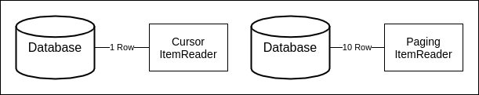

> Paging에서 10 Row는 PageSize를 얘기합니다.  
> 10 외에 다른 값도 가능하며 여기선 예시로 10개로 두었습니다.

Cursor 방식은 Database와 커넥션을 맺은 후, Cursor를 한칸씩 옮기면서 지속적을 데이터를 불러옵니다.  
반면 Paging 방식에서는 한번에 10개 (또는 개발자가 지정한 Paging Size) 만큼 데이터를 가져옵니다.

2개 방식의 구현체는 다음과 같습니다.  
- Cursor 기반 ItemReader 구현체 
  - JdbcCursorItemReader
  - HibernateCursorItemReader
  - StoreProcedureItemReader
- Paging 기반 ItemReader 구현체
  - JdbcPagingItemReader
  - HibernatePagingItemReader
  - JpaPagingItemReader

모든 ItemReader의 예제를 다루기에는 양이 많으니  
여기서는 각 Reader의 대표격인 JdbcCursorItemReader와 JdbcPagingItemReader, JpaPagingItemReader를 예제와 함께 소개해 드리겠습니다.

> 여기서 다루지 않는 예제는 [공식문서](https://docs.spring.io/spring-batch/docs/4.3.x/reference/html/readersAndWriters.html#database) 에서 아주 상세하게 예제 코드가 있으니 참고해 주세요.

## CursorItemReader
위에서 언급한대로 CursorItemReader는 Paging과 다르게 Streaming으로 데이터를 처리합니다.  
아주 쉽게 생각하면 Database와 Application 사이에 통로를 하나 연결하고 하나씩 불러온다고 생각하시면 됩니다.  
JSP 또는 Servlet으로 게시판을 작성해보신 분들은 ResultSet을 사용해서 `next()`로 하나씩 데이터를 가져왔던 것을 기억하시면 됩니다.

이런 Cursor 방식의 대표격인 JdbcCursorItemReader를 소개합니다.  

### JdbcCursorItemReader
JdbcCursorItemReader는 Cursor 기반의 JDBC Reader 구현체입니다.  
아래 샘플 코드를 바로 보겠습니다.  

###### Pay.java
```java
package com.hansoleee.basicspringbatch.domain;

import lombok.Getter;
import lombok.NoArgsConstructor;
import lombok.Setter;
import lombok.ToString;

import javax.persistence.Entity;
import javax.persistence.GeneratedValue;
import javax.persistence.Id;
import java.time.LocalDateTime;
import java.time.format.DateTimeFormatter;

@Entity
@NoArgsConstructor
@Getter
@Setter
@ToString
public class Pay {

    public static final DateTimeFormatter FORMATTER = DateTimeFormatter.ofPattern("yyyy-MM-dd hh:mm:ss");
    
    @Id
    @GeneratedValue
    private Long id;
    
    private Long amount;
    
    private String txName;
    
    private LocalDateTime txDateTime;

    public Pay(Long amount, String txName, LocalDateTime txDateTime) {
        this.amount = amount;
        this.txName = txName;
        this.txDateTime = txDateTime;
    }

    public Pay(Long id, Long amount, String txName, LocalDateTime txDateTime) {
        this.id = id;
        this.amount = amount;
        this.txName = txName;
        this.txDateTime = txDateTime;
    }
}
```

###### JdbcCursorItemReaderJobConfiguration.java
```java
package com.hansoleee.basicspringbatch.job;

import com.hansoleee.basicspringbatch.domain.Pay;
import lombok.RequiredArgsConstructor;
import lombok.extern.slf4j.Slf4j;
import org.springframework.batch.core.Job;
import org.springframework.batch.core.Step;
import org.springframework.batch.core.configuration.annotation.JobBuilderFactory;
import org.springframework.batch.core.configuration.annotation.StepBuilderFactory;
import org.springframework.batch.item.ItemWriter;
import org.springframework.batch.item.database.JdbcCursorItemReader;
import org.springframework.batch.item.database.builder.JdbcCursorItemReaderBuilder;
import org.springframework.context.annotation.Bean;
import org.springframework.context.annotation.Configuration;
import org.springframework.jdbc.core.BeanPropertyRowMapper;

import javax.sql.DataSource;

@Slf4j
@Configuration
@RequiredArgsConstructor
public class JdbcCursorItemReaderJobConfiguration {

    private final JobBuilderFactory jobBuilderFactory;
    private final StepBuilderFactory stepBuilderFactory;
    private final DataSource dataSource;

    public static final int chunkSize = 10;

    @Bean
    public Job jdbcCursorItemReaderJob() {
        return jobBuilderFactory.get("jdbcCursorItemReaderJob")
                .start(jdbcCursorItemReaderStep())
                .build();
    }

    @Bean
    public Step jdbcCursorItemReaderStep() {
        return stepBuilderFactory.get("jdbcCursorItemReaderStep")
                .<Pay, Pay>chunk(chunkSize)
                .reader(jdbcCursorItemReader())
                .writer(jdbcCursorItemWriter())
                .build();
    }
    
    @Bean
    public JdbcCursorItemReader<Pay> jdbcCursorItemReader() {
        return new JdbcCursorItemReaderBuilder<Pay>()
                .fetchSize(chunkSize)
                .dataSource(dataSource)
                .rowMapper(new BeanPropertyRowMapper<>(Pay.class))
                .sql("SELECT id, amount, tx_name, tx_date_time FROM pay")
                .name("jdbcCursorItemReader")
                .build();
    }

    private ItemWriter<Pay> jdbcCursorItemWriter() {
        return list -> {
            for (Pay pay : list) {
                log.info("Current Pay={}", pay);
            }
        };
    }
}
```

위에서 사용하는 `Pay.java`의 코드는 아래와 같습니다.

reader는 Tasklet이 아니기 때문에 reader만으로는 수행될 수 없고, 간단한 출력 Writer를 하나 추가했습니다.

> **processor는 필수가 아닙니다.  
> 위 예제처럼 reader에서 읽은 데이터에 대해 크게 변경 로직이 없다면 processor를 제외하고 writer만 구현하시면 됩니다.

jdbcCursorItemReader의 설정 값들은 다음과 같은 역할을 합니다.

- chunk
  - `<Pay, Pay>` 에서 **첫번째 Pay는 Reader에서 반환할 타입**이며, **두번째 Pay는 Writer에 파라미터로 넘어올 타입**을 얘기합니다.
  - `chunkSize`로 인자 값을 넣은 경우는 Reader & Writer 가 묶일 Chunk 트랜잭션 범위입니다.
- fetchSize
  - Database에서 한번에 가져올 데이터 양을 나타냅니다.
  - Paging과는 다를 것이, Paging은 실제 쿼리를 `limit`, `offset`을 이용해서 분할 처리합니다. 하지만 Cursor는 쿼리를 분할 처리 없이 실행하고 내부적으로 가져오는 데이터는 FetchSize만큼 가져와 `read()`를 통해서 하나씩 가져옵니다.
- dataSource
  - Database에 접근하기 위해 사용한 Datasource 객체를 할당합니다.
- rowMapper
  - 쿼리 결과를 Java 인스턴스로 매핑하기 위한 Mapper 입니다.
  - 커스텀하게 생성해서 사용할 수 있지만, 이렇게 될 경우 매번 Mapper 클래스를 생성해야 되서 Spring에서 공식적으로 지원하는 BeanPropertyRowMapper.class를 사용합니다.
- sql
  - Reader로 사용할 쿼리문을 사용하시면 됩니다.
- name
  - reader의 이름을 지정합니다.
  - Bean의 이름이 아니며 Spring Batch의 ExecutionCOntext에서 저장되어질 이름입니다.

문법을 보시면 익숙하실 것 같아요.  
이유는 JdbcItemReader는 `JdbcTemplate`과 인터페이스가 동일하기 때문에 별도로 공부할 필요없이 쉽게 사용하실 수 있습니다.  
위의 예제를 `jdbcTemplate`으로 구현하면 아래처럼 됩니다.  

```java
JdbcTemplate jdbcTemplate = new JdbcTemplate(dataSource);
List<Pay> payList = jdbcTemplate.query("SELECT id, amount, tx_name, tx_date_time FROM pay", new BeanPropertyRowMapper<>(Pay.class));
```

거의 차이가 없죠?  
그러나 ItemReader의 가장 큰 장점은 **데이터를 Streaming 할 수 있다**는 것입니다.   
`read()` 메소드는 데이터를 하나씩 가져와 ItemWriter로 데이터를 전달하고, 다음 데이터를 다시 가져 옵니다.  
이를 통해 reader * processor * writer가 Chunk 단위로 수행되고 주기적으로 Commit 됩니다.  
이는 고성능의 배치처리에서는 핵심입니다.  

그럼 위 코드를 한번 테스트 해보겠습니다.  
테스트를 위해 프로젝트에서 사용중인 DB에 insert문을 수행하겠습니다.  
아래 쿼리를 실행해 주시면 됩니다.
```sql
create table pay (
  id         bigint not null auto_increment,
  amount     bigint,
  tx_name     varchar(255),
  tx_date_time datetime,
  primary key (id)
) engine = InnoDB;

insert into pay (amount, tx_name, tx_date_time) VALUES (1000, 'trade1', '2018-09-10 00:00:00');
insert into pay (amount, tx_name, tx_date_time) VALUES (2000, 'trade2', '2018-09-10 00:00:00');
insert into pay (amount, tx_name, tx_date_time) VALUES (3000, 'trade3', '2018-09-10 00:00:00');
insert into pay (amount, tx_name, tx_date_time) VALUES (4000, 'trade4', '2018-09-10 00:00:00');
```

배치를 실행하겠습니다.  
먼저 Reader에서 어떻게 쿼리가 생성되고 실행되는지 확인하기 위해 Log Level을 변경해 보겠습니다.  
application.yml에 아래의 코드를 추가합니다.

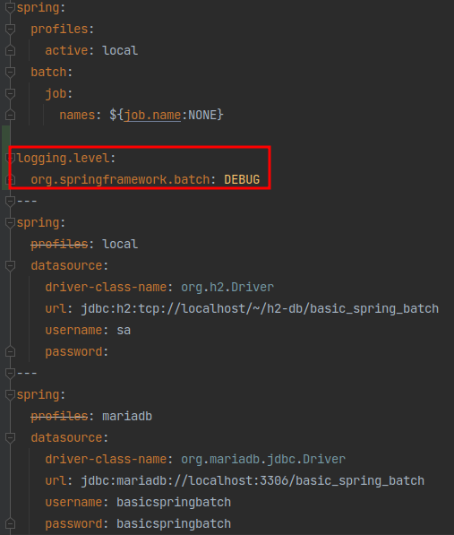
###### application.yml 
```yaml
logging.level.org.springframework.batch: DEBUG
```

그리고 배치를 실행한 결과는 아래와 같습니다.

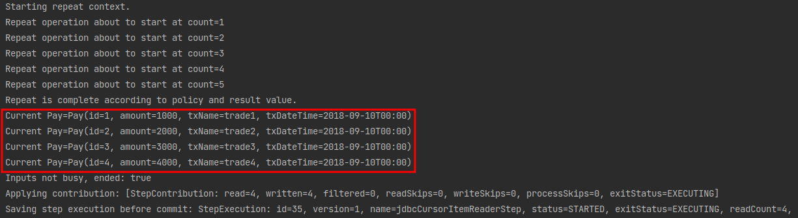

이렇게 등록한 데이터가 잘 조회되어 Writer에 명시한대로 데이터를 Print 하는 것을 확인할 수 있습니다.  
> JPA는 CursorItemReader가 없습니다. 

#### CursorItemReader의 주의사항
CursorItemReader를 사용하실 때는 Database와 SocketTimeout을 충분히 큰 값으로 설정해야만 합니다.  
**Cursor는 하나의 Connection으로 Batch가 끝날때까지 사용**되기 때문에 Batch가 끝나기전에 Database와 Application의 Connection이 먼저 끊어질 수 있기 때문입니다.  

그래서 **Batch 수행 시간이 오래 걸리는 경우에는 PagingItemReader를 사용하시는게 낫습니다.**  
Paging의 경우 한 페이지를 읽을때마다 Connection을 맺고 끊기 때문에 아무리 많은 데이터라도 타임아웃과 부하 없이 수행될 수 있습니다.  

### PagingItemReader
Database Cursor를 사용하는 대신 여러 쿼리를 실행하여 각 쿼리가 결과의 일부를 가져오는 방법도 있습니다.  
이런 처리 방법을 Paging이라고 합니다.  
게시판의 페이징을 구현해보신 분들은 아시겠지만 페이징을 한다는 것은 각 쿼리에 시작 행 번호 (`offset`)와 페이지에서 반환할 행 수 (`limit`)를 지정해야함을 의미합니다.  
Spring Batch에서는 `offset`과 `limit`을 **PagingSize에 맞게 자동으로 생성해 줍니다.  
다만 각 쿼리는 개별적으로 실행한다는 점을 유의해야 합니다.  
각 페이지마다 새로운 쿼리를 실행하므로 **페이징시 결과를 정렬하는 것이 중요합니다.**  
데이터 결과의 순서가 보장될 수 있 order by가 권장됩니다.  
(이건 아래서 자세하게 알아보겠습니다.)  

가장 먼저 JdbcPagingItemReader를 알아보겠습니다.  

#### JdbcPagingItemReader 
JdbcPagingItemReader는 JdbcCursorItemReader와 같은 JdbcTemplate 인터페이스를 이용한 PagingItemReader입니다.  
코드는 아래와 같습니다.  

```java
package com.hansoleee.basicspringbatch.job;

import com.hansoleee.basicspringbatch.domain.Pay;
import lombok.RequiredArgsConstructor;
import lombok.extern.slf4j.Slf4j;
import org.springframework.batch.core.Job;
import org.springframework.batch.core.Step;
import org.springframework.batch.core.configuration.annotation.JobBuilderFactory;
import org.springframework.batch.core.configuration.annotation.StepBuilderFactory;
import org.springframework.batch.item.ItemWriter;
import org.springframework.batch.item.database.JdbcPagingItemReader;
import org.springframework.batch.item.database.Order;
import org.springframework.batch.item.database.PagingQueryProvider;
import org.springframework.batch.item.database.builder.JdbcPagingItemReaderBuilder;
import org.springframework.batch.item.database.support.SqlPagingQueryProviderFactoryBean;
import org.springframework.context.annotation.Bean;
import org.springframework.context.annotation.Configuration;
import org.springframework.jdbc.core.BeanPropertyRowMapper;

import javax.sql.DataSource;
import java.util.HashMap;
import java.util.Map;

@Slf4j
@Configuration
@RequiredArgsConstructor
public class JdbcPagingItemReaderJobConfiguration {

    private final JobBuilderFactory jobBuilderFactory;
    private final StepBuilderFactory stepBuilderFactory;
    private final DataSource dataSource;

    public static final int chunkSize = 10;

    @Bean
    public Job jdbcPagingItemReaderJob() throws Exception {
        return jobBuilderFactory.get("jdbcPagingItemReaderJob")
                .start(jdbcPagingItemReaderStep())
                .build();
    }

    @Bean
    public Step jdbcPagingItemReaderStep() throws Exception {
        return stepBuilderFactory.get("jdbcPagingItemReaderStep")
                .<Pay, Pay>chunk(chunkSize)
                .reader(jdbcPagingItemReader())
                .writer(jdbcPagingItemWriter())
                .build();
    }

    @Bean
    public JdbcPagingItemReader<Pay> jdbcPagingItemReader() throws Exception {
        Map<String, Object> parameterValues = new HashMap<>();
        parameterValues.put("amount", 2000);

        return new JdbcPagingItemReaderBuilder<Pay>()
                .pageSize(chunkSize)
                .fetchSize(chunkSize)
                .dataSource(dataSource)
                .rowMapper(new BeanPropertyRowMapper<>(Pay.class))
                .queryProvider(createQueryProvider())
                .parameterValues(parameterValues)
                .name("jdbcPagingItemReader")
                .build();
    }

    @Bean
    public PagingQueryProvider createQueryProvider() throws Exception {
        SqlPagingQueryProviderFactoryBean queryProvider = new SqlPagingQueryProviderFactoryBean();

        queryProvider.setDataSource(dataSource);
        queryProvider.setSelectClause("id, amount, tx_name, tx_date_time");
        queryProvider.setFromClause("from pay");
        queryProvider.setWhereClause("where amount >= :amout");

        Map<String, Order> sortKeys = new HashMap<>();
        sortKeys.put("id", Order.ASCENDING);

        queryProvider.setSortKeys(sortKeys);

        return queryProvider.getObject();
    }

    private ItemWriter<Pay> jdbcPagingItemWriter() {
        return list -> {
            for (Pay pay : list) {
                log.info("Current Pay={}", pay);
            }
        };
    }
}
```

코드를 보시면 jdbcCursorItemReader와 설정이 크게 다른것이 하나 있습니다.  
바로 쿼리(`createQueryProvider()`)입니다.  
JdbcCursorItemReader를 사용할 때는 단순히 `String` 타입으로 쿼리를 생성했지만, PagingItemReader에서는 PagingQueryProvider를 통해 쿼리를 생성합니다.  
이렇게 하는데는 큰 이유가 있습니다.  

**각 Database에는 Paging을 지원하는 자체적인 전략들이 있습니다.**  
때문에 Spring Batch에는 각 Database의 Paging 전략에 맞춰 구현되어야만 합니다.  
그래서 아래와 같이 각 Database에 맞는 Provider들이 존재합니다.  

###### SqlPagingQueryProviderFactoryBean.java
```java
...
  {
    providers.put(DB2, new Db2PagingQueryProvider());
    providers.put(DB2VSE, new Db2PagingQueryProvider());
    providers.put(DB2ZOS, new Db2PagingQueryProvider());
    providers.put(DB2AS400, new Db2PagingQueryProvider());
    providers.put(DERBY,new DerbyPagingQueryProvider());
    providers.put(HSQL,new HsqlPagingQueryProvider());
    providers.put(H2,new H2PagingQueryProvider());
    providers.put(MYSQL,new MySqlPagingQueryProvider());
    providers.put(ORACLE,new OraclePagingQueryProvider());
    providers.put(POSTGRES,new PostgresPagingQueryProvider());
    providers.put(SQLITE, new SqlitePagingQueryProvider());
    providers.put(SQLSERVER,new SqlServerPagingQueryProvider());
    providers.put(SYBASE,new SybasePagingQueryProvider());
  }
...
```

하지만 이렇게 되면 Database 마다 Provider 코드를 바꿔야하니 불편함이 많습니다.  
(로컬은 h2로 사용하면서 개발/운영은 MySQL을 사용하면 Provider를 하나로 고정시킬수가 없겠죠?)

그래서 Spring Batch에서는 **SqlPagingQueryProvierFactoryBean**을 통해 **Datsource 설정 값을 보고** 위 이미지에서 작성된 **Provider중 하나를 자동을 선택**하도록 합니다.  

이렇게 하면 코드 변경 사항이 줄어들고 Spring Batch에서 공직 지원하는 방법입니다.

이외 다른 설정들의 값은 JdbcCursorItemReader와 크게 다르지 않습니다.  
- parameterValues
  - 쿼리에 대한 매개 변수 값의 Map을 지정합니다. 
  - `queryProvider.setWhereClause`을 보시면 어떻게 변수를 사용하느지 자세히 알 수 있습니다. 
  - where 절에서 선언된 파라미터 변수명과 parameterValues에서 선언된 파라미터 변수명이 일치해야만 합니다.  

이제 실행해 보겠습니다.  

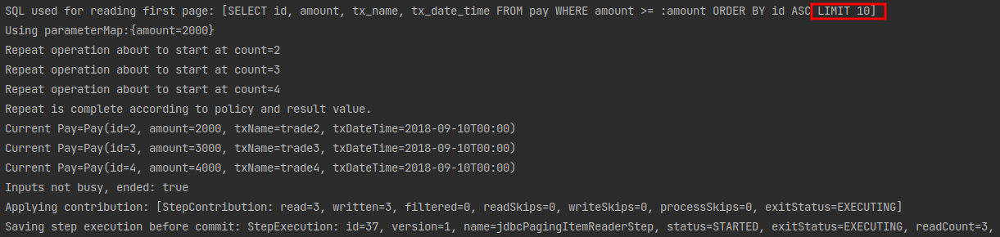

쿼리 로그를 보시면 `LIMIT 10`이 들어간 것을 알 수 있습니다.  
작성한 코드에서 LIMIT 선언은 없지만, 사용된 쿼리에선 추가되었습니다.  
이는 위에서 언급했듯이 JdbcPagingItemReader에서 선언된 pageSize (Cursor에서는 fetchSize)에 맞게 자동으로 쿼리에 추가해줬기 때문입니다.  
만약 조회할 데이터가 10개 이상이라면 `offset`으로 적절하게 다음 fetchSize만큼을 가져올 수 있습니다.  

### JpaPagingItemReader
Jdbc 뿐만 아니라 Jpa 또한 Spring Batch에서도 사용하실 수 있습니다. 
> 현재 Querydsl, Jooq 등을 통한 ItemReader 구현체는 공식 지원하지 않습니다.  
> CustomItemReader 구현체를 만드셔야만 합니다.  
> 이건 다른 글에서 알아보기로 하겠습니다.  
> 당장 필요하신 분들은 [공식문서](https://docs.spring.io/spring-batch/docs/4.3.x/reference/html/readersAndWriters.html#customReader) 를 참고해 주세요.

JPA는 Hibernate와 많은 유사점을 가지고 있습니다.   
다른 것도 물론 있고 그 중 한 가지는 Hibernate에서는 Cursor가 지원되지만 **JPA는 Cursor 기반 Database 접근을 지원하지 않습니다.**  

자 그럼 코드를 한 번 살펴 보겠습니다.

```java
package com.hansoleee.basicspringbatch.job;

import com.hansoleee.basicspringbatch.domain.Pay;
import lombok.RequiredArgsConstructor;
import lombok.extern.slf4j.Slf4j;
import org.springframework.batch.core.Job;
import org.springframework.batch.core.Step;
import org.springframework.batch.core.configuration.annotation.JobBuilderFactory;
import org.springframework.batch.core.configuration.annotation.StepBuilderFactory;
import org.springframework.batch.item.ItemWriter;
import org.springframework.batch.item.database.JpaPagingItemReader;
import org.springframework.batch.item.database.builder.JpaPagingItemReaderBuilder;
import org.springframework.context.annotation.Bean;
import org.springframework.context.annotation.Configuration;

import javax.persistence.EntityManagerFactory;

@Slf4j
@Configuration
@RequiredArgsConstructor
public class JpaPagingItemReaderJobConfiguration {

    private final JobBuilderFactory jobBuilderFactory;
    private final StepBuilderFactory stepBuilderFactory;
    private final EntityManagerFactory entityManagerFactory;

    public static final int chunkSize = 10;

    @Bean
    public Job jpaPagingItemReaderJob() {
        return jobBuilderFactory.get("jpaPagingItemReaderJob")
                .start(jpaPagingItemReaderStep())
                .build();
    }

    @Bean
    public Step jpaPagingItemReaderStep() {
        return stepBuilderFactory.get("jpaPagingItemReaderStep")
                .<Pay, Pay>chunk(chunkSize)
                .reader(jpaPagingItemReader())
                .writer(jpaPagingItemWriter())
                .build();
    }

    @Bean
    public JpaPagingItemReader<Pay> jpaPagingItemReader() {
        return new JpaPagingItemReaderBuilder<Pay>()
                .name("jpaPagingItemReader")
                .entityManagerFactory(entityManagerFactory)
                .pageSize(chunkSize)
                .queryString("SELECT p FROM Pay p WHERE amount >= 2000")
                .build();
    }

    private ItemWriter<Pay> jpaPagingItemWriter() {
        return list -> {
            for (Pay pay : list) {
                log.info("Current pay={}", pay);
            }
        };
    }
}
```

**EntityManagerFactory를 지정하는 것**을 제외한다면 JdbcPagingItemReader와 크게 다른 점은 없습니다.  
한 번 실행해 보겠습니다.  

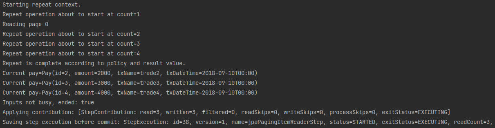

정상적으로 배치가 실행되었습니다.  

#### PagingItemReader의 주의사항
정렬 (`order`)가 반드시 포함되어 있어야 합니다.  
관련해서는 [Spring Batch Paging Reader시 주의사항 written by jojoldu](https://jojoldu.tistory.com/166) 를 참고해 주시기 바랍니다.  

### IteamReader 주의사항
- JpaRepository를 ListItemRedaer, QueueItemReader에 사용하시면 안됩니다.  
  - 간혹 JPA의 조회 쿼리를 쉽게 구현하기 위해 JpaRepository를 이용해서 `new ListItemReader<>(jpaRepository.findByAge(age)`)로 Reader를 구현하시는 분들이 계십니다.  
  - 이렇게 할 경우 Spring Batch의 장점인 페이징 * Cursor 구현이 없어 대규모 데이터 처리가 불가능 합니다. (물론 Chunk 단위 트랜잭션은 됩니다.)
  - 만약 정말 JpaRepository를 사용해야 한다면 RepositoryitemReader를 사용하시는 것을 추천합니다.
    - [예제 코드](https://stackoverflow.com/questions/43003266/spring-batch-with-spring-data/43986718#43986718)  
    - Paging을 기본적으로 지원합니다.  
- Hibernate, JPA 등 영속성 컨텍스트가 필요한 Reader 사용시 fetchSize와 chunkSize는 같은 값을 유지해야 합니다.  
  - [Spring Batch 영속성 컨텍스트 문제 written by jojoldu](https://jojoldu.tistory.com/146) 
 
ItemReader는 Spring Batch를 구현하는데 있어 정말 중요한 구현체입니다.  
어디서 데이터를 읽어오고, 어떤 방식으로 읽느냐에 따라 Batch의 성능을 크게 좌지우지합니다.  
